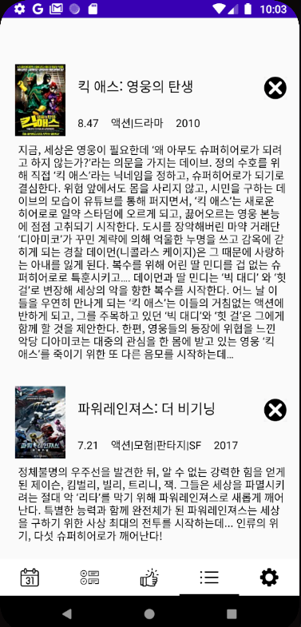

# NLP_AndroidApp

## Project

- 영화 제목과 리뷰를 입력하면, 자동으로 긍정 부정을 예측해주고 그 결과에 따라서 영화를 추천해주는 어플을 만들어 보자

## How to proceed

1. 기훈 (Ansan-gihun) : 리뷰 감정 예측 - 파이썬 사이킷런/딥러닝

   - Word2Vec, FastText, LSA, Tensorflow 등의 다양한 임베딩 기법들과 CNN, RNN, RandomForest, Logistic Regression 등의 다양한 예측 모델을 사용해본 결과를 비교해 FastText와 Logistic Regression 을 사용
   - 형태소 분석기는 Okt를 사용하여 모델을 작성했지만 예측하는 과정에서 빠른 응답이 필요하므로 Mecab을 사용했다. 더 정확한 모델을 위해서는 Mecab을 이용한 모델을 다시 한 번 만들어 적용할 계획이다.

2. 성민 (seongmin-97) : 안드로이드 앱, restAPI 통신

   - 안드로이드 스튜디오를 이용해 안드로이드 앱 제작 (with Kotlin)

   - Django를 이용해 영화 데이터와 영화 추천 데이터, 감성 예측 모델을 restAPI로 전달받았다.

     (https://github.com/seongmin-97/nlp_andoridApp_aws)

   - 영화 리뷰가 긍정이면 그 영화와 유사도가 가장 높은 10개의 영화를 추천하고, 영화 리뷰가 부정이면 그 영화와 유사도가 가장 낮은 10개의 영화를 추천했다.

3. 추천 알고리즘

   - https://github.com/jbose038/naver-movie-recommendation 에서 도움을 받았습니다.

## How to use

기본 모습은 다음과 같다.

영화 제목을 입력하고 검색 버튼을 누르면 다음과 같은 결과를 볼 수 있다.

원하는 영화를 선택한 후 리뷰를 마져 작성하면 두번째 탭 (맨 아래 탭 메뉴) 에 영화 리뷰가 저장된다. 이 때 긍정이면 영화 제목 아래 1, 부정이면 0이 나타난다.

맨 아래 세번째 탭 메뉴를 클릭하면 (엄지 척 모양) 추천 영화 리스트를 볼 수 있다.

여기서 나중에 보고 싶은 영화는 체크 모양의 버튼을 눌러 저장할 수 있다. 저장된 영화들은 네 번째 탭 메뉴에서 확인할 수 있다.

## Error

- 가장 심각한 오류로는 영화 리뷰를 작성하고, 추천 목록을 보고의 첫 싸이클은 잘 되는데, 이어서 두 번째 영화를 검색하고 리뷰를 남기려고 하면 에러가 발생한다... 이를 해결하기 위해 이것저것 검색해보았지만, 코틀린 기반의 안드로이드는 질문과 게시글이 적어서 알맞은 해답을 찾지 못했다.
- 감정 예측이 우리가 원하는 대로 나오지 않을 때가 있다.
- 추천 영화가 가끔은 연관성이 없어 보인다는 문제점이 있다.
- 에러는 아니지만 설정 탭은 아무 것도 구성할 수가 없었다. 후에 추가하기로 했다.
- 감정 예측을 웹을 통해 받으려고 하다 보니 시간이 오래 걸릴 때가 있고 이로 인한 에러가 발생할 수 있다.
- scrapy를 사용하지 않고, 무작정 크롤링으로 데이터를 csv로 받아서 사용했기에 최신 영화나 너무 오래된 영화는 데이터 베이스에 존재하지 않는다.

## Realization

- 감성 모델 예측의 모델을 직접 만들고 임베딩하고 형태소 분석을 하면서 그 일련의 과정들에 대해서 더 정확하게 이해할 수 있었다. (임베딩된 값들을 어떻게 활용하는지, 이를 모델에 어떻게 넣는지, 예측은 어떻게 할 수 있는지 등)
- 안드로이드 어플을 처음 만들어 보면서 다양한 개념들을 (Kotlin, Thread, Activity, Fragment, 생명 주기 등) 접하기 배울 수 있었고, 자신감을 얻을 수 있었다. 다음에는 Java와 React Native를 이용해서도 만들어 보고 싶다.
- 이런 간단한 것들도 만들기가 힘들구나

- 팀원이랑 말이 통하니까 행복하다

## Period

2020년 12월 말 ~ 2021년 2월

- 프로젝트가 길어진 이유
  1. 안드로이드를 처음 접해본다.
  2. 예상치 못한 에러들이 계속 발생했다.
  3. 중간에 주제가 한 번 바뀌었다.
     - 처음에는 감정 다이어리로 가닥을 잡았지만, 다이어리를 위한 감정 예측 데이터셋을 구하기가 힘들었고, 이를 크롤링을 통해 모아봤지만, 이 데이터들로 의미있는 비지도학습을 통한 감정 예측이 힘들어서 nsmc 데이터를 이용한 영화 리뷰 예측으로 주제를 바꿨다.

## Development Environment

- window10

- python 3.7

- tensorflow2.0

- scikit-learn 0.23.1

- gensim 3.8.3

- Django 2.2.2

- djangorestframework 3.12.2

- AndroidStudio 4.1

- Kotlin

- Retrofit2.0

- 
  
  

## Directory

#### androidMovieDiary
- 안드로이드 앱 프로젝트
#### data
- 감성분석을 위한 데이터 (data for sentiment analysis) -> nsmc 데이터
- preprocess : 전처리한 데이터 (preprocessed data)

#### Embedding
- 단어 임베딩 데이터와 코드 (word embedding data and its code)
- embedding_data : 임베딩된 

#### model
- 네이버 영화 리뷰 데이터를 이용한 리뷰 감성 분석 모델

#### scraping
- 크롤링을 통한 데이터 수집 코드 (python code for scraping)

#### recommendation
- 네이버 영화 데이터를 바탕으로 한 추천 시스템 만들기

#### studyForProject (written in Korean)
- AndroidStudio with kotlin : 이것이 안드로이드다 with 코틀린 (고돈호 지음, 한빛미디어) 참고 (Book Reference)
- NLP : 텐서플로2와 머신러닝으로 시작하는 자연어 처리 (전창욱, 최태균, 조종현, 신성진 지음, 위키북스) 참고 (Book Reference) & 한국어 임베딩 - 이기창 지음 (에이콘) 참고

#### web
- restAPI를 위한 Django 프로젝트
