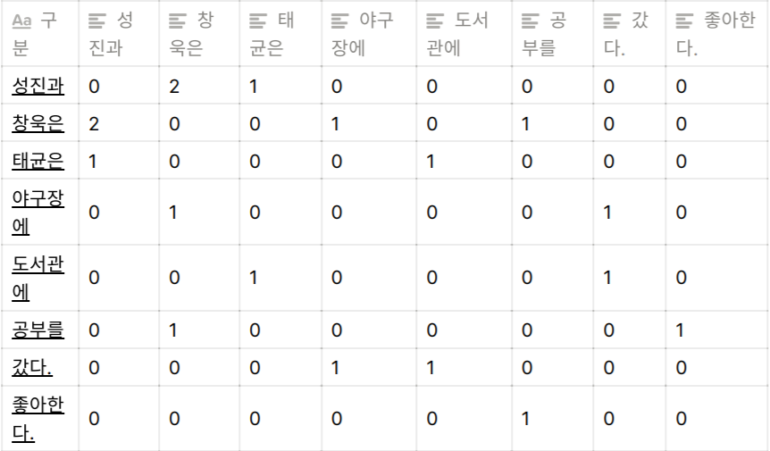
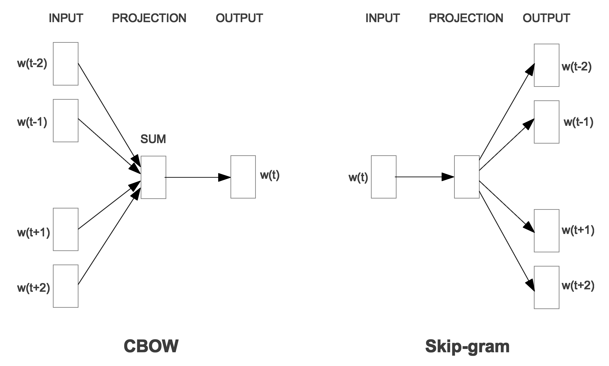

# 자연어 처리 개요 - 01 단어 표현

자연어 처리는 컴퓨터가 인간의 언어를 이해하고 분석 가능한 모든 분야를 말한다. 즉, 자연어 처리의 가장 기본적인 문제는 '어떻게 우리가 하는 말들을 컴퓨터에게 인식시킬 수 있을까?' 이다.

컴퓨터는 우리가 하는 말들을 0, 1로만 구성된 값으로 인식할 수 있다. 따라서, 지금 내가 쓰는 글처럼 우리가 사용하는 텍스트는 유니코드 혹은 아스키 코드라는 방식 등을 이용한다. "언어"라는 텍스트를 유니코드라는 방식으로 컴퓨터가 인식한다면 다음과 같은 형태로 컴퓨터에 입력된다.

- '언' : 1100010110111000
- '어' : 1100010110110100

하지만 이 방식을 그대로 자연어 처리에 사용할 수 없다. 위 방식은 언어적인 특성이 전혀 없이 (글자에 내포된 뜻과 관계없이) 그대로 숫자로 바꾸기 때문에 자연어 처리를 위해 만드는 모델에는 적용하기 부적합하기 때문이다.

그렇다면 어떤 방식으로 텍스트를 표현해야 자연어 처리 모델에 적용할 수 있을까? 이에 대한 답이 바로 "단어 표현(Word Representation)" 분야이다. 텍스트를 자연어 처리를 위한 모델에 적용할 수 있게 "언어적인 특성을 반영해서" 단어를 수치화하는 방법을 찾는 것이다. 그리고 이렇게 단어를 수치화 할때는 단어를 주로 "벡터"로 표현한다. 따라서 단어 표현은 "단어 임베딩(word embedding)" 또는 "단어 벡터(word vector)"로 불리기도 한다.

단어를 표현하는 가장 기본적인 방법은 원-핫 인코딩(one-hot encoding)방식이다. 단어를 하나의 벡터로 표현하는 방법인데, 각 값은 0 또는 1의 값만 가진다. 벡터 값 가운데 하나만 1을 가지고, 나머지는 모두 0을 가지는 방식이다. 이해를 돕기 위해 예시를 들어보자

6개의 단어를 알려줘야 한다고 생각해보자 (남자, 여자, 아빠, 엄마, 삼촌, 이모) 이를 원-핫 인코딩 박식으로 표현한다고 해보자. 이때 각 단어를 표현하는 벡터의 크기는 6이 된다. 

= > 우리가 알려줘야 할 단어(우리가 벡터로 나타내고자 하는 단어)가 6개이기 때문이다.

따라서 각 단어의 벡터는 총 6개의 값을 가지는데, 이중에서 하나만 1이 된다. 이때 1이 되는 값을 통해 각 단어가 어떤 단어인지 알 수 있다. 순서대로 남자 여자 아빠 엄마 삼촌 이모를 나타낸다고 할 때 각 벡터는 다음과 같다

- 남자 : [1, 0, 0, 0, 0, 0]
- 여자 : [0, 1, 0, 0, 0, 0]
- 아빠 : [0, 0, 1, 0, 0, 0]
- 엄마 : [0, 0, 0, 1, 0, 0]
- 삼촌 : [0, 0, 0, 0, 1, 0]
- 이모 : [0, 0, 0, 0, 0, 1]

즉, 예시에서 보앗듯이,  원-핫 인코딩 박식은 각 단어의 인덱스를 정한 후 각 단어의 벡터에서 그 단어에 해당하는 인덱스의 값을 1로 표현하는 방식이다. 방법 자체가 매우 간단해서 이해하기도 쉽다는 장점이 있다. 하지만 이 방식에는 결정적인 문제점이 있다. 

첫번째 문제점은 위 예시에서는 6개의 단어만 표현했지만 실제로 자연어 처리 문제를 해결할 때는 수십만, 수백만 개가 넘는 단어를 표현해야 한다. 이 경우에는 각 단어 벡터의 크기가 너무 커지기 때문에 공간을 많이 사용하고, 큰 공간에 비해 실제 사용하는 값은 1이 되는 값 하나뿐이므로 매우 비효율적이다. 또 다른 문제점은 이러한 표현 방식은 단어가 뭔지만 알려줄 수 있고, 벡터값 자체에는 단어의 의미나 특성이 전혀 표현되지 않는다는 것이다.

정리 : 원-핫 인코딩의 문제점

- 단어 벡터의 크기가 너무 크고 값이 희소하다
- 단어의 의미나 특성을 전혀 표현할 수 없다

이를 해결하기 위해 다른 인코딩 방법이 제안됐다. 즉, 벡터의 크기가 작으면서도 벡터가 단어의 의미를 표현할 수 있는 방법들인데, 이러한 방법들을 분포가설(Distributed hypothesis)을 기반으로 한다. 분포 가설이란, "같은 문맥의 단어, 즉 비슷한 위치에 나오는 단어는 비슷한 의미를 가진다" 라는 개념이다. 즉, 어떤 글에서 단어가 비슷한 위치에 나오면 단어 간의 유사도가 높다고 판단하는 방법인데 크게 두가지 방법으로 나뉜다

- 카운트 기반 방법 (count-base) : 특정 문맥 안에서 단어들이 동시에 등장하는 횟수를 직접 세는 방법
- 예측 방법 (predictive) : 신경망 등을 통해 (딥러닝 같은) 문맥 안의 단어들을 예측하는 방법

이 두가지 분류에 대해 어떤 단어 표현 방법이 있는지 알아보고, 어떤 방식으로 단어를 표현하는지 알아보자.

1. 카운트 기반 방법

    앞서 설명햇듯이 카운트 기반 방법으로 단어를 표현한다는 것은 어떤 글의 문맥 안에 단어가 동시에 등장하는 횟수를 세는 방법(예 : A단어, B단어 동시 등장)이다. 여기에 동시에 등장하는 횟수를 동시출현 혹은 공기라고 부르고 영어로는 Co-occurrence 라고 한다. 카운트 기반 방법은 기본적으로 동시 등장 횟수를 하나의 행렬로 나타낸 뒤 그 행렬을 수치화해서 단어 벡터로 만드는 방법을 사용하는 방식인데, 다음과 같은 방법들이 있다.

    - 특이값 분해(Singular Value Decomposition, SVD)
    - 잠재의미분석(Latent Semantic Analysis, LSA)
    - Hyperspace Analogue to Language(HAL)
    - Hellinger PCA(Principal Component Analysis)

    위의 방법은 모두 동시 출현 행렬 (Co-occurrence Matrix)을 만들고 그 행렬들을 다시 변형하는 방식인데, 동시 출현 행렬까지만 만들어보자.

    우선은 다음 예시를 가지고 동시 출현 행렬을 만들어 보자.

    - 성진과 창욱은 야구장에 갔다.
    - 성진과 태균은 도서관에 갔다.
    - 성진과 창욱은 공부를 좋아한다.

    위의 문장들로 동시 출현 행렬을 만들려면 같은 문장 안에 단어가 함께 출현한 횟수를 센 후 다음과 같은 행렬을 만들면 된다.

    - 동시 출현 행렬

    

    이렇게 만들어진 동시 출현 행렬을 토대로 특이값 분해 방법 등을 사용해 단어 벡터를 만들면 된다. 이러한 카운트 기반 방법으리 장점은 우선 빠르다는 것이다. 우리가 만들어야 할 단어 벡터가 많아질수록 사용하는 방법에 따라 시간이 많이 소요되는데, 이러한 방식의 장점은 적은 시간으로 단어 벡터를 만들 수 있다는 것이다. 그리고 이러한 방식은 예측 방법에 비해 좀 더 이전에 만들어진 방법이지만, 데이터가 많을 경우에는 단어가 잘 표현되고 효율적이어서 아직까지도 많이 사용되는 방법이다.

2. 예측 방법

    예측 기반 방법은 신경망 구조 혹은 어떠한 모델을 (특정 딥러닝 모델이나 인공지능 모델) 사용해 특정 문맥에서 어떤 단어가 나올지를 예측하면서 단어를 벡터로 만드는 방식이다. 예측 방법에는 다음과 같은 것들이 있다.

    - Word2vec
    - NNLM(Neural Network Language Model)
    - RNNLM(Recurrent Neural Network Language Model)

    여러 예측 기반 방법 중에서 단어 표현 방법으로 가장 많이 사용되는 방법은 Word2vec이다. Word2vec은 

    - CBOW(Continuous Bag of Words)
    - Skip-Gram

    위와 같은 두가지 모델로 나뉜다.  두 모델은 서로 반대되는 개념이라고 생각하면 되는데, CBOW는 어떤 단어를 문맥 안의 주변 단어들을 통해 예측하는 방법이고, 반대로 Skip-Gram은 어떤 단어를 가지고 특정 문맥 안의 주변 단어들을 예측하는 방법이다. 이해가 어려우면 고민하지 말고 다음 예시를 바로 보자.

    "창욱은 냉장고에서 음식을 꺼내서 먹었다" 라는 문장이 있다고 생각해보자.

    1. CBOW

        CBOW는 주변 단어를 통해 하나의 단어를 예측하는 모델이다. 즉, 다음 문장의 빈칸을 채우는 모델이라 생각하면 된다.

        - 창욱은 냉장고에서 _____ 꺼내서 먹었다.
    2. Skip-Gram

        반대로 Skip-Gram은 하나의 단어를 가지고 주변에 올 단어를 예측하는 모델이다. 즉, 다음 문장의 빈칸을 채우는 모델이라고 생각하면 된다.

        - ____ ________ 음식을 _____ _____

    아무튼, 두 모델은 위와 같이 단어들을 예측하면서 단어 벡터를 계속해서 학습한다. 모델의 전체적인 구조는 다음과 같다. 대충 그렇구나 하고 넘어가자

    

    각 모델의 학습 방법에 대해 설명하면 다음과 같다.

    - CBOW
    1. 각 주변 단어들을 원-핫 벡터로 만들어 입력값으로 사용한다.(입력층 벡터)
    2. 가중치 행렬(weight-matrix)을 각 원-핫에 곱해서 n-차원 벡터를 만든다.(N-차원 은닉층)
    3. 만들어진 n-차원 벡터를 모두 더한 후 개수로 나눠 평균 n-차원 벡터를 만든다.(출력층 벡터)
    4. n-차원 벡터에 다시 가중치 행렬을 곱해서 원-핫 벡터와 같은 차원의 벡터로 만든다.
    5. 만들어진 벡터를 실제 예측하려고 하는 단어의 원-핫 벡터와 비교해서 학습한다.

    - Skip-Gram
    1. 하나의 단어를 원-핫 벡터로 만들어서 입력값으로 사용한다.(입력층 벡터)
    2. 가중치 행렬을 원-핫 벡터에 곱해서 n-차원 벡터를 만든다.(N-차원 은닉층)
    3. n-차원 벡터에 다시 가중치 행렬을 곱해서 원-핫 벡터와 같은 차원의 벡터로 만든다.(출력층 벡터)
    4. 만들어진 벡터를 실제 예측하려는 주변 단어들 각각의 원-핫 벡터와 비교해서 학습한다.

    두 모델의 학습 방법은 비슷해 보이지만 약간의 차이점이 있다. CBOW에서는 입력값으로 여러 개의 단어를 사용하고, 학습을 위해 하나의 단어와 비교하지만, Skip-Gram에서는 입력값이 하나의 단어를 사용하고, 학습을 위해 주변의 여러 단어와 비교한다.

    아무튼 이런 방식으로 학습을 모두 끝내면 가중치 행렬의 각 행을 단어 벡터로 사용한다. 이처럼 Word2vec의 두 모델은 여러가지 장점이 있다. 기존의 카운트 기반 방법으로 만든 단어 벡터보다 단어 간의 유사도를 더 잘 측정한다. 또, 단어들의 복잡한 특징까지도 잘 잡아낸다. 마지막으로 이렇게 만들어진 단어벡터는 서로에게 유의미한 관계를 측정할 수 있다는 점인데, 예를 들면 엄마와 아빠의 단어벡터들 간의 거리는 남자와 여자의 단어벡터들 간의 거리가 같게 나온다.

    일반적으로는 CBOW보다 Skip-Gram이 성능이 더 좋지만, 절대적인 것은 아니므로 두 가지 모두 고려할 만하다.

보통의 경우 카운트 기반보다는 예측 기반이 성능이 더 좋아 예측 기반 방법을 주로 사용한다. 이 외에도 Glove라는 예측과 카운트 기반을 모두 사용하는 방법 또한 자주 사용된다. 이 글 이외에도 단어 임베딩에 관한 여러가지를 찾아보며 더 정확하게 배워두자. 

이해가 안가면 댓글을 달던지 게시판을 하나 만들어서 질문을 하던지 갠톡을 하던지 검색을 하던지 하고싶은대로 하자.