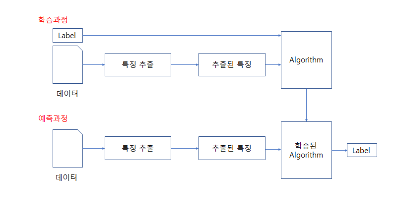
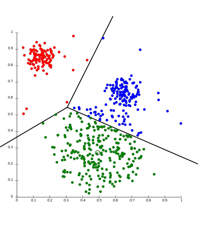

# 자연어 처리 개요 - 02 텍스트 분류

텍스트 분류(Text Classification)는 자연어 처리 문제중 대표적이고 많이 접하는 문제다. 자연어 처리 기술을 활용해 특정 텍스트를 사람들이 정한 몇 가지 범주(Class) 중 어느 범주에 속하는지 분류하는 문제다. 분류해야 할 범주(Label)이 두가지인 경우 이진 분류(Binary Classification) 문제, 3가지 이상의 범주(Label)에 대해 분류하는 경우는 다중 범주 분류(Multi Class Classification) 문제라 한다.

※  범주는 Label이라고도 하고 Class라고도 하더라 앞으로 레이블이나 클래스라는 단어로 사용시 대충 문맥에 따라 그렇구나 하면서 이해하면 된다.

- 텍스트 분류의 예시

1. 스팸 분류

    말 그대로 스팸 메일을 분류하는 문제이다. 여기서 분류해야 할 범주는 스팸 메일과 일반 메일로 레이블이 2가지 이다.  즉, 이진 분류에 속한다.

2. 감정 분류 | (우리가 해야할 거다. 감성 분석이라는 말로도 표현이 되는데 뭐가 맞는진 모르겠다.)

    주어진 글에 대해 이 글이 긍정직인지 부정적인지 판단하는 문제이다. 이 경우 범주는 긍정 혹은 부정이 된다. 경우에 따라 긍정 부정만이 아니라 중립의 범주가 추가될 수도 있고, 긍정 혹은 부정의 경우에도 정도에 따라 범주를 세분화 할 수 있다. 문제에서 분류하려는 의도에 따라 범주가 정해지는 것이다. 

    가장 대표적인 문제가 영화 리뷰에 대해 각 리뷰가 긍정적인지, 부정적인지  판단하는 문제이다.

3. 뉴스 기사 분류

    인터넷에는 수많은 뉴스가 존재하는데, 사용자 입장에서는 어떤 뉴스를 봐야할 지 선택하기도 힘들다.  따라서 뉴스 업체는 사용자가 원하는 뉴스를 선택해서 볼 수 있게 범주를 잘 분류해야 할 것이다. 스포츠, 경제, 사회, 연예 등 다양한 주제의 기사를 각각 주제에 맞게 분류해서 준비해둬야 한다. 자연어 처리 기술을 사용한다면 뉴스 기사를 더욱 효율적으로 분류할 수 있다.

4. 기타

    텍스트 분류에는 이 외에도 다른 다양한 문제들이 있다. 품사 분류 와 같은 것들이 그 예시가 될 것이다.

- 지도 학습을 통한 텍스트 분류

    지도 학습을 통해 문장분류를 하는 전체적인 그림은 다음과 같다. 알고리즘은 우리의 목표에 맞게 인공지능을 학습시키는 역할을 한다. 또한 예측 과정은 우리가 학습을 시킨 인공지능을 직접 사용해 보는 과정이라고 할 수 있다.

물론, 알고 있겠지만, 지도학습은 글(데이터)에 대해 각각 속한 범주에 대한 값(라벨)이 이미 주어져 있다. 쉽게 설명하면 지도학습은 인공지능에게 학습시킬 데이터에 문제(글[데이터])와 정답(라벨 스펨인지아닌지, 긍정인지 부정인지 등)이 주어져있는 방식이다. 이해가 안되면 고민하지 말고 바로 다음 예시를 보자

스팸 분류 문제를 지도학습으로 해결한다고 생각해보자. 10000개의 메일 데이터가 있고, 이 메일 중 스팸 메일은 5000개, 일반 메일이 5000개 있다고 생각하자. 각 메일 데이터에는 해당 메일이 스팸인지 아닌지를 나타내는 라벨링된 값이 있다. (예를 들면 스팸이면 1, 아니면 0으로 나타낸 값) 이제 각 메일에서 특징을 뽑아내서 예측한 뒤 우리가 정답으로 넣은 데이터인 라벨링값과 맞는지 확인하면서 학습한다.  10000개의 메일을 모두 사용해서 학습한 뒤 이제 새로운 메일을 입력하면 우리가 학습시킨 모델을 통해 스팸 메일인지 아닌지 예측한다.

약간의 설명을 덧붙이면 보통 데이터가 10000개가 있다고 하면 무작위로 학습 데이터와 테스트 데이터로 나눈다.  학습데이터를 8000개, 테스트 데이터를 2000개로 지정을 하면 8000개의 데이터에 대해서만 학습을 시키고, 나머지 2000개의 테스트 데이터는 우리가 학습시킨 모델이 정말로 잘 학습되었는지 확인한다.

그런데 딥러닝 모델을 돌릴 때에 학습데이터를 다시 학습 데이터와 검증 데이터로 나누어 사용할 때가 있다. 만약 총 학습 데이터가 8000개이고, 이를 진짜 학습 시킬 데이터 6000개, 검증 데이터 2000개로 나누었다고 하면 실제로 학습되는 데이터는 6000개이고, 검증 데이터는 학습이 되는 와중에 계속 테스트를 실시하는 것이다. 

이와 같이 하는 이유는 우리가 딥러닝을 이용해 인공지능을 학습 시킬 때 우리가 가진 데이터를 한 번만 학습시키는게 아니라 여러번 학습시키는 경우가 많은데, 학습을 무조건 많이 시킨다고 정확도가 올라가는 것이 아니기 때문이다. 학습을 돌릴수록 정확도가 올라갔다가 어느 시점부터는 정확도가 떨어질 수도 있는데, 검증 데이터로 이 과정중에 계속 테스트를 해서 학습되는 중간중간의 데이터의 정확도를 알 수 있다면 이를 기준으로 학습을 중지시킬 수 있다. (검증 데이터로 평가한 정확도가 2번 연속 떨어지면 학습을 중단해! 와 같은 느낌이다.) 대충 이런게 있구나 하고 알아만 두자

아무튼 지도 학습을 통한 문장 분류 모델에는 다양한 종류가 있다. 대표적인 지도 학습의 예는 다음과 같다

- 나이브 베이즈 분류(Naive Bayes Classfier)
- 서포트 벡터 머신(Support Vector Machine)
- 신경망(Neural Network)
- 선형 분류(Linear Classifier)
- 로지스틱 분류(Logistic Classifier)
- 랜덤 포레스트(Random Forest)

이 밖에도 수많은 모델이 있다. 이 중에 정답이 있는건 아니므로 다양한 모델을 사용해보는 습관을 기르도록 하자.

- 비지도 학습을 통한 텍스트 분류

    이번에도 어느정도 알겠지만, 지도 학습에는 각 데이터가 어떤 범주의 데이터인지에 대한 값(라벨)을 이미 가지고 있었다면, 비지도 학습에서는 그렇지 않다. 데이터만 존재하고, 각 데이터는 범주로 미리 나눠져 있지 않다. 따라서 적당한 특성을 찾아내서 적당한 범주를 만들어 각 데이터를 나누는 것이 목표라 할 수 있다.

대표적인 비지도학습의 예인 k-평균 군집화(k-means clustering)을 예로 들어보자.

각 문장의 데이터는 다음과 같이 벡터화한 뒤에 좌표축에 표현된다. 이후 k-평균 군집화 모델을 사용해 데이터를 몇 개의 군집으로 나눈다.(몇 개의 그룹으로 나눈다.)

비지도 학습을 통한 분류는 어떤 특정한 분류가 있는 것이 아니라 데이터의 특성에 따라 비슷한 데이터끼리 묶어주는 개념이다. 위의 그림에서도 비슷하게 분포된 데이터끼리 같은 색을 가지고 있으며 이 분포를 보고 적당히 선을 그어 데이터들을 분류할 수 있다. 만약, 우리가 새로운 데이터를 예측하기 위해 새로운 데이터를 위의 좌표 평면에 나타내면 그어진 선을 통해 이 데이터가 어느 군집(그룹)에 속하는 지 예측할 수 있다.

비지도 학습을 통한 텍스트 분류는 텍스트 군집화라고도 불린다. 비지도 학습 모델은 다음과 같다.

- K-평균 군집화(K-means Clustering)
- 계층적 군집화(Hierarchical Clustering)

- 요약

    지도 학습과 비지도 학습 중 어떤 방법을 사용할지 결정하는데 가장 큰 기준은 데이터에 정답 라벨이 있냐 없냐이다. 있으면 지도 학습, 없으면 비지도 학습을 사용해 문제를 해결하면 된다. (아니면 일일이 정답라벨을 작성해주는 노동을 하던가...) 일반적인 분류의 경우 지도 학습을 사용하지만, 정확한 범주가 없고 단순히 군집화(그룹화) 만 할 경우 비지도 학습을 통해 데이터를 군집화 하면 된다.

이해가 안가면 댓글을 달던지 게시판을 하나 만들어서 질문을 하던지 갠톡을 하던지 검색을 하던지 하고싶은대로 하자.