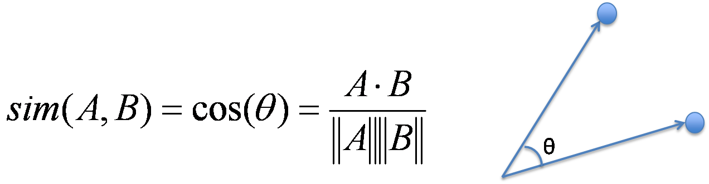
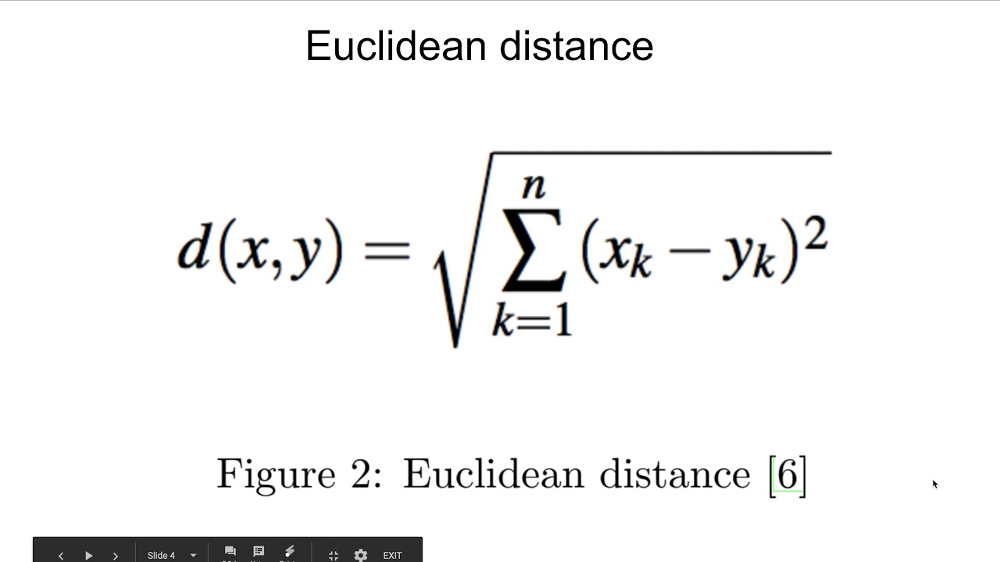

# 자연어 처리 개요 - 03 텍스트 유사도


- 이 노래 누가 만들었어?
- 지금 나오는 노래의 작곡가가 누구야?

위 두 문장은 같은 의미이지만 인공지능 스피커에게는 단순하게 다른 문장으로 인식될 것이다. 따라서 각기 다른 대답을 준비해야 하는데 효율성을 위해서는 비슷한 의미를 가진 문장에 대해서는 같은 대답을 준비할 수 있을 것이다. 이 때 문장이 유사한지 측정해야 하며 이 때 측정하는 방법이 텍스트 유사도(Text Similarity) 이다.

텍스트 유사도는 말 그대로 주어진 텍스트들이 얼마나 유사한 의미를 가지고 있는지 측정하는 것이다. 물론, 유사도를 판단하는 척도는 매우 주관적이기 때문에 데이터를 구성하기가 쉽지 않고 정량화 하는데 한계가 있다. 하지만 이를 최대한 정량화해서 모델을 만드는 것이 중요하다.

일반적으로 유사도를 측정하기 위해 정량화하는 방법에는 여러 가지가 있다. 단순히 다른 단어의 개수를 사용해서 유사도를 판단하는 방법, 형태소로 나누어 형태소로 비교하는 방법, 자소 단위로 나누어 단어를 비교하는 방법 등 다양한 방법이 있다. 우리는 그 중에서도 딥러닝을 기반으로 텍스트의 유사도를 측정하는 방식을 주로 다룰 것이다. 단어, 형태소, 유사도의 종류에 관계 없이, 텍스트를 벡터화한 후 벡터화된 각 문장간의 유사도를 측정하는 방식이다. 그리고 자주 쓰이는 유사도는 총 4가지 이다.

- 자카드 유사도
- 유클리디언 유사도
- 코사인 유사도
- 맨하탄 유사도

우선 위의 유사도들을 알아보기 전에 TF-IDF에 대해 알아보자. 위의 유사도에서도 요긴하게 쓰이고, 앞으로도 종종 나올 것이다.

- TF-IDF

    TF-IDF는 특정한 값을 사용해서 텍스트 데이터의 특징을 추출하는 방법이다. 각 값이 의미하는 바를 설명하자면 TF(Term Frequency)란 특정 단어가 하나의 데이터 안에서 등장하는 횟수를 말한다. 그리고 DF(Document Frequency)는 문서 빈도 값으로, 특정 단어가 여러 데이터에 자주 등장하는지를 알려주는 지표다. IDF(Inverse Document Frequency)는  DF의 값에 역수를 취하여 구할 수 있으며, 특정 단어가 다른 데이터에 등장하지 않을수록 값이 커진다. TF-IDF는 이 두값을 곱해서 사용하므로 어떤 단어가 해당 문서에 자주 등장하지만, 다른 문서에는 많이 없는 단어일수록 높은 값을 가지게 된다. 예를 들면 조사같은 경우는 자주 등장하므로 TF값이 크지만 다른 문서에도 많이 나타나기에 IDF값이 작아져서 TF-IDF값이 작게 유지된다.

    TF-IDF는 사이킷런을 이용하여 사용 할 수 있는데, 아래 코드를 실행해보고 사이킷런이 설치되어 있지 않다면 pip install sklearn을 anaconda prompt에 입력하여 다운로드 받자.

    ```python
    from sklearn.feature_extraction.text import TfidfVectorizer
    #TF-IDF 사용하기 위해 sklearn에서 TfidfVectorizer를 부름

    text_data = ['나는 배가 고프다', '내일 점심 뭐먹지',
    			 '내일 공부 해야겠다', '점심 먹고 공부 해야지']
    #임의의 예시 텍스트이다.

    tfidf_vectorizer = TfidfVectorizer()
    #변수를 만들어서 TfidfVectorizer의 객체를 생성해준다.
    #TF-IDF를 사용할 때는 '단어 사전'을 만들어야 한다.
    #단어 사전을 만든 후 단어 사전의 목록을 출력하고, 해당 데이터의 한 문장만 개체에 적용해
    #벡터로 바뀐값도 출력해보자.

    tfidf_vectorizer.fit(text_data)
    #텍스트 데이터를 tfidf를 이용하여 계산한다.
    print(tfidf_vectorizer.vocabulary_)
    #단어사전을 출력한다.

    sentence = [text_data[3]] #내일 점심 먹고 공부해야지
    #임의의 문장 하나를 선택했다.
    print(tfidf_vectorizer.transform(sentence).toarray())
    #우리가 선택한 문장이 tfidf값을 통해 변환된 벡터가 출력된다.
    ```

    위의 코드를 실행하게 되면 단어사전과 TF-IDF값으로 변환된 벡터값이 출력된다. 단어 사전의 경우 해당 단어가 데이터에서 몇 번 나왔는가를 정리해 놓은 것으로 생각하면 된다. 솔직히 나도 잘 모르겠다. 단어사전은...

    아래 코드 역시 TF-IDF를 이용하는 것인데, 뒤에 코드에 써먹으니 TF-IDF를 다시 한 번 확인한다고 생각하고 작성해보자.

    ```python
    # tfidf함수 임포트하는건 생략!
    sent = ("휴일 인 오늘 도 서쪽 을 중심 으로 폭염 이 이어졌는데요, 내일 은 반가운 비 소식 이 있습니다.",
    				"폭염 을 피해서 휴일 에 놀러왔다가 갑작스런 비 로 인해 망연자실 하고 있습니다.")
    #띄어쓰기가 이런거는 토큰화와 관련있어 보인다. (뇌피셜임)
    #각 문장을 벡터화 하기전에 단어 단위로 잘라주는 작업인 토큰화 작업이 필요한데
    #여기서는 임의로 단어 별로 띄어쓰기를 함으로써 토큰화가 된 문장들을 입력했다.
    #참고로 토큰화를 해주는 메소드를 토크나이저라고 한다. (정확하진 않은데 대충 그런 의미...)
    tfidf_vectorizer = TfidfVectorizer()
    tfidf_matrix = tfidf_vectorizer.fit_transform(sent) #sent에 있는 문장 벡터화

    idf = tfidf_vectorizer.idf_
    print(dict(zip(tfidf_vectorizer.get_feature_names(), idf))) #각 수치에 대한 값 시각화
    ```

    앞서 설명한 유사도를 구하는 4가지 방법 중 2가지만 알아보도록 하자. 나머지는 만약 필요하면 그 때 알아보자.

    - 코사인 유사도

        먼저 코사인 유사도에 대해 알아보면 코사인 유사도는 두 개의 벡터값에서 코사인 각도를 구하는 방법이다. 코사인 유사도 값은 -1과 1 사이의 값을 가지고 1에 가까울수록 유사하다는 것을 의미한다. 다른 유사도 접근법에 비해 일반적으로 성능이 좋은 편에 속한다. 

        

        위 그림이 코사인 유사도를 구하는 공식이다. 고등학생때 본 두 벡터 사이의 각을 구하는 식이랑 똑같다. 앞서 TF-IDF로 벡터화한 문장을 사용해 코사인 유사도를 구하는 코드는 다음과 같다. 코사인 유사도의 경우 직접 함수를 구현할 필요는 없고, 사이킷런에서 제공하는 함수를 이용하면 된다.

        ```python
        from sklearn.metrics.pairwise import cosine_similarity

        cosine_similarity(tfidf_matrix[0:1], tfidf_matrix[1:2])
        ```

        위와 같이 입력하면 결과값으로 array([[0.113]])이 출력된다. 함수의 인자값 두 개는 각 문장을 벡터화한 행렬이 들어간다. 즉, 비교하고자 하는 문장 두 개가 각각 벡터화된 채로 입력되면 그 문장들의 유사도가 출력된다.

    - 유클리디언 유사도

        유클리디언 유사도는 가장 기본적인 거리를 측정하는 유사도 공식이며, 우리가 흔히 생각하는 좌표 공간에서 거리를 계산하는 방법과 같다.

        

        위 식으로 구할수 있으며 n차원 공간에서 두 점 사이의 최단 거리를 구하는 접근법이다. 보자마자 알테니 바로 코드로 구현해보자. 마찬가지로 사이킷런에서 제공하는 함수를 이용하면 된다.

        ```python
        from sklearn.metrics.pairwise import euclidean_distances

        euclidean_distance(tfidf_metrix[0:1], tfidf_metrix[1:2])
        ```

        결과값으로는 array([[1.331]])이 출력된다. 입력해야 할 값과 출력값은 코사인 유사도와 동일하다. 그리고 유클리디안 유사도는 단순 거리를 의미하기에 최대값이 없고 계속해서 값이 커질 수 있다. 이러한 제한이 없는 유사도 값은 사용하기가 어렵기 때문에 값을 제한해야 한다. 간단하게 0과 1 사이의 값을 가지도록 만들어 보자.

        방법은 다음과 같다. 이해가 안될 수 있는데 당연한거니까 대충 읽고 넘어가자. 앞서 문장을 벡터화했는데, 이 벡터를 일반화(Nomalize)한 후 다시 유클리디언 유사도를 측정하면 0과 1 사이의 값을 가지게 된다. 일반화 방법 중 L1 정규화 방법을 사용할 건데, 각 벡터 안의 요소 값을 모두 다한 것의 크기가 1이 되도록 벡터의 크기를 조절하는 방법이다. 즉, 벡터의 모든 값을 더한 뒤 이 값으로 각 벡터의 값을 나누면 된다. L1 정규화를 새로운 함수로 정의하고 다시 유클리디안 유사도를 측정해보자. (L1 정규화 함수도 어디 있을텐데...)

        ```python
        import numpy as np

        def l1_nomalize(v) :
        	norm = np.sum(v)
        	return v / norm

        tfidf_norm_l1 = l1_normalize(tfidf_matrix)
        euclidean_distance(tfidf_norm_l1[0:1], tfidf_norm_l1[1:2])
        ```

        결과값으로 array([[0.212]])가 출력된다. 코드에 주석을 달 수도 있었지만 안달아도 이해할거 같아서 안달았다. 모르면 앞뒤 천천히 보고, 그래도 모르면 알려줄게.

        글을 올릴때 본문에 적어놓겠지만 우리가 하려는 텍스트 분류에 (우리가 하려는게 왜 텍스트 분류인지 모르면 2번째 글을 다시 읽어보자.) 지금 배운 텍스트 유사도가 들어가는 지, 필요한건지는 잘 모르겠다. 내용이 어렵거나 하지 않고 간단해서 적어봤으니 대충 하고 넘어가자. 책에는 그 뒤로도 

        자연어 생성과 (혼자 기사를 쓴다거나 문장을 요약한다거나 뭐 그런 인공지능이 글쓰는 느낌) 

        기계 이해는 (기계가 어떤 텍스트에 대해 정보를 학습하고 질문을 던지면 대답할 수 있게 이해 시키는 것. 간단한 비문학 문제를 푸는 느낌이다.)

        쓸데없고 어려운거 같아서 뺐는데 궁금하면 나중에 해보던가 하자. 이제부터는 코드가 더 많이 늘어날 것 같다.