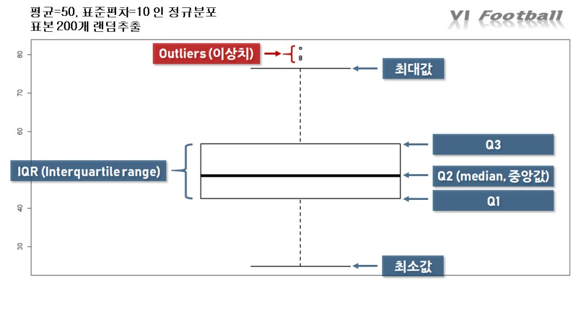

# 자연어 처리 개요 - 04 데이터 이해하기


다음 글부터는 본격적으로 모델링을 해보는 과정을 해 볼 것이다. 처음에 우리의 목적에 맞게 모델을 만들고, 훈련 후에 성능을 평가하고, 생각보다 성능이 나오지 않는다면 모델에 문제가 있다고 판단하여 다른 모델을 사용한다. 이처럼 모델에 문제가 있는 경우도 있지만, 우선적으로 해당 문제를 잘 해결하기 위해서는 데이터 이해가 선행되어야 한다. 이러한 과정을 탐색적 데이터 분석(EDA : Exploratory Data Analysis)이라고 한다. 이러한 과정에서 생각하지 못한 데이터의 여러 패턴이나 잠재적인 문제점 등을 발견할 수 있다.

또한 모델에 문제가 없더라도 데이터마다 적합한 무델이 있는데, 해당 모델과 데이터가 잘 맞지 않으면 좋은 결과를 얻을 수 없다. 즉, 아무리 좋은 모델이더라도 데이터와 궁합이 맞지 않는 모델이라면 여러 가지 문제에 직면하게 될 것이다.

그렇다면 탐색적 데이터 분색은 어떻게 진행될까? 간단하게 이야기하면 정해진 틀 없이 데이터에 대해 최대한 많은 정보를 뽑아내면 된다. 데이터에 대한 정보란 데이터의 평균값, 중앙값, 최솟값, 최댓값, 범위, 분포, 이상치 등이 있다. 이러한 값들을 확인하고 히스토그램, 그래프 등의 다양한 방법으로 시각화하면서 데이터에 대한 직관을 얻어야 한다.

데이터를 분석할 때는 분석가의 선입견을 철저히 배제하고 데이터가 보여주는 수치만으로 분석을 진행하여아 한다. 그리고 이러한 데이터 분석 과정은 모델링 과정과 서로 상호작용하면서 결과적으로 성능에 영향을 주기 때문에 매우 중요하다.

간단한 실습을 통해 데이터 분석에 대해 자세히 알아보자. 실습에 이용한 데이터는 영화 리뷰 데이터로, 리뷰와 그 리뷰에 해당하는 감정(긍정, 부정)값을 가지고 있다. 우선 실습에 사용할 라이브러리들을 불러온 후에 데이터를 설치하자. (실행과정이 매우 오래걸린다.)

```python
import os
import re
import numpy as np
import pandas as pd
import matplotlib.pyplot as plt
import tensorflow as tf
from tensorflow.keras import utils

data_set = tf.keras.utils.get_file(
      fname="imdb.tar.gz", 
      origin="http://ai.stanford.edu/~amaas/data/sentiment/aclImdb_v1.tar.gz", 
      extract=True)

def directory_data(directory):
    data = {}
    data["review"] = []
    for file_path in os.listdir(directory):
        with open(os.path.join(directory, file_path), "r", encoding='utf-8') as file:
            data["review"].append(file.read())
            
    return pd.DataFrame.from_dict(data)

def data(directory) :
    pos_df = directory_data(os.path.join(directory, "pos"))
    neg_df = directory_data(os.path.join(directory, "neg"))
    pos_df["sentiment"] = 1
    neg_df["sentiment"] = 0
    
    return pd.concat([pos_df, neg_df])

train_df = data(os.path.join(os.path.dirname(data_set), "aclImdb", "train"))
test_df = data(os.path.join(os.path.dirname(data_set), "aclImdb", "test"))
```

위의 코드를 실행하면 train_df와 test_df에 각각 훈련 데이터와 테스트 데이터가 저장된다. 코드에 대한 설명은 솔직히 나도 잘 모르고 (os라이브러리 모름..) 지금으로 크게 중요하지도 않고 책에도 안써있고 해서 넘기도록 하자. 그냥 데이터가 저장되었다! 정도로 이해하고 넘어가자. 아무튼 이런식으로 판다스를 이용해 데이터를 저장한다. train_df.head()를 입력해서 첫 5줄의 데이터를 볼 수 있다. 또, 긍정은 1, 부정은 0으로 저장했다.

이제 우리가 저장한 데이터가 어떤 특징을 가지고 있는지 알아보자. 그 전에 아래 코드처럼 리스트를 생성하는 법을 모른다면 딥러닝 교과서 398페이지를 보도록 하자. 어느 정도 이해가 될 것이다. 이해 안되면 알려줌

```python
#리뷰들만 담는 변수에 리뷰들을 리스트 형태로 저장. 편하게 다루기 위함이다.
reviews = list(train_df['review'])

#리뷰들은 모두 문장으로 되어있다. train_df.head()를 봐서 알겠지만...
#그래서 우리가 이것을 단어단위로 잘라주는 토큰화 작업을 해야한다.
#이것을 도와주는 토크나이저라고 불리우는 메소드들이 있지만 시간이 은근 좀 걸리는 편이다.
#그래서 여기서는 단순히 공백을 기준으로 단어를 구분하였다.
#예를 들면, '이제 우리가 저장한 데이터가 어떤 특징을 가지고 잇는지 알아보자'는 9단어이다.
#공백이 8개이니까
#아무튼 그렇게 해서 tokenized_reviews에 리스트 형태로 저장했다.
tokenized_reviews = [r.split() for r in reviews]
#split()은 공백을 기준으로 문자열을 잘라준다.
#만약 text='이제 우리가 저장한 데이터가 어떤 특징을 가지고 잇는지 알아보자'이고,
#text.split()을 하면 결과물은
#['이제', '우라기', '저장한', ... , '알아보자']와 같이 "리스트 형태"로 출력된다.
#따라서 위 코드는 각 문장을 split한 결과들이 리스트에 담기므로 리스트 안에 리스트들이 있는
#형태로 생각하면 된다.

#토크나이징을 한 리스트들에 대한 길이를 저장한다.
review_len_by_token = [len(t) for t in tokenized_reviews]

#공백을 제외한 리뷰들의 길이를 저장한다.(알파벳 수와 같다.)
review_len_by_eumjeol = [len(s.replace(' ', '') for s in reviews]
#replace()는 문자열에 사용하는 메소드로 문자열에 첫번째 입력값이 있다면
#이 부분을 두번째 입력값으로 바꿔준다.
#만약 text='이제 우리가 저장한 데이터가 어떤 특징을 가지고 잇는지 알아보자'이고,
#text.replace(' ', '')을 하면
#'이제우리가저장한데이터가어떤특징을가지고잇는지알아보자'가 된다.
#text.replace('우리가', '너가')를 하면
#'이제 너가 저장한 데이터가 어떤 특징을 가지고 있는지 알아보자'가 된다.
```

히스토그램을 통해 문장을 구성하는 단어의 개수와 알파벳의 개수를 알아볼 수 있다. 히스토그램은 데이터 안에서 빈도수를 나타내주는 그래프임을 기억하자.

```python
# 그래프에 대한 이미지 사이즈 선언
# figsize: (가로, 세로) 형태의 튜플로 입력
plt.figure(figsize=(12, 5))
# 히스토그램 선언
# bins: 히스토그램 값들에 대한 버켓 범위
# range: x축 값의 범위
# alpha: 그래프 색상 투명도
# color: 그래프 색상
# label: 그래프에 대한 라벨
plt.hist(review_len_by_token, bins=50, alpha=0.5, color= 'r', label='word')
plt.hist(review_len_by_eumjeol, bins=50, alpha=0.5, color='b', label='alphabet')
plt.yscale('log', nonposy='clip')
# 그래프 제목
plt.title('Review Length Histogram')
# 그래프 x 축 라벨
plt.xlabel('Review Length')
# 그래프 y 축 라벨
plt.ylabel('Number of Reviews')
plt.show()
```

위 그림은 importmatplotlib.pyplot as plt 를 이용한 것이다.

plt.hist()는 히스토그램을 그려준다.  필수 입력값으로 우리가 빈도수를 보고자 하는 데이터 값을 넣어주면 된다. plt.yscale은 y축의 범위를 어떻게 할 것인지, plt.xlabel, plt.ylabel은 각 축의 이름을 지정할 수 있고, plt.title은 그래프의 제목이다. 또 plt.hist에 들어가는 다른 인자들은 그래프를 꾸미는 용도로 그 의미는 주석에 달려있다.

아무튼 결과로 나온 그래프를 보면, 빨간색 히스토그램은 단어 개수에 대한 것이고, 파란색은 알파벳 개수에 대한 히스토그램이다. 알파벳이 10000개를 넘는 문장들보다 2000개인 문장들이 훨씬 많구나, 뭐 이런식으로 보면 된다. 대부분의 문장들은 단어 길이가 200개를 넘지 않는구나, 대부분의 문장들은 알파벳이 8000개를 넘지 않는구나 하는 점들은 나중에 모델링을 하기 전에 필요한 고찰 중 하나이다. 이를 정확히 수치화해서, 또 그래프를 통해 볼 수 있다. 아래 코드는 문장의 길이에 대해서 수치화한 것이다.

```python
print('문장 최대길이: {}'.format(np.max(review_len_by_token)))
print('문장 최소길이: {}'.format(np.min(review_len_by_token)))
print('문장 평균길이: {:.2f}'.format(np.mean(review_len_by_token)))
print('문장 길이 표준편차: {:.2f}'.format(np.std(review_len_by_token)))
print('문장 중간길이: {}'.format(np.median(review_len_by_token)))
# 사분위의 대한 경우는 0~100 스케일로 되어있음
print('제 1 사분위 길이: {}'.format(np.percentile(review_len_by_token, 25)))
print('제 3 사분위 길이: {}'.format(np.percentile(review_len_by_token, 75)))
```

제 1 사분위는 데이터를 오름차순으로 나열했을 때 아래에서 25퍼센트 지점이다. 제 3 사분위는 75퍼센트 지점이고, 제 2 사분위는 중간값이다.  위 코드를 통해 데이터(문장)들의 길이에 대한 수치들을 확인 할 수 있다.  또, 박스 플롯을 이용해 그래프를 그리면 보다 직관적으로 데이터를 관찰할 수 있다.



위 그림이 박스플롯과 그에대한 설명인데, Q1, Q2, Q3은 각각 제 1 사분위, 제 2 사분위, 제 3 사분위를 뜻한다. Q1과 Q3사이를 IQR이라 하고, 데이터의 50퍼센트가 포함한다. 위 그림에서 최대값과 최소값은 데이터의 최대 최소가 아닌 "이상치를 제외한 최대 최소값"이다. 헷갈리지 말자. 즉 그림에서의 최대 최소값이라서 화살표된 선을 벗어난 점들은 이상치를 나타내며 말그대로 이상한 값들이다. (좀 의심되는 애들) 아무튼 파이썬으로도 위의 박스플롯을 그릴 수 있다.

우리가 살펴보고 있는 문장들의 길이에 대해서 박스플롯을 그려보자. 문장에 속한 단어들의 개수, 문장에 속한 알파벳의 개수에 대해 각각 그려볼 것이다.

```python
plt.figure(figsize=(12, 5))
# 박스플롯 생성
# 첫번째 파라메터: 여러 분포에 대한 데이터 리스트를 입력
# labels: 입력한 데이터에 대한 라벨
# showmeans: 평균값을 마크함

plt.boxplot([review_len_by_token],
             labels=['token'],
             showmeans=True)
plt.show()
#-------------- 이 부분을 기준으로 위와 아래를 다른 칸(?)에 따로 실행시키자.
#동시출력 하는거도 아마 되는지 모르겠는데 되게하려면 뭐 또 찾아봐야되는데 귀찮다...
plt.figure(figsize=(12, 5))
plt.boxplot([review_len_by_eumjeol],
             labels=['Eumjeol'], 
             showmeans=True)
plt.show()
```

위 코드를 실행하면 이상치가 유독 많은 것을 확인할 수있다. 이상치가 심하면 데이터의 범위가 너무 넓어져서 학습이 효율적으로 이루어지지 않는다. 

다음은 워드클라우드로 데이터를 시각화해보는 것이다. 워드클라우드를 사용하면 데이터에 포함된 단어의 등장 횟수에 따라 단어의 크기가 커진다. 이를 위해 주피터 노트북에서 해도 되고, 아니면 cmd창에 pip install wordcloud를 쳐야한다.

```python
from wordcloud import WordCloud, STOPWORDS
import matplotlib.pyplot as plt
%matplotlib inline

wordcloud = WordCloud(stopwords = STOPWORDS, background_color = 'black', width = 800, height = 600).generate(' '.join(train_df['review']))

plt.figure(figsize = (15, 10))
plt.imshow(wordcloud)
plt.axis("off")
plt.show()
```

결과 중에 br이 상당히 크게 보이는데, 이는 <br>과 같은 HTML에서 사용하는 태그들이 많이 포함되어 있기 때문이다. (웹을 구성하는 문서에서 엔터를 담당하는 역할) 이러한 경우는 학습할 때 도움이 아니라 오히려 방해가 될 수 있는 부분이니 이와 같은 쓸데없는 단어들은 제거해주어야 한다.  이와 관련해서는 다음에 다시한번 다루도록 하자. 이 과정을 stopword 제거, 불용어 제거 등으로 부를 수 있다.

진짜 마지막으로 각 데이터중에서 긍정과 부정이 서로 어느정도 비율로 분포해있는지 확인해보자. 학습을 할 때 긍정과 부정이 균등하게 들어가 있는 것은 중요하다. 만약 한쪽이 너무 높다면 인공지능은 대부분의 데이터는 긍정이다, 혹은 부정이다 라고 생각할 것이기 때문이다.

```python
import seaborn as sns
import matplotlib.pyplot as plt

sentiment = train_df['sentiment'].value_counts()
fig, axe = plt.subplots(ncols=1)
fig.set_size_inches(6, 3)
sns.countplot(train_df['sentiment'])
```

seaborn은 솔직히 나도 잘 사용못하고 plt가 있는데 왜쓰는지 잘은 모르겠지만, 그냥 그렇구나 하면서 대충 보자... 아무튼 위 데이터의 경우 긍정과 부정의 데이터 개수가 거의 비슷한 것을 알 수 있다. 

앞으로 직접 텍스트 분류를 해보자. 뭔가 이번에는 문서가 되게 긴 느낌인데 좀 그렇다. 아무튼 화이팅