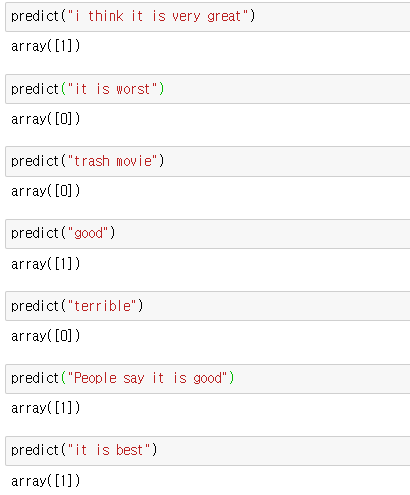
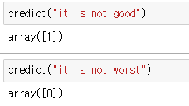

# 영어 텍스트 분류 - 02 TF-IDF를 활용한 모델 구현

Created: 2020년 12월 2일 오후 7:41

이전에 데이터를 모델에 적용하기 전에 데이터에 대해 이해하는 EDA(탐색적 데이터 분석) 과정과 데이터를 효과적으로 모델에 적용하기 위해 데이터를 정제하는 과정인 데이터 전처리 과정을 진행했다. 이번에는 앞의 결과를 통해 나온 전처리된 데이터를 직접 모델에 적용하고 주어진 텍스트에 대해 감정이 긍정인지 부정인지 예측할 수 있는 모델을 만들어 보자. 그런데 하나의 모델이 아닌 여러가지 모델을 만들어 비교해 볼 것이다. 우선 이번에는 TF-IDF를 활용한 모델을 구현해보자.

- 데이터 불러오기 및 필요 라이브러리 임포트

    ```python
    import os
    import re
    import nltk
    from nltk.corpus import stopwords

    import pandas as pd
    import numpy as np

    from bs4 import BeautifulSoup
    from sklearn.feature_extraction.text import TfidfVectorizer
    from sklearn.model_selection import train_test_split
    from sklearn.linear_model import LogisticRegression
    ```

    ```python
    DATA_IN_PATH = './'
    TRAIN_CLEAN_DATA = 'train_clean.csv'

    train_data = pd.read_csv(DATA_IN_PATH + TRAIN_CLEAN_DATA)
    train_data
    ```

    데이터들을 train_data에 데이터프레임 형태로 저장했다.

    ```python
    reviews = list(train_data['review'])
    sentiments = list(train_data['sentiment'])
    ```

    데이터프레임의 리뷰 컬럼과 감정 컬럼을 따로따로 리스트 형태로 만들어 각 변수에 저장했다.

    ```python
    vectorizer = TfidfVectorizer(min_df=0.0, analyzer="char", sublinear_tf=True, ngram_range=(1, 3), max_features=5000)
    X = vectorizer.fit_transform(reviews)
    print(X)
    ```

    vectorizer에 Tfidf벡터화를 진행하기 위해 TfidfVectorizer를 생성했다. 다음은 인자에 대한 설명인데, 이해가 되지 않으면 우선 넘어가자. min_df는 설정한 값보다 특정 토큰의 df값이 더 적게 나오면 벡터와 과정에서 제거한다는 의미다. df에 대한 설명은 앞의 글에서 설명한 TF-IDF에서 나와있다. analyzer는 char와 word의 두가지 옵션을 선택할 수 있는데, 'word'의 경우 단어 하나를 단위로, 'char'는 문자 하나를 단위로 하는 것이다. sublinear_tf는 문서의 단어 빈도 수에 대한 스무딩 여부를 설정하는 값이고, ngram_range는 빈도의 기본 단위를 어느 범위의 n-gram으로 할지, 마지막으로 max_features는 각 벡터의 최대 길이, 특징의 길이를 설정하는 것이다.

- 학습과 테스트 데이터 셋 분리

    ```python
    RANDOM_SEED = 42
    TEST_SPLIT = 0.2

    y = np.array(sentiments)

    X_train, X_test, y_train, y_test = train_test_split(X, y, test_size=TEST_SPLIT, random_state=RANDOM_SEED)
    ```

    우선 위 두줄은 알다시피 변수를 생성한것이고, 세번째 코드는 앞서 list형태로 저장된 sentiment를 np.array형태로 바꿔서 y형태로 저장해준 것이다. 마지막 줄은 훈련 데이터셋과 테스트 데이터 셋을 분리하는 과정이라 할 수 있다. train_test_split()은 자동으로 훈련데이터와 테스트 데이터를 분리해주는데, 수학문제로 치면, 첫번째 인자로는 '문제', 두번째 인자로는 '답'이 온다. 이는 필수적이다. test_size인자는 전체 데이터 중 테스트 데이터의 비율을 얼마나 할지에 대한 것이다. 위에서는 0.2로 설정했으니 훈련데이터는 80프로, 테스트 데이터는 20프로로 저장된다. 또 random_state는 필수가 아니지만, 같은 값으로 지정해두면 같은 결과가 나온다. 예를 들어 내 컴퓨터에서 42로 설정하고, 다른 사람 컴퓨터에서 42로 설정하고 진행하면 둘 다 같은 결과가 나온다.

    여기서 다시 침착하게 생각해 볼 부분이 있다. 여기서 훈련 데이터, 테스트 데이터로 나누었고 이렇게 나눈 데이터들이 실제 우리가 모델을 통해 훈련시키고 테스트할 값이다. 그렇다면 우리가 train_test_split()에 어떤 데이터가 결과적으로 들어갔는지 확인할 필요가 있는데, X값은 Tfidf로 변환된 값들이, y는 np.array() 1차원 형태의 값이 들어왔다. 우리가 모델을 학습시키고 우리가 원하는 문자에 대해 감정을 예측받으려면 우리가 입력하는 값들을 이 데이터들 처럼 똑같이 전처리해서 tfidf를 이용해 변환한 값들로 예측해야한다는 것이다. 모델링이 끝나면 이 과정도 해볼테니 어느정도 이해가 안되도 일단 넘어가자.

- 모델 선언 및 학습

    ```python
    lgs = LogisticRegression(class_weight='balanced')
    lgs.fit(X_train, y_train)
    ```

    lgs에 로지스틱 회귀 모델을 저장해였다. 그리고 두번째 코드는 학습시키는 코드로 첫번째 인자에 문제 데이터들, 두번째 인자에 정답 데이터들이 들어온다.

- 성능 평가

    ```python
    print("훈련 데이터 정확도 : %f" % lgs.score(X_train, y_train))
    print("테스트 데이터 정확도 : %f" % lgs.score(X_test, y_test))
    ```

    성능을 평가하는 지표는 매우 많지만 일단 가장 쉬운 정확도를 보자. 훈련데이터의 정확도는 88.5프로, 테스트 데이터에 대한 정확도는 86프로이다. 훈련 데이터에 대한 정확도는 인공지능이 자기가 공부한 곳에서 나온 문제를 풀었을 때의 정확도이고, 테스트 데이터에 대한 정확도는 실전에서 응용했을 때의 정확도라고 생각하면 쉽다. 그래서 만약 훈련 데이터가 너무 높고, 테스트 데이터가 점수가 너무 낮을 수도 있다. 인공지능이 특수한 케이스에만 맞춰져서 학습했다던가 적합하지 않은 모델 등의 이유로 배운 것에 대해서는 잘 예측하지만 실전에서 약한 것이다. 이런 경우를 '과적합'이라고 한다.

- 예측

    이제 우리가 만든 모델을 이용해 우리가 원하는 문자들을 입력해서 예측해보자. 사실 이 부분은 책에 없어서 직접 코드를 작성했다. 예측을 안해보면 모델을 뭐하러 만드나 싶어서 만들어봤다.

    ```python
    def preprocessing(review, remove_stopwords = False): 
        # 불용어 제거는 옵션으로 선택 가능하다.
        stopwords
        # 1. HTML 태그 제거
        review_text = BeautifulSoup(review, "html5lib").get_text()	

        # 2. 영어가 아닌 특수문자들을 공백(" ")으로 바꾸기
        review_text = re.sub("[^a-zA-Z]", " ", review_text)

        # 3. 대문자들을 소문자로 바꾸고 공백단위로 텍스트들 나눠서 리스트로 만든다.
        words = review_text.lower().split()

        if remove_stopwords: 
            # 4. 불용어들을 제거
        
            #영어에 관련된 불용어 불러오기
            stops = set(stopwords.words("english"))
            # 불용어가 아닌 단어들로 이루어진 새로운 리스트 생성
            words = [w for w in words if not w in stops]
            # 5. 단어 리스트를 공백을 넣어서 하나의 글로 합친다.	
            clean_review = ' '.join(words)

        else: # 불용어 제거하지 않을 때
            clean_review = ' '.join(words)

        return clean_review
    ```

    어디서 많이 봤다 싶겠지만 데이터를 전처리할 때 사용했던 함수이다. 새로운 데이터를 예측할 때에는 훈련 데이터에 해준 과정을 그대로 진행시킨 뒤 예측해야 한다.

    ```python
    def tfidf(review) :
        global vectorizer
        tfidf_review = vectorizer.transform(review)
        return tfidf_review
    ```

    리뷰를 tfidf로 변환시키는 함수이다. 전처리를 한 리뷰가 들어오면 tfidf로 변환된다.

    ```python
    def predict(review) :
        global lgs
        List = []
        clean_review = preprocessing(review, remove_stopwords=True)
        List.append(clean_review)
        tfidf_review = tfidf(List)
        return lgs.predict(tfidf_review)
    ```

    위 두 함수를 매번 사용하기도 귀찮으니 예측 과정을 모두 처리해주는 함수를 제작했다. 원래 함수 안에서 변수들은 함수 안에서만 사용 가능하고, 바깥에 있는 변수와 이름이 같아도 다른 변수로 인식되지만, global을 통해 변수를 선언하면 바깥에 있는 변수를 함수 내에서도 사용이 가능하다. 그렇게 lgs에 저장한 모델을 가져왔다. 그리고 빈 리스트를 정의하고, 다음으로 리뷰를 preprocessing 함수를 통과시켜서 이 결과를 clean_review에 저장했다. 이것을 List에 정의된 빈 리스트에 추가해주었다. 왜냐하면 tfidf함수에 clean_review를 넣어서 vectorizer.transform()을 할 때 리스트에 감싸진 형태로 입력되어야 하기 때문이다. 아무튼 그렇게 clean_review를 담은 List를 tfidf 함수에 통과시키면 tfidf_review변수에 저장된다. lgs.predict()는 우리가 학습시킨 모델을 바탕으로 새로운 입력값이 들어오면 결과가 어떨지 예측해서 반환해주는 역할을 한다. 즉, predict함수의 입력값은 review를 문자열 형태로 입력하고, 결과로 리뷰가 긍정인지 부정인지 출력된다. 사용해본 모습은 다음과 같다. 1이 긍정 0이 부정이다.

    

    이상한 결과도 나와서 학습이 잘못된건지 예측하는 코드를 알밪게 사용한긴 한건지는 모르겠다...

    