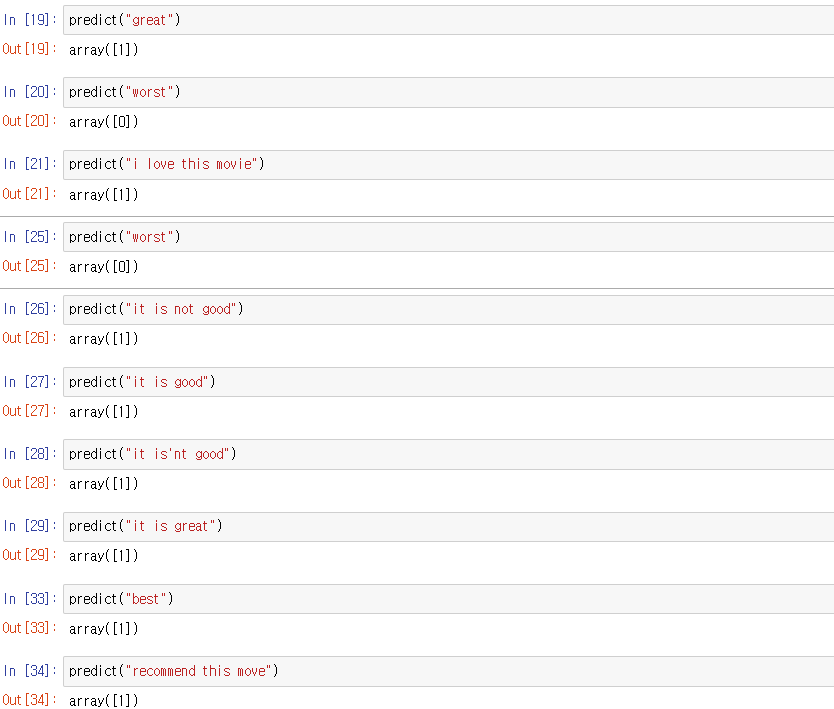

# 영어 텍스트 분류 - 03 word2vec을 이용한 모델 구현


- 필요한 라이브러리와 데이터 불러오기

    ```python
    import os
    import re

    import pandas as pd
    import numpy as np

    from bs4 import BeautifulSoup
    from nltk.corpus import stopwords
    from nltk.tokenize import word_tokenize
    ```

    ```python
    DATA_IN_PATH = './'
    TRAIN_CLEAN_DATA = 'train_clean.csv'

    train_data = pd.read_csv(DATA_IN_PATH + TRAIN_CLEAN_DATA)

    reviews = list(train_data['review'])
    sentiments = list(train_data['sentiment'])

    sentences = []
    for review in reviews :
        sentences.append(review.split())
    ```

    저번과 똑같은 방식으로 데이터를 불러왔는데, reviews를 다시 sentences에 저장했다. sentences는 [[],[],[],...,[]] 와 같은 2차원의 리스트가 된다.

    ```python
    pip install gensim
    ```

    gensim라이브러리를 설치하자.

    ```python
    import logging
    logging.basicConfig(format='%(asctime)s : %(levelname)s : %(message)s', level=logging.INFO)
    ```

    위 코드는 word2vec을 본격적으로 진행하기 전에 word2vec을 학습하는 과정에서 진행 상황을 확인해 보기 위한 코드이다.

- word2vec

    word2vec에 대한 설명은 제일 첫 문서 - 단어표현에 어느정도 설명이 되어있는 기법이다. 이를 구현해보자.

    ```python
    #학습 시 필요한 하이퍼파라미터
    num_features = 300 
    #워드 벡터 특징값 수 : 각 단어에 대해 임베딩된 벡터의 차원을 정한다.
    #단어 임베딩의 품질은 차원이 높을수록 향상됩니다. 그러나 어느 시점에 도달하면 한계 이득이 감소
    #벡터의 차원은 100과 1000 사이에서 설정된다
    min_word_count = 40
    #단어에 대한 최소 빈도 수 : 모델에 의미 있는 단어를 가지고 학습하기 위해 더 적은 빈도 수의 단어들은 학습하지 않는다.
    num_workers = 4
    #프로세스 개수 : 모델 학습 시 학습을 위한 프로세스 개수를 지정한다.
    context = 10
    #컨텍스트 윈도 크기 : word2vec을 수행하기 위한 컨텍스트 윈도 크기를 지정 (주어진 단어의 앞뒤 단어수 결정)
    downsampling = 1e-3
    #다운 샘플링 비율 : word2vec학습을 수행할 때 빠른 학슴을 위해 정답 단어 라벨에 대한 다운샘플링 비율을 지정한다. 
    #보통 0.001이 좋은 성능을 낸다고 한다.
    ```

    학습 시 필요한 인자값을 미리 변수에 저장해 둔 모습니다. 바로 아래 코드에 사용된다.

    ```python
    from gensim.models import word2vec
    print("Training model...")
    model = word2vec.Word2Vec(sentences,
                              workers=num_workers,
                              size=num_features,
                              min_count=min_word_count,
                              window=context,
                              sample=downsampling)
    ```

    word2vec모델을 model변수에 저장했다. 우리가 가진 리뷰 데이터들 sentences를 첫 인자로 넣어주었다. 그러면 이 sentences를 벡터화해서 반환된다.

    ```python
    model_name="300features_40minwords_10context"
    model.save(model_name)
    ```

    모델을 저장하는 방법이다. 우리가 사용한 모델을 model_name이라는 변수에 저장된 문자열을 이름으로 model.save()를 이용해 저장한다. 일단 대충이라도 이해가 안되면 바로 넘어가자.

    이제 만들어진 word2vec모델을 활용해 선형 회귀 모델을 학습해보자. (선형회귀 참고 : [https://blog.naver.com/hobbang143/221470838542](https://blog.naver.com/hobbang143/221470838542)) 지금은 word2vec 모델에서 각 단어가 벡터로 표현되어 있다. 우리가 word2vec을 통해 한 것은 sentences에 있는 수많은 문장들과 단어들 사이의 관계를 통해 어떠한 공식에 의해서 단어들끼리 의미를 가지는 벡터를 생성한 것이다.  그리고 이것이 단어사전에 저장되어 있다.(model.wv.index2word 코드로 확인할 수 있다.)우리가 이것을 활용하려면 이 단어들이 가진 벡터들을 참고해 각 리뷰들이 가지는 벡터를 만들어주어야 한다. 따라서 우리는 미리 0으로만 이루어진 벡터를 이미 만들어 놓고 리뷰하나가 들어오면 이 리뷰안에 있는 단어들이 단어사전안에 있다면 그 단어에 해당되는 벡터를 0으로만 이루어진 벡터에 더해주고 단어사전에 없다면 건너뛴다. 그리고 다음단어도 단어사전에 있는지 확인해서 있으면 앞선 벡터에 더해주고 없으면 건너뛴다.

    리뷰마다 단어의 개수가 모두 다르기 때문에 입력값을 하나의 형태(방식)로 통일시켜주어야 한다. 가장 단순한 방법으로는 문장에 있는 모든 단어의 벡터값에 대해 평균을 내서 리뷰 하나당 하나의 벡터로 만드는 방법이 있다. 따라서 여기서는 이 방법을 통해 입력값을 만든다.

    ```python
    def get_feature(words, model, num_features) :
    		#출력 벡터 초기화
        feature_vector = np.zeros((num_features), dtype=np.float32)
        
        num_words = 0
    		#어휘사전 준비
        index2word_set = set(model.wv.index2word)
        
        for w in words : #여기서 words는 리스트형태이다.
            if w in index2word_set :
                num_words += 1
    						#사전에 해당하는 단어에 대해 단어 벡터를 더함
                feature_vector = np.add(feature_vector, model[w])
                
        feature_vector = np.divide(feature_vector, num_words)
        return feature_vector
    ```

    하나의 벡터를 만드는 과정에서 속도를 빠르게 하기 위해 np.zeros를 이용해 미리 모두 0의 값을 가지는 벡터를 만든다. 그리고 문장의 단어가 해당 모델 단어사전에 속하는지 보기 위해 model.wv.index2word를 set 객체 (집합과 같은 성질) 로 생성해서 index2word_set변수에 할당한다. 다음 반복문을 통해 리뷰를 구성하는 단어에 대해 임베딩된 벡터가 있는 단어 벡터의 합을 구한다. 마지막으로 사용한 단어의 전체 개수를 나눔으로써 평균 벡터의 값을 구한다.

    ```python
    def get_dataset(reviews, model, num_features) :
        dataset = list()
        
        for s in reviews :
            dataset.append(get_feature(s, model, num_features))
        
        reviewFeatureVecs = np.stack(dataset)
        
        return reviewFeatureVecs
    ```

    앞에서 정의한 함수를 이용해 전체 리뷰에 대해 각 리뷰의 평균 벡터를 구하는 함수를 정의한 것이다.

    ```python
    test_data_vecs = get_dataset(sentences, model, num_features)
    ```

- 학습 데이터와 테스트 데이터의 분리

    ```python
    from sklearn.model_selection import train_test_split

    X = test_data_vecs
    y = np.array(sentiments)

    RANDOM_SEED = 42
    TEST_SPLIT = 0.2

    X_train, X_test, y_train, y_test = train_test_split(X, y, test_size=TEST_SPLIT, random_state=RANDOM_SEED)
    ```

    저번과 똑같은 내용이다.

- 모델 선언 및 학습

    ```python
    from sklearn.linear_model import LogisticRegression

    lgs = LogisticRegression(class_weight='balanced')
    lgs.fit(X_train, y_train)
    ```

    저번과 똑같이 로지스틱 회귀를 이용하였다.

- 평가

    ```python
    print("훈련 데이터 정확도 : %f" % lgs.score(X_train, y_train))
    print("테스트 데이터 정확도 : %f" % lgs.score(X_test, y_test))
    ```

- 예측

    ```python
    def preprocessing(review, remove_stopwords = False): 
        # 불용어 제거는 옵션으로 선택 가능하다.
        stopwords
        # 1. HTML 태그 제거
        review_text = BeautifulSoup(review, "html5lib").get_text()	

        # 2. 영어가 아닌 특수문자들을 공백(" ")으로 바꾸기
        review_text = re.sub("[^a-zA-Z]", " ", review_text)

        # 3. 대문자들을 소문자로 바꾸고 공백단위로 텍스트들 나눠서 리스트로 만든다.
        words = review_text.lower().split()

        if remove_stopwords: 
            # 4. 불용어들을 제거
        
            #영어에 관련된 불용어 불러오기
            stops = set(stopwords.words("english"))
            # 불용어가 아닌 단어들로 이루어진 새로운 리스트 생성
            words = [w for w in words if not w in stops]
            # 5. 단어 리스트를 공백을 넣어서 하나의 글로 합친다.	
            clean_review = ' '.join(words)

        else: # 불용어 제거하지 않을 때
            clean_review = ' '.join(words)

        return clean_review
    ```

    저번과 마찬가지로 예측하는 코드를 훈련데이터랑 똑같이 전처리하는 함수다.

    ```python
    def get_feature_predict(words, model, num_features) :
        feature_vector = np.zeros((num_features), dtype=np.float32)
        
        num_words = 0
        index2word_set = set(model.wv.index2word)
        for w in words.split() :
            if w in index2word_set :
                num_words += 1
                feature_vector = np.add(feature_vector, model.wv[w])
                
        feature_vector = np.divide(feature_vector, num_words)
        return feature_vector
    ```

    앞에있는 get_feature함수와 똑같은데 다른 점은 반복문이 words가 아닌, words.split()이다. 우리가 작성한 리뷰를 하나하나 넣어보면서 확인해볼 때 직관적으로 리스트 형태가 아닌 문자열 형태로 데이터를 넣게 되니 공백을 기준으로 split()으로 자르고 리스트 형태로 만들어주었다.

    ```python
    def predict(review) :
        global model, num_features
        clean_review = preprocessing(review, remove_stopwords=True)
        result = get_feature_predict(clean_review, model, num_features)
        List = []
        List.append(result)
        return lgs.predict(List)
    ```

    앞의 두 함수를 이용해 전체적인 예측함수를 만들었다. 예측함수를 만드는 과정도 저번과 같다. 훈련데이터가 변해온 것 처럼 전처리 → 벡터화 → 예측 이다. 단지, 저번과 다른 것은 저번에는 벡터화가 TF-IDF를 이용한 것이었고, 이번에는 word2vec을 이용했다는 것 뿐이다. 하나하나 이해하는 것도 중요하지만 전체적인 그림을 이해하는 것이 더 중요하다. 그리고 이번에도 'it is not good'을 긍정으로 해석하길래 왜그런가 했는데, 단어사전에 'not' 자체가 없어서 아예 임베딩과 예측에 반영되지가 않는다.

    

    1이 긍정 0이 부정