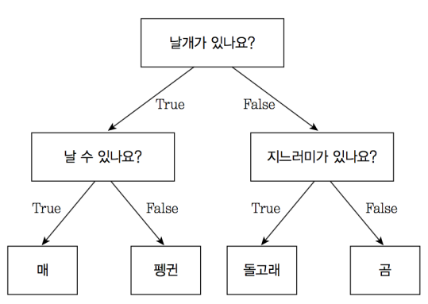

# 영어 텍스트 분류 - 04 랜덤 포레스트 분류 모델


이전 까지는 로지스틱 회귀 모델을 사용해 감정 분류 모델을 만들었다. 매우 간단한 모델임에도 80퍼센트 중후반대의 성능을 보였다. 이번에는 조금 더 복잡한 모델을 사용해 좀 더 좋은 결과를 만들어 보자. 여러 모델이 있지만, 그 중에서도 자주 사용되고 간단하게 사용할 수 있는 모델인 랜덤 포레스트 모델을 사용해보자.

- 랜덤 포레스트

    랜덤 포레스트는 머신러닝 모델 중 하나이다. 여러 개의 의사결정 트리의 결과값을 평균낸 것을 결과로 사용한다. 이를 통해 분류 혹은 회귀를 할 수 있으며 랜덤 포레스트에 대해 자세히 알아보기 이전에 의사결정 트리가 무엇인지 알아보자.

    

    의사결정 트리란 자료구조 중 하나인 트리 구조와 같은 형태로 이루어진 알고리즘이다. 위 그림과 같이 질문에 따라 다음 노드가 달라지며 몇개의 질문이 끝난 후에 결과가 나오는 형태로 쉽게 생각하면 스무고개와 비슷하다. 그림을 보며 이해하는 것이 빠르다. 실제 의사결정 트리의 경우 훨씬 많은 가지가 있고 많은 질문을 통해 결과가 나온다. 그렇다면 이제 랜덤 포레스트에 대해 알아보자. 랜덤 포레스트는 의사결정 트리를 한 가지가 아닌 여러 가지를 사용하여 과적합을 방지하는 방법이다. 위 그림을 예를 들면, 의사결정 트리구조가 하나일 때는 위 그림과 같지만, 랜덤 포레스트에서는 날 수 있는지에 대한 의사결정  트리 하나, 지느러미가 있는지에 대한 의사결정 트리 하나, 날개가 있는지에 대한 의사결정 트리 하나 등 3개로 나누어 사용한다. 3개보다 더 많을 수도 있고 더 적을 수도 있지만, 여러 개의 의사결정 트리를 사용한다는 것이 포인트라고 할 수 있다.

- CountVectorizer를 활용한 벡터화

    모델을 구현하기에 앞서 모델에 사용할 입력값을 정해야 한다. 이전 선형 회귀 모델(로지스틱 회귀)에서는 TF-IDF와 word2vec을 활용해서 벡터화한 데이터를 입력값으로 사용했다. 이번에는 또 다른 방법인 CountVectorizer를 사용해 모델의 입력값을 만든다.

    CountVectorizer는 이름에서도 확인할 수 있듯이 텍스트 데이터에서 횟수를 기준으로 특징을 추출하는 방법이다. 여기서 어떤 단위의 횟수를 셀 것인지는 선택 사항이다. 여기서 말하는 단위는 단어가 될 수도 있고, 문자 하나하나가 될 수도 있다. 보통은 텍스트에서 단어를 기준으로 횟수를 측정하는데, 문장을 입력으로 받아 단어의 횟수를 측정한 뒤 벡터로 만든다.

    CountVectorizer를 사용하려면 먼저 객체를 만들고, 이 객체에 특정 텍스트를 적합시켜야 한다. 여기서 말하는 적합의 의미는 횟수를 셀 단어의 목록을 만드는 과정이다. 우리가 TF-IDF와 word2vec을 사용할 때와 비슷하다. 그 다음 횟수를 기준으로 해당 텍스트를 벡터화 한다.

    예를 들어, '나는 매일 공부를 한다'라는 문장을 횟수값으로 이루어진 벡터를 나든다면, 우선 단어 사전을 정의해야 한다. 이 때 단어 사전이 '나는' '너가' '매일' '공부를' '한다' '좋아한다' 등의 6 단어로 이루어져 있다면 '나는 매일 공부를 한다' 문장은 [1, 0, 1, 1, 1, 0]으로 표현할 수 있다. 만약 '나는 매일 매일 공부를 한다' 라는 문장을 벡터화 한다면 [1, 0, 2, 1, 1, 0] 이라는 벡터가 될 것이다.

- 데이터 불러오기

    ```python
    import numpy as np
    import pandas as pd
    from nltk.corpus import stopwords
    from bs4 import BeautifulSoup
    import re
    ```

    ```python
    DATA_IN_PATH = './'
    TRAIN_CLEAN_DATA = 'train_clean.csv'

    train_data = pd.read_csv(DATA_IN_PATH + TRAIN_CLEAN_DATA)
    reviews = list(train_data['review'])
    y = np.array(train_data['sentiment'])
    ```

    앞에서와 같이 데이터를 불러왔다. 라이브러리를 임포트하는 부분 중 아래 3개는 나중에 예측을 할 때 필요한 부분이다.

- CountVectorizer로 벡터화하기

    ```python
    from sklearn.feature_extraction.text import CountVectorizer

    vectorizer = CountVectorizer(analyzer='word', max_features=5000)
    train_data_features = vectorizer.fit_transform(reviews)
    ```

    CountVectorizer는 TF-IDF와 사용법이 거의 비슷하다. 우선 import를 먼저 해주고, CountVectorizer객체를 불러온다. ()안에는 매개변수가 들어가는데, analyzer는 어떤 것을 기준으로 셀 것인지 단위를 정해준다. 우리는 단어를 기준으로 했고, max_features는 벡터의 차원 수를 정한다. 우리는 5000차원으로 정했다. 그리고 세번째 줄에서 fit_transform에 review를 넣어주어서 review에 있는 단어들로 countvector를 만들어 주었다. 이를 train_data_features로 저장했다.

    ```python
    train_data_features
    ```

    위와 같이 입력하고 실행하면 train_data_features가 25000x5000인 것을 알 수 있는데, 리뷰가 25000개여서 25000개의 리뷰들이 모두 벡터로 표현되었음을 알 수 있고, 이들이 각 5000차원임을 알 수 있다. 

- 학습 데이터와 테스트 데이터 나누기

    ```python
    from sklearn.model_selection import train_test_split

    TEST_SIZE = 0.2
    RANDOM_SEED = 42

    X_train, X_test, y_train, y_test = train_test_split(train_data_features, y, test_size=TEST_SIZE, random_state=RANDOM_SEED)
    ```

    우리가 만든 train_data_features가 X값으로 들어갔다. y값은 위에서 만든 sentiment값이 들어갔다.

- 랜덤 포레스트 모델 만들기

    ```python
    from sklearn.ensemble import RandomForestClassifier

    forest = RandomForestClassifier(n_estimators=100)
    forest.fit(X_train, y_train)
    ```

    랜덤 포레스트 객체를 만들고, 이를 .fit을 통해 훈련시켰다. 여기서 랜덤 포레스트 객체를 만들 때 n_estimators라는 매개변수가 있는데, 이는 의사결정 트리를 몇 개를 만들지 결정하는 변수이다. 우리는 100개로 설정하였다.

- 정확도 측정

    ```python
    print("Accuracy: %f" % forest.score(X_test, y_test))
    ```

    테스트 데이터로 정확도를 측정했다.

- 예측하기

    이번에도 예측을 해보는데, TF-IDF와 거의 과정이 같다. 약간 복습하는 느낌으로, 대강의 큰 순서를 기억하면서 해보자.

    ```python
    def preprocessing(review, remove_stopwords = False): 
        # 불용어 제거는 옵션으로 선택 가능하다.
        stopwords
        # 1. HTML 태그 제거
        review_text = BeautifulSoup(review, "html5lib").get_text()	

        # 2. 영어가 아닌 특수문자들을 공백(" ")으로 바꾸기
        review_text = re.sub("[^a-zA-Z]", " ", review_text)

        # 3. 대문자들을 소문자로 바꾸고 공백단위로 텍스트들 나눠서 리스트로 만든다.
        words = review_text.lower().split()

        if remove_stopwords: 
            # 4. 불용어들을 제거
        
            #영어에 관련된 불용어 불러오기
            stops = set(stopwords.words("english"))
            # 불용어가 아닌 단어들로 이루어진 새로운 리스트 생성
            words = [w for w in words if not w in stops]
            # 5. 단어 리스트를 공백을 넣어서 하나의 글로 합친다.	
            clean_review = ' '.join(words)

        else: # 불용어 제거하지 않을 때
            clean_review = ' '.join(words)

        return clean_review
    ```

    전처리를 해주는 함수이다.

    ```python
    def countvector(review) :
        global vectorizer
        return vectorizer.transform(review)
    ```

    리뷰를 countvector로 만들어 주는 함수이다.

    ```python
    def randomforest(countvector) :
        global forest
        return forest.predict(countvector)
    ```

    입력으로 countvector를 받고 이를 랜덤 포레스트를 통해 긍정인지 부정인지 예측하는 함수이다.

    ```python
    def predict(review) :
        clean_review = preprocessing(review, remove_stopwords=True)
        List = []
        List.append(clean_review)
        vector = countvector(List)
        return randomforest(vector)
    ```

    위의 세 함수를 이용해 한 번에 예측을 해주는 함수이다. 긍정이 1이고 부정이 0이다. TF-IDF를 했던 것과 비교하면 거의 과정의 동일한 것을 알 수 있다. 다른 것은 TF-IDF가 CountVectorizer로 바뀐 것과 로지스틱 회귀 모델이 랜덤 포레스트 모델로 바뀐 것 뿐이다. 다시 한 번 예측의 큰 과정을 보자. 예측의 큰 과정은 모델을 만들었던 과정과 크게 다르지 않다. 먼저 데이터를 전처리를 하고, 리뷰(데이터)를 벡터로 만든 후 만든 모델을 이용해서 예측을 하고 그 결과를 알려주는 것이다. 이 일련의 큰 과정을 이해해보도록 하자.

    