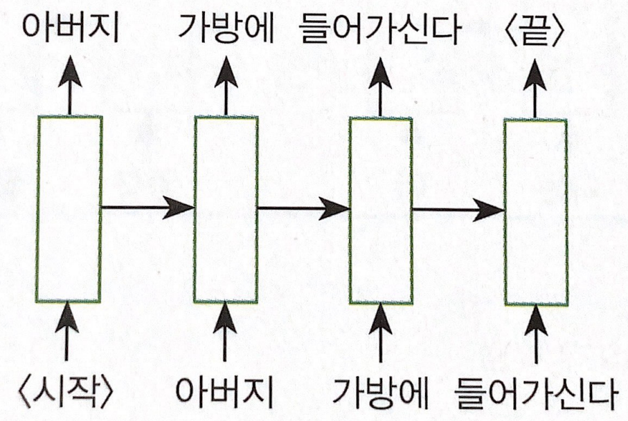
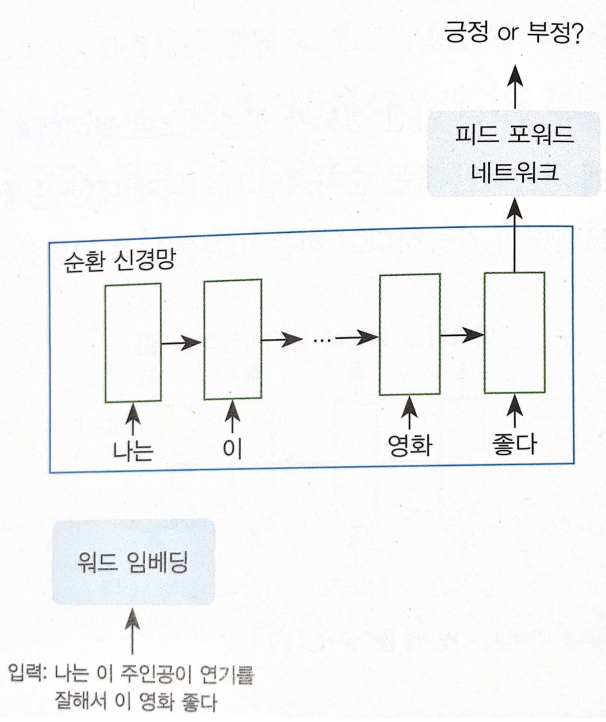
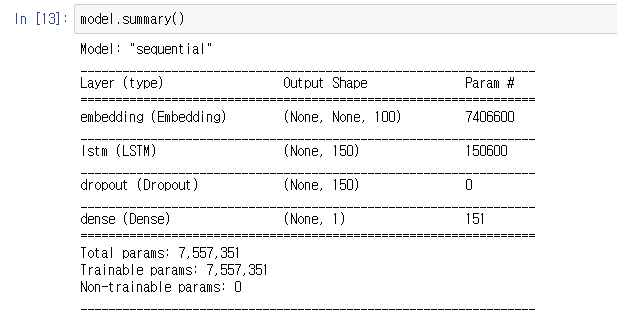

# 영어 텍스트 분류 - 05 순환 신경망 (RNN) 분류 모델

Created: 2020년 12월 12일 오후 11:53

우리가 앞서 진행한 모델들은 머신러닝을 활용한 모델이다. 이번 부터는 딥러닝을 활용해 분류하는 모델을 살펴보고자 한다. 순환 신경망은 언어 모델에서 많이 쓰이는 딥러닝 모델 중 하나다. 주로 순서가 있는 데이터, 즉 문장 데이터를 입력해서 문장 흐름에서 패턴을 찾아 분류하게 한다. 앞선 모델들과 달리 이미 주어진 단어 특징 벡터를 활용해 모델을 학습하지 않고 텍스트 정보를 입력해서 문장에 대한 특징 정보를 추출한다.

- 모델 소개

    순환 신경망은 RNN이라고도한다. RNN은 현재 정보는 이전 정보가 점층적으로 쌓이면서 정보를 표현할 수 있는 모델이다. 따라서 시간에 의존적인 또는 순차적인 데이터에 대한 문제에 활용된다. 

    

    그림은 한 언어 모델을 순환 신경망의 구조로 간략히 표현한 내용이다. 이 모델은 한 단어에 대한 정보를 입력하면 이 단어 다음에 나올 단어를 맞추는 모델이다. 모델에서 우선 '아버지'라는 단어 정보를 입력해서 그 다음에 나올 단어를 예측하고, 그 다음 '가방에' 라는 정보를 입력한다고 하자. 이 상황에서 현재 입력하는 단어 정보인 '가방에' 다음에 올 단어를 예측할 때는 단순히 '가방에'라는 단어 정보만 가지고 예측하는 것이 아니라 앞서 입력한 '아버지'라는 정보를 입력해서 처리된 정보와 함께 활용해 다음 단어를 예측하게 된다. 여기서 현재 정보 '가방에'를 입력 상태(input state)라고 부르고 이전 정보를 은닉 상태 (hidden state)라 부른다. 순환 신경망은 이 두 상태 정보를 활용해 순서가 있는 데이터에 대한 예측 모델링을 가능하게 한다.

    우리는 이러한 방식으로 동작하는 순환 신경망 RNN을 가지고 영화 평점 예측 모델을 만들고자 한다. 우리가 만들고자 하는 모델의 형태는 다음과 같다.

    

    앞서 설명한 예시와는 조금 다른데, 입력 문장을 순차적으로 입력만 하고 마지막으로 입력한 시점에 출력 정보를 뽑아 영화 평점을 예측하는 것이다. 매 시간 스텝에 따리 입력되는 입력 정보는 은닉 상태(hidden state)를 통해 정보를 다음 시간 스텝으로 전달할 수 있게 한다. 마지막 시간 스텝에 나온 은닉 상태는 문장 전체 정보가 담긴 정보로써 이 정보를 활용해 영화 평점을 예측할 수 있도록 로지스틱 회귀 또는 이진 분류를 하면 된다. 대충 그렇구나 정도로 이해하고 코드로 이해하자.

- 필요한 모듈 임포트

    ```python
    import tensorflow as tf
    from tensorflow.python.keras.preprocessing.text import Tokenizer
    from tensorflow.keras.preprocessing.sequence import pad_sequences
    from tensorflow.keras.callbacks import EarlyStopping, ModelCheckpoint
    from tensorflow.keras.layers import Embedding, LSTM, Dense, Dropout
    from tensorflow.keras import layers

    import numpy as np
    import pandas as pd

    import matplotlib.pyplot as plt

    import re
    import os
    import json

    from tqdm import tqdm

    from bs4 import BeautifulSoup
    import nltk
    from nltk.corpus import stopwords
    ```

    ```python
    SEED_NUM = 1234
    tf.random.set_seed(SEED_NUM)
    ```

    이번에는 머신러닝이 아닌 딥러닝을 이용한다. 따라서 텐서플로우를 블러왔다. 그리고 사이킷런에서 랜덤 스태이트를 설정한 것처럼 텐서플로우에서 랜덤 스태이트를 설정해주었다.

- 데이터 불러오기

    ```python
    DATA_IN_PATH = './'
    DATA_OUT_PATH = './'
    TRAIN_INPUT_DATA = 'train_input.npy'
    TRAIN_LABEL_DATA = 'train_label.npy'
    DATA_CONFIGS = 'data_configs.json'

    train_input = np.load(open(DATA_IN_PATH + TRAIN_INPUT_DATA, 'rb'))
    train_label = np.load(open(DATA_IN_PATH + TRAIN_LABEL_DATA, 'rb'))
    prepro_configs = json.load(open(DATA_IN_PATH + DATA_CONFIGS, 'r'))
    ```

    여기서 .npy파일은 넘파이 파일이다. 우리가 데이터 전처리를 할 때 마지막 부분에 텐서플로우의 Tokenizer를 이용해 데이터의 단어사전을 만들고 이를 이용해 리뷰를 벡터화해서 이를 넘파이 형태로 저장했는데, 이를 다시 불러온 것이다. 우리가 그동안 word2vec이나 TF-IDF 등을 이용해서 리뷰를 벡터화 시켰다면, 이번에는 텐서플로우의 Tokenizer를 이용한 것이다. 단지, 이 과정이 데이터 전처리때 미리 해놓았기에 이번에는 불러오기만 했다. 아래 세줄 중 위 두줄은 이 넘파이 파일들을 불러와서 넘파이 형태로 각 변수에 저장을 하는 과정이고, 마지막 줄은 단어사전을 JSON이라는 형태로 불러와서 변수에 저장한 것이다. train_input의 shape를 찍으면 25000, 174가 나오는데 이는 리뷰가 25000개, 각 리뷰 벡터의 길이가 174임을 의미하는데 우리가 저번에 데이터 전처리를 하며 토크나이저를 이용할 때 리뷰 벡터의 길이를 174로 맞춰두었었다.

- 모델 구현

    ```python
    model_name = 'rnn_classifier_en'
    BATCH_SIZE = 128
    NUM_EPOCHS = 5
    VALID_SPLIT = 0.1
    MAX_LEN = train_input.shape[1]
    ```

    모델에 들어갈 매개변수들의 값을 미리 다른 변수에 담아두었다. BATCH-SIZE는 딥러닝이 학습을 할 때 데이터를 한 번에 몇 개씩 학습시키느냐 하는 것에 대한 값이다. 미니배치라고도 한다. 128로 지정했으므로 딥러닝이 한 번 학습을 할 때 데이터 128개씩 불러와서 학습을 한다. 이렇게 우리가 가진 25000개의 모든 데이터를 한 번 다 학습을 하게 되면 EPOCH이 1 번 되는 것이다. 우리는 NUM_EPOCHS를 5로 지정했으므로 EPOCH값이 5가 된다. 즉, 모든 데이터를 1번, 2번, ... 반복 학습을 해서 5번 까지 한다는 의미이다.

    ```python
    model = tf.keras.Sequential([
        Embedding(74066, 100),
        LSTM(150),
        Dropout(0.2),
        Dense(1, activation='sigmoid')
    ])
    ```

    

    사실 책에서는 더 복잡한 구조의 모델이지만 여기서는 간단하게 구현했다. 왜냐하면 시간이 너무 오래걸리기 때문이다. 먼저 모델을 담을 변수를 지정하고 Sequential안에 차례로 딥러닝의 층을 쌓는다. Embedding 레이어 (층) 는 입력으로 들어오는 벡터를 저차원으로 바꿔준다. 우리의 단어사전에 74066개의 단어가 있어서 첫 인자로 74066이 왔고, 이를 100차원으로 줄일 것이기에 두번째 매개변수에 100이 왔다. 

    두번째는 LSTM인데, 입력 값이 Embedding 층을 거친 후에 도달하게 된다. 여기서 150은 이 LSTM을 통과한 후 150차원이 된다는 뜻이다. 우리가 다른 수로 설정하면 다른 차원이 된다. 

    Dropout은 과적합을 막는 용도이다. 딥러닝은 우리의 뇌를 모방하기 때문에 하나 하나의 퍼셉트론, 뇌로 따지면 뉴런들이 있는데, 일반적으로 학습을 하게 되면 이 퍼셉트론 마다 올바른 결과물을 내기 위해 '가중치'와 '파라미터' 값이 바뀐다. 그런데 Dropout을 쓰게 되면 각 층에서 일정 비율의 랜덤의 퍼셉트론의 학습을 막는다. 그렇게 해서 과적합을 막는다. 우리는 0.2를 매개변수로 주어 퍼셉트론의 20%의 학습을 방해함으로 과적합을 방지한다.

    마지막으로 Dense층이다. Dense는 가장 기본적인 구조라고 할 수 있다. 우리가 결과적으로 얻고 싶은 것은 텍스트를 '분류'하기 위한 것이므로 필요하다 할 수 있다. 일단 이정도로만 알고 넘어가는데, 이 역시 출력차원으로 1차원만 필요하므로 1로 설정, activation은 활성함수라는 것을 지정하는데, 일반적으로 우리처럼 긍정/부정 처럼 이진분류를 할 때는 sigmoid 함수로 설정한다. 만약 다중분류를 하면 'softmax'함수를 쓴다.

    ```python
    model.compile(optimizer=tf.keras.optimizers.Adam(1e-4),
                  loss=tf.keras.losses.BinaryCrossentropy(),
                  metrics=[tf.keras.metrics.BinaryAccuracy(name='accuracy')])
    ```

    우리가 모델의 구조를 세웠으니 이를 컴파일해야한다. 이를 통해 학습할 옵티마이저, 손실함수, 평가를 위한 지표 등을 설정한다. 일단 그렇구나 하고 넘어가자.

    ```python
    # overfitting을 막기 위한 ealrystop 추가
    earlystop_callback = EarlyStopping(monitor='val_accuracy', min_delta=0.0001, patience=1)
    # min_delta: the threshold that triggers the termination (acc should at least improve 0.0001)
    # patience: no improvment epochs (patience = 1, 1번 이상 상승이 없으면 종료)

    checkpoint_path = DATA_OUT_PATH + model_name + '/weights.h5'
    checkpoint_dir = os.path.dirname(checkpoint_path)

    # Create path if exists
    if os.path.exists(checkpoint_dir):
        print("{} -- Folder already exists \n".format(checkpoint_dir))
    else:
        os.makedirs(checkpoint_dir, exist_ok=True)
        print("{} -- Folder create complete \n".format(checkpoint_dir))
        

    cp_callback = ModelCheckpoint(
        checkpoint_path, monitor='val_accuracy', verbose=1, save_best_only=True, save_weights_only=True)
    ```

    앞서 과적합이란 학습데이터를 평가하면 점수가 잘 나오는데, 학습하지 않은, 미지의 데이터, 테스트 데이터를 사용하면 점수가 낮게 나오는 현상이라고 했다. 이 현상의 원인 중 하나가 목적은 단순한데 너무 복잡하게 모델을 구현하는 것과, 학습을 같은 데이터로 너무 많이 시키는 것 등이 있다. 위 코드는 학습을 너무 많이 했다, 조금 아쉽다, 뭐 이런 지점이 애매하므로 학습을 하는 도중에 정확도가 떨어지기 시작하면 학습을 멈추고 그 지점에서의 모델을 저장하는 코드라고 할 수 있다. 

    우리가 학습을 하는 도중에는 학습데이터의 손실값(정답과 모델이 예측한 값이 얼마나 차이나는지)과 정확도가 출력이 되고, 검증데이터에 대해 설정하면 이에 대한 손실과 정확도 값도 출력이 된다. 모델은 학습을 하는 도중에 이 두가지 값을 계속 우리에게 보여준다. 검증 데이터는 테스트 데이터를 이용했던 것 처럼 생각하면 된다.

    epoch이 진행될 때마다 검증데이터는 무작위로 우리가 설정해준 비율에 따라 설정이 된다. 우리는 이 검증 데이터의 값을 보고 학습을 하다가 갑자기 검증 데이터의 정확도가 떨어지기 시작하면 모델 학습을 멈춘다.

    ```python
    history = model.fit(train_input, train_label, batch_size=BATCH_SIZE, epochs=NUM_EPOCHS,
                        validation_split=VALID_SPLIT, callbacks=[earlystop_callback, cp_callback])
    ```

    드디어 이제 모델을 학습시킨다. 이게 꽤 오래 걸린다. 첫 값과 두번째 값은 학습시킬 데이터와 라벨이다. 우리가 맨처음에 불러온 넘파이 값들이 되겠다. batch사이즈와 epochs는 위에서 설명한 것과 같고, validation_split이 검증 데이터를 전체 데이터의 몇 만큼의 비율로 가져가겠냐는 매개변수이다. callbacks는 콜백 함수를 지정하는 것으로, 이 코드 바로 위에 우리가 설정한 콜백 함수들, 검증 데이터의 정확도가 떨어지면 바로 모델일 멈추고 저장하는 코드들이 들어갔다.

    이번에는 테스트 데이터를 따로 사용하지 않았는데, 전에 한번 딥러닝 - 텐서플로우를 이용할 때는 테스트 데이터를 따로 떼어놓고 남은 데이터를 학습데이터와 검증데이터로 이용했었다. 여기서는 테스트 데이터는 사용하지 않았다.

    ```python
    model.evaluate(train_input, train_label)
    ```

    그냥 우리가 가진, 학습 시킨 데이터로 정확도를 측정하면 94프로가 나온다. 출력값으로 리스트가 나오는데, 첫 값은 손실값, 두번째 값이 정확도 값이다.

- 모델 예측

    이 다음은 모델 예측인데 좀 생각보다 저조하다. 정확도는 94프로이지만 짧은 단어는 전부 90프로 안팎으로 긍정을 예측한다. 결과값으로 0과 1 사이의 수가 나오는데 0에 가까울 수록 부정, 1에 가까울 수록 긍정인데 짧은 글은 전부 0.9에 머무는 놀라운 결과를 보여준다. 예측을 내가 잘못했나? 해서 학습 데이터에서 부정인 글들을 입력시켰더니 0.0323 이나 0.0338 등의 결과가 나왔다. 아무래도 학습 데이터가 워낙 긴 리뷰들만 있어서 짧은 건 잘 예측 못하는 것일 수도 있고, 각 매개변수가 적절한 것이 들어가지 않았다던가 하는 문제가 있어서 그런 것이라고 생각한다. 개인적으로는 Dropout 층이 문제일 것 같기도 하다. 모델이 별로 복잡하지도 않은데 굳이 쓸 이유가... 아무튼 밑에는 예측 코드다.

    ```python
    tokenizer = Tokenizer()
    tokenizer.fit_on_texts(train_clean['review'])
    text_sequences = tokenizer.texts_to_sequences(train_clean)
    text_pad = pad_sequences(text_sequences, maxlen=174, padding='post')
    ```

    다시 한 번 쓰지만 전체적인 텍스트 분류의 과정은 데이터 전처리 → 리뷰를 숫자로 벡터화! → 분류 모델 구현 → 예측, 사용 및 평가 인데, 데이터 전처리는 맨 처음에 미리 다 해놓았고, 다음 단계인 벡터화는 그동안은 계속 모델을 구현하기 전에 했었지만 이번에는 데이터 전처리때 미리 해 놓았떤 것을 가져다 썼다. 그런데 예측을 하려면 벡터화를 진행하는 과정에서 만들었던 단어사전을 사용할 필요가 있어서 그것으 만드는 과정이다. 코드 자체는 데이터 전처리 파트에서 다루었던 것이랑 똑같다.

    ```python
    def preprocessing( review, remove_stopwords = False ): 
        # 불용어 제거는 옵션으로 선택 가능하다.
        
        # 1. HTML 태그 제거
        review_text = BeautifulSoup(review, "html5lib").get_text()	

        # 2. 영어가 아닌 특수문자들을 공백(" ")으로 바꾸기
        review_text = re.sub("[^a-zA-Z]", " ", review_text)

        # 3. 대문자들을 소문자로 바꾸고 공백단위로 텍스트들 나눠서 리스트로 만든다.
        words = review_text.lower().split()

        if remove_stopwords: 
            # 4. 불용어들을 제거
        
            #영어에 관련된 불용어 불러오기
            stops = set(stopwords.words("english"))
            # 불용어가 아닌 단어들로 이루어진 새로운 리스트 생성
            words = [w for w in words if not w in stops]
            # 5. 단어 리스트를 공백을 넣어서 하나의 글로 합친다.	
            clean_review = ' '.join(words)

        else: # 불용어 제거하지 않을 때
            clean_review = ' '.join(words)

        return clean_review
    ```

    전처리다.

    ```python
    def encoding(review) :
        global tokenizer
        encoded = tokenizer.texts_to_sequences([review])
        pad = pad_sequences(encoded, maxlen=174)
    		return pad
    ```

    리뷰도 역시 위 과정을 그대로 따른다. 전처리된 문자들을 텍스트로 바꾼다. 위와 동일한 과정으로!

    ```python
    def predict(review) :
        clean_review = preprocessing(review, remove_stopwords=True)
        pad = encoding(clean_review)
        return float(model.predict(pad))
    ```

    위의 전처리와 인코딩 함수를 모두 이용해서 하나의 함수로 만들었다. encoding함수를 통해 나온 결과값을 모델을 예측하는 메소드의 입력값으로 넣어서 결과를 도출한다. 이렇게 몇 번 실행한 결과가 위에서 서술한대로 만족스럽지 못하니 이번에 스크린샷은 ㅠ