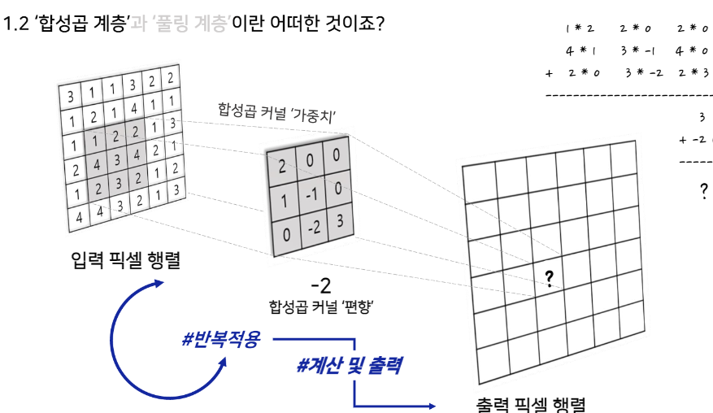
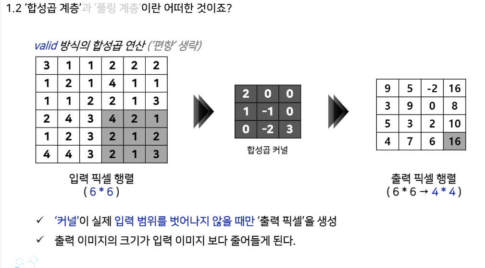
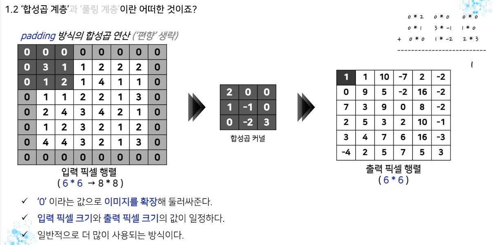
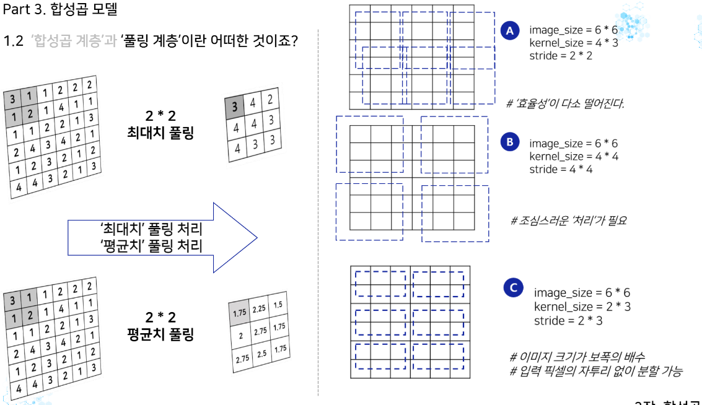
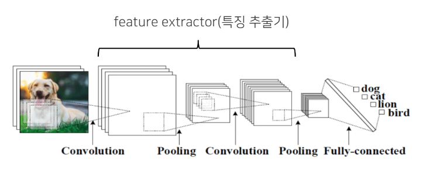
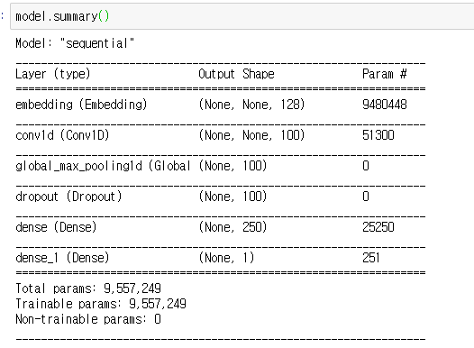
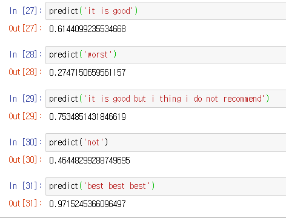

# 영어 텍스트 분류 - 06 컨볼루션 신경망 (CNN) 분류 모델

Created: 2020년 12월 17일 오후 6:25

저번처럼 이번에도 딥러닝 모델 중 하나인 컨볼루션 신경망, CNN을 활용하여 모델을 구축해보자.

- 모델 소개

    합성곱 (Convolution) 신경망은 딥러닝의 부흥을 이끈 핵심 알고리즘 모델 중 하나로 전통적인 신경망 앞에 여러 계층의 합성곱 계층을 쌓은 모델이다. 처음에는 이미지를 학습하기 위한 모델로 사용하였다. 

    만약 우리가 이미지를 사용해 여러 층의 퍼셉트론, 다층 퍼셉트론으로 이미지를 학습시킨다고 하자. 이 때 우리는 사람들이 쓴 마스크를 구별해내는 모델을 학습시킨다고 가정하자. 다층 퍼셉트론이 '마스크 이미지'를 골고루 학습하려면 이미지에서 어떤 위치에 등장할 지 모르는, 온갖 위치에 등장하는 '마스크 이미지'가 필요하다. 게다가 이미지는 엄청난 수의 픽셀로 이루어져있다. 즉, 입력 벡터의 크기가 증가하고, 학습할 가중치 파라미터의 크기도 증가한다. 이는 학습하는데 있어 매우 긴 시간을 소모하게 하고, 효율적이지도 못하다. 그래서 나온 것이 합성곱 계층과 풀링 계층이다.

    

    우선 합성곱 계층이다. 그림에서 맨 왼쪽에 있는 행렬이 이미지를 나타낸 것이다. 이렇게 이미지 데이터가 주어지면 커널, 그림에서 가운데 있는 3x3행렬을 통해 출력을 계산한다. 커널이 왼쪽 위 부터 오른쪽 하단까지 정해진 보폭에 따라 움직이면서 값들을 추출하고, 이는 출력 행렬에 나타난다. 같은 커널이 모든 위치에 적용되기 때문에 '한 곳에서 포착한 패턴'이 다른 곳에 이용될 수 있다. 그림에서 입력 픽셀 행렬에서 어두운 부분과 커널에 대해 계산한 값이 그림 오른쪽 상단에 있는 내용이다. 아래 그림도 참고해서 이해해보자.

    

    이런 계산 과정에서 입력 행렬과 출력 행렬을 비교하면 크기가 줄어드는데, 이를 방지하고자 하면 사용하는 것이 padding이다. 자세한 것은 그림과 같다.

    

    다음으로 풀링 계층을 알아보자. 풀링 계층은 이미지 파일의 크기를 축소시키는 역할을 한다. 이미지 행렬의 일부분, 예를 들면 2*2 정도의 크기를 최대값 혹은 평균값을 이용해서 하나로 줄이고, 정해진 보폭만큼 이동해서 다시 최대값 혹은 평균값을 이용해서 하나로 줄이고 하는 과정을 반복해서 크기를 줄인다. 

    즉, 입력만으로 대표값을 구하는 과정이며 '파라미터'는 필요가 없다. 풀링 계층은 합성곱 계층 사이에 배치되어 점점 작은 해상도의 특징맵에 정보가 집약되게 만든다.

    

    이렇듯 커널을 통해 입력한 이미지의 특정 패턴이나 특징에 민감하게 반응하여 학습하는 경향이 있다. 또, 채널이란 것이 있는데, 우리가 가진 이미지를 표현하는 방법의 수라고 할 수 있겠다. 만약, 우리가 이미지를 RGB로 표현한다면 흑백 이미지는 채널이 1이고, 컬러 이미지는 채널이 3이라고 할 수 있다.

    우리가 모델을 쌓을 때 첫 합성곱 계층의 입력 채널 수는 '최초의 이미지'에 따라 정해진다. 만약 합성곱 계층이 이전 합성곱 계층을 거친 후에 있다면, 중간에 있다면, 이전 계층이 생성한 '출력 채널 수'가 입력 채널 수가 된다. 출력 채널 수는 모델을 설계하는 사람이 자유롭게 정할 수 있다. 또 출력 채널 수 만큼의 특징맵(결과물)이 만들어지는데 그러기 위해서는 커널이 출력 채널 수 만큼 존재해야 한다.

    

    위 그림이 사진을 입력한 CNN모델의 모습이다. 각 단계에 겹쳐있는 것이 채널 수, 특징맵이라고 보면 된다. 특징 추출기 부분에서는 합성곱 레이어와 풀링 레이어가 돌아가며 나온다. 이렇게 특징을 추출해 내면, Fully-connected(완전 연결 계층) 부분으로 분류를 하게 된다. 이것은 저번에 사용했던 Dense층의 역할이다. 저번 RNN에서도 RNN 레이어를 거친 결과를 Dense층을 이요해 분류를 했는데, 이번에도 특징 추출기를 거친 결과를 Dense층을 거쳐 분류해준다고 생각하면 된다.

    그렇다면 텍스트에서는 합성곱 신경망을 어떻게 활용했을까? 물론 텍스트에서도 좋은 효과를 낼 수 있다는 점을 Yoon Kim 박사가 2014년 입증했다. RNN이 단어의 입력 순서를 중요하게 반영한다면 CNN은 문장의 지역 정보를 보존하면서 각 문장 성분의 등장 정보를 학습에 반영하는 구조로 풀어가고 있다. 학습할 때 각 필터 크기를 조절하면서 언어의 특징 값을 추출하게 되는데, 기존의 n-gram 방식과 유사하다고 볼 수 있다.

- 필요한 라이브러리와 데이터 불러오기

    ```python
    import tensorflow as tf
    from tensorflow.python.keras.preprocessing.text import Tokenizer
    from tensorflow.keras.preprocessing.sequence import pad_sequences
    from tensorflow.keras.callbacks import EarlyStopping, ModelCheckpoint
    from tensorflow.keras import layers
    from tensorflow.keras.layers import Embedding, Conv1D, GlobalMaxPooling1D, Dropout, Dense

    import numpy as np
    import pandas as pd

    import matplotlib.pyplot as plt

    import re
    import os
    import json

    from tqdm import tqdm
    from bs4 import BeautifulSoup
    import nltk
    from nltk.corpus import stopwords
    ```

    ```python
    DATA_IN_PATH = './'
    DATA_OUT_PATH = './'
    TRAIN_INPUT_DATA = 'train_input.npy'
    TRAIN_LABEL_DATA = 'train_label.npy'
    DATA_CONFIGS = 'data_configs.json'
    ```

    ```python
    SEED_NUM = 1234
    tf.random.set_seed(SEED_NUM)
    ```

    ```python
    train_input = np.load(open(DATA_IN_PATH + TRAIN_INPUT_DATA, 'rb'))
    train_label = np.load(open(DATA_IN_PATH + TRAIN_LABEL_DATA, 'rb'))
    prepro_configs = prepro_configs = json.load(open(DATA_IN_PATH + DATA_CONFIGS, 'r'))
    ```

    필요한 데이터와 라이브러리를 불러왔고, 랜덤 시드 역시 정해주었다.

- 하이퍼파라미터 정의와 모델링

    ```python
    model_name = 'cnn_classifier_en'
    BATCH_SIZE = 512
    NUM_EPOCHS = 2
    VALID_SPLIT = 0.1
    MAX_LEN = train_input.shape[1]
    ```

    모델의 하이퍼파라미터를 미리 정의했다. 여기서 우리가 그동안 강조했듯이 데이터 전처리는 미리 했고, 리뷰를 숫자로 바꾸는 임베딩 작업은 데이터 전처리 때 했었던, 저번 RNN 실습 때와 같은 파일을 가져온다. 그래서 우리가 불러온 train_input은 넘파이 파일이다. 안하는게 아니라 데이터 전처리 때 했던 것을 가져오는 것이란 것을 잊지 말자.

    ```python
    model = tf.keras.Sequential([
        Embedding(input_dim=74066, output_dim=128),
        Conv1D(filters=100, kernel_size=4, padding='valid', activation=tf.keras.activations.relu),
        GlobalMaxPooling1D(),
        Dropout(0.2),
        Dense(units=250, activation='relu'),
        Dense(units=1, activation='sigmoid')
    ])
    ```

    모델을 쌓는 과정이다. Embedding은 저번에 이야기했으니 넘어가자. Conv1D가 합성곱 레이어이다. 1D가 차원을 이야기하며 이미지를 사용할 때는 Conv2D를 사용한다. 

    filters가 만들어 낼 특징맵, 출력 채널 수를 정한다. kernel_size가 커널의 크기를 정하는데, 이미지에서는 2차원이므로 튜플을 이용해 (3, 3)처럼 표기하지만 우리는 1차원 합성곱이므로 스칼라 값으로 정해준다. padding은 valid로 지정하여 padding을 하지 않는 것으로 설정했다. 활성함수는 relu함수다. 그 다음은 풀링 레이어인데, 최대값을 사용하는 풀링 레이어를 사용했다. 그리고 전에 보았던 과적합을 방지하는 Dropout 레이어, 마지막으로 완전 연결 계층인 Dense 층 두 개를 쌓았다. 

```python
model.compile(optimizer=tf.keras.optimizers.Adam(),
              loss=tf.keras.losses.BinaryCrossentropy(),
              metrics=[tf.keras.metrics.BinaryAccuracy(name='accuracy')])
```

```python
# overfitting을 막기 위한 ealrystop 추가
earlystop_callback = EarlyStopping(monitor='val_accuracy', min_delta=0.0001,patience=2)
# min_delta: the threshold that triggers the termination (acc should at least improve 0.0001)
# patience: no improvment epochs (patience = 1, 1번 이상 상승이 없으면 종료)\

checkpoint_path = DATA_OUT_PATH + model_name + '/weights.h5'
checkpoint_dir = os.path.dirname(checkpoint_path)

# Create path if exists
if os.path.exists(checkpoint_dir):
    print("{} -- Folder already exists \n".format(checkpoint_dir))
else:
    os.makedirs(checkpoint_dir, exist_ok=True)
    print("{} -- Folder create complete \n".format(checkpoint_dir))
    

cp_callback = ModelCheckpoint(
    checkpoint_path, monitor='val_accuracy', verbose=1, save_best_only=True, save_weights_only=True)
```

모델 컴파일과 콜백함수는 저번 RNN실습과 동일하게 그대로 가져왔다.

- 모델 학습

    ```python
    history = model.fit(train_input, train_label, batch_size=BATCH_SIZE, epochs=NUM_EPOCHS,
                        validation_split=VALID_SPLIT, callbacks=[earlystop_callback, cp_callback])
    ```

    모델을 학습시킨다. 생각보다 빨리 끝난다.

    

    모델을 요약한 표는 그림과 같다. 아무튼 학습을 모두 마치고 나면 검증데이터는 대략 88.7퍼센트, 학습 데이터는 85.6퍼센트의 정확도를 보인다. 이제 예측을 해보자.

- 예측 및 사용

    사실 저번 RNN과 같은 임베딩 과정 (데이터 전처리 때 사용한 것을 그대로 가져온 과정) 이고 텐서플로우 모델의 구성만 다를 뿐 같은 텐서플로우를 사용하고, 변수도 똑같이 model이라고 사용해서 저번 RNN때 사용한 코드를 그대로 가져오기만 하면 된다. 복습이다 생각하자.

    ```python
    train_clean = pd.read_csv('train_clean.csv')

    tokenizer = Tokenizer()
    tokenizer.fit_on_texts(train_clean['review'])
    text_sequences = tokenizer.texts_to_sequences(train_clean)
    text_pad = pad_sequences(text_sequences, maxlen=174, padding='post')
    ```

    ```python
    def preprocessing( review, remove_stopwords = False ): 
        # 불용어 제거는 옵션으로 선택 가능하다.
        
        # 1. HTML 태그 제거
        review_text = BeautifulSoup(review, "html5lib").get_text()	

        # 2. 영어가 아닌 특수문자들을 공백(" ")으로 바꾸기
        review_text = re.sub("[^a-zA-Z]", " ", review_text)

        # 3. 대문자들을 소문자로 바꾸고 공백단위로 텍스트들 나눠서 리스트로 만든다.
        words = review_text.lower().split()

        if remove_stopwords: 
            # 4. 불용어들을 제거
        
            #영어에 관련된 불용어 불러오기
            stops = set(stopwords.words("english"))
            # 불용어가 아닌 단어들로 이루어진 새로운 리스트 생성
            words = [w for w in words if not w in stops]
            # 5. 단어 리스트를 공백을 넣어서 하나의 글로 합친다.	
            clean_review = ' '.join(words)

        else: # 불용어 제거하지 않을 때
            clean_review = ' '.join(words)

        return clean_review
    ```

    ```python
    def encoding(review) :
        global tokenizer
        encoded = tokenizer.texts_to_sequences([review])
        pad = pad_sequences(encoded, maxlen=174)
        return pad
    ```

    ```python
    def predict(review) :
        clean_review = preprocessing(review, remove_stopwords=True)
        pad = encoding(clean_review)
        return float(model.predict(pad))
    ```

    이제 predict에 내가 넣고 싶은 문자열을 넣으면 알아서 결과가 나온다. 1에 가까울수록 긍정이다. 0에 가까우면 부정이다.

    

    앞에서 not이 없기에 단어사전에 없었던 것을 기억할 것이다. 그래서 not이 들어가면 제대로 예측하지 못한다.