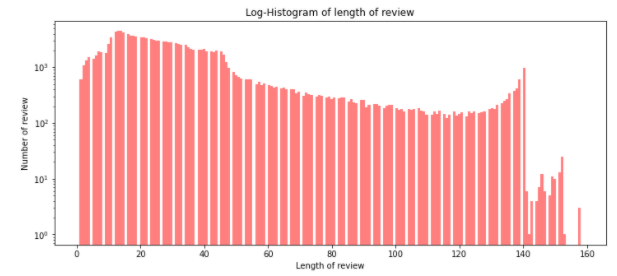
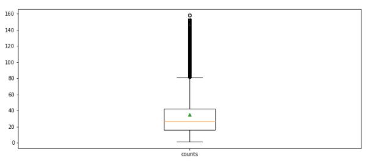
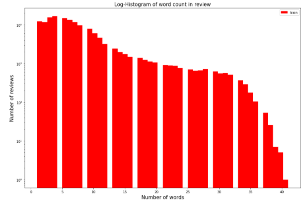

# 한글 텍스트 분류 - 01 데이터 전처리


저번까지는 영어 데이터를 활용해 텍스트 분류 문제를 해결했다면 이번에는 한글 데이터를 활용해 텍스트 분류 문제를 살펴보자. 한글과 영어는 언어적인 특성이 매우 달라서 언어를 처리하는 과정이 다르다. 한글 텍스트를 다루는 방법을 알아보고 텍스트를 분류하는 방법을 알아보자.

본격적으로 한글 텍스트 분류에 앞서 라이브러리 하나를 소개하자면, 이전에 사용했던 자연어 처리를 도와주는 라이브러리 NLTK는 한글 텍스트를 지원하지 않는다. 한글 자연어 처리를 도와주는 파이썬 라이브러리로 대표적인 것이 KoNLPy이다. 따라서 이번에는 KoNLPy를 사용해 보도록 하자.

한글 데이터는 영어 데이터에 비해 데이터도 많지 않고 한글 자연어 처리와 관련된 참고 자료 또한 많지 않은데 공개되어 있는 데이터 중 유명한 것이 바로 네이버 영화 리뷰 데이터인 "Naver sentiment movie corpus v1.0" 이다. 다음 URL에서 다운 받도록 하자.

https://github.com/e9t/nsmc

이 역시 저번과 마찬가지로 긍정 혹은 부정의 감정을 가진다. 우리가 사용할 데이터 파일은 총 3개이다.

- ratings.txt : 전체 리뷰를 모아둔 데이터. 전체 20만개의 데이터로 구성되어 있다.
- ratings_train.txt : 학습 데이터. 총 15만 개의 데이터로 구성되어 있다.
- ratings_test.txt : 평가 데이터. 총 5만 개의 데이터로 구성되어 있다.

우리는 학습, 평가 데이터로 나뉜 파일 2개를 사용하는데, 만약 두 데이ㅓㅌ의 비율을 다르게 하고 싶으면 전체 데이터를 직접 분리해서 사용하면 된다.

- 데이터 불러오기 및 분석하기

    데이터를 내려받았다면 먼저 데이터를 분석해보아야 한다. 영어 데이터를 대상으로 진행했던 것과 마찬가지로 데이터를 분석한 후 그 결과를 토대로 데이터 전처리를 진행한다. 먼저 필요한 라이브러리와 데이터를 불러오자.

    ```python
    import numpy as np 
    import pandas as pd
    import os
    import matplotlib.pyplot as plt
    import seaborn as sns
    from wordcloud import WordCloud
    %matplotlib inline
    ```

    ```python
    DATA_IN_PATH = './'
    train_data = pd.read_csv(DATA_IN_PATH + 'ratings_train.txt', header = 0, delimiter = '\t', quoting = 3)
    train_data.head()
    ```

    데이터 파일이 작성되는 코드와 같은 폴더에 있음을 가정하고 데이터를 불러왔다. 만약 데이터 파일이 작성되는 코드와 다른 폴더에 있따면 DATA_IN_PATH를 상대경로로 데이터가 있는 폴더를 지정해주면 된다.

    ```python
    print('전체 학습데이터의 개수: {}'.format(len(train_data)))
    ```

    전체 학습 데이터는 15만 개 임을 알 수 있다. 이제 각 데이터에 대해 리뷰 길이를 확인해보자. 데이터프레임의 apply 함수를 사용해 길이 값을 추출한다.

    ```python
    train_length = train_data['document'].astype(str).apply(len)
    train_length.head()
    ```

    이 결과 값을 이용해 전체 데이터에 대해 길이에 대한 히스토그램을 그려보자.

    ```python
    # 그래프에 대한 이미지 사이즈 선언
    # figsize: (가로, 세로) 형태의 튜플로 입력
    plt.figure(figsize=(12, 5))
    # 히스토그램 선언
    # bins: 히스토그램 값들에 대한 버켓 범위
    # range: x축 값의 범위
    # alpha: 그래프 색상 투명도
    # color: 그래프 색상
    # label: 그래프에 대한 라벨
    plt.hist(train_lenght, bins=200, alpha=0.5, color= 'r', label='word')
    plt.yscale('log', nonposy='clip')
    # 그래프 제목
    plt.title('Log-Histogram of length of review')
    # 그래프 x 축 라벨
    plt.xlabel('Length of review')
    # 그래프 y 축 라벨
    plt.ylabel('Number of review')
    plt.show()
    ```

    

    길이를 보면 매우 짧은 길이부터 140자까지 고르게 분포되어 있다. 조금 특이한 부분은 보통 20자 이하에 많이 분포되어 있다가 길이가 길어질수록 점점 수가 작아지는데 140자 부근에서 데이터 수가 갑자기 많아지는 모습을 보여준다. 해당 데이터의 경우 140자 제한이 있는 데이터이기 때문인데 그래서 최대 글자수에 조금 모여있는 형태이다. 이제 그래프가 아닌 실제 여러가지 통계값으로 확인해보자.

    ```python
    print('리뷰 길이 최대 값: {}'.format(np.max(train_lenght)))
    print('리뷰 길이 최소 값: {}'.format(np.min(train_lenght)))
    print('리뷰 길이 평균 값: {:.2f}'.format(np.mean(train_lenght)))
    print('리뷰 길이 표준편차: {:.2f}'.format(np.std(train_lenght)))
    print('리뷰 길이 중간 값: {}'.format(np.median(train_lenght)))
    # 사분위의 대한 경우는 0~100 스케일로 되어있음
    print('리뷰 길이 제 1 사분위: {}'.format(np.percentile(train_lenght, 25)))
    print('리뷰 길이 제 3 사분위: {}'.format(np.percentile(train_lenght, 75)))
    ```

    길이의 최대값은 158이다. 최대 글자 수가 140이지만 특수 문자 등으로 인해 좀 더 긴 데이터도 포함되어 있다. 최솟값은 1이고 평균 35자 정도이다. 중간값은 27자이다. 이 수치들을 박스 플롯으로 그려보자.

    ```python
    plt.figure(figsize=(12, 5))
    # 박스플롯 생성
    # 첫번째 파라메터: 여러 분포에 대한 데이터 리스트를 입력
    # labels: 입력한 데이터에 대한 라벨
    # showmeans: 평균값을 마크함

    plt.boxplot(train_lenght,
                 labels=['counts'],
                 showmeans=True)
    plt.show()
    ```

    

    그림을 보면 일부 길이가 긴 데이터가 꽤 있다는 것을 확인할 수 있다. 중간값과 평균값은 전체 데이터로 보면 아래쪽에 위치한다.

    이제 데이터에서 자주 사용되는 어휘를 알아보기 위해 어휘 빈도 분석을 해보자. 이전 영어 데이터를 분석했을 때와 마찬가지로 워드클라우드를 사용한다. 

    우선 데이터 안에 들어있는 문자열이 아닌 데이터는 모두 제거한다. 어휘 빈도 분석은 문자열에 대해서만 진행할 수 있기 때문에 다른 형식이 있다면 오류가 발생할 수 있다.

    ```python
    train_review = [review for review in train_data['document'] if type(review) is str]
    ```

    위 구문이 이해가지 않으면 딥러닝 교과서 398페이지를 보자. 이렇게 문자열만 남은 리뷰 데이터를 워드클라우드에 적용하면 된다.

    여기서 문제가 하나 있는데 워드클라우드는 기본적으로 영어 텍스트를 지원하는 라이브러리이기 때문에 한글 데이터를 넣으면 글자가 깨진 형태로 나온다는 것이다. 따라서 한글을 볼 수 있도록 한글 폰트를 설정해야 한다. 이를 포함하는 코드가 다음과 같다.

    ```python
    wordcloud = WordCloud(font_path = DATA_IN_PATH + 'NanumGothic.ttf').generate(' '.join(train_review))
    plt.imshow(wordcloud, interpolation='bilinear')
    plt.axis('off')
    plt.show()
    ```


영화, 너무, 진짜 등의 어휘가 가장 낳이 사용된 것을 확인할 수 있다. 저번과 달리 <br>과 같은 HTML 태그나 특수 문자가 많이 사용되지 않은 것을 알 수 있다. 

다음으로 데이터의 긍정, 부정을 나타내는 라벨값의 비율을 알아보자. 두 라벨이 비슷해야 좋은 학습 데이터라고 할 수 있다. 이 이유가 생각나지 않는다면 저번 데이터 전처리를 확인해보자.

```python
fig, axe = plt.subplots(ncols=1)
fig.set_size_inches(6, 3)
sns.countplot(train_data['label'])
```

```python
print("긍정 리뷰 개수: {}".format(train_data['label'].value_counts()[1]))
print("부정 리뷰 개수: {}".format(train_data['label'].value_counts()[0]))
```

위 코드는 그래프, 아래 코드는 구체적 숫자로 긍정 부정 리뷰의 개수를 보여준다. 긍정과 부정이 거의 반반씩 잘 분포된 모습이다. 거의 비슷한 분포를 보이고 있어 데이터를 그대로 사용해도 무방하다.

다음으로 각 리뷰의 '단어' 수를 확인해보자. 우선 각 데이터를 띄어쓰기 기준으로 나눠서 그 개수를 하나의 변수로 할당하고 그 값을 히스토그램으로 그리자. 즉, 띄어쓰기를 기준으로 단어를 구분하여 그 개수를 세는 것이다.

```python
train_word_counts = train_data['document'].astype(str).apply(lambda x:len(x.split(' ')))
```

```python
plt.figure(figsize=(15, 10))
plt.hist(train_word_counts, bins=50, facecolor='r',label='train')
plt.title('Log-Histogram of word count in review', fontsize=15)
plt.yscale('log', nonposy='clip')
plt.legend()
plt.xlabel('Number of words', fontsize=15)
plt.ylabel('Number of reviews', fontsize=15)
plt.show()
```



단어 개수가 5개로 이루어진 경우가 가장 많고 그 이후로는 거의 고르게 분포되다가 30개 이상의 데이터부터는 그 수가 급격히 줄어든다. 다음은 위의 리뷰 단어 개수를 정확한 수치로 표현한 것이다.

```python
print('리뷰 단어 개수 최대 값: {}'.format(np.max(train_word_counts)))
print('리뷰 단어 개수 최소 값: {}'.format(np.min(train_word_counts)))
print('리뷰 단어 개수 평균 값: {:.2f}'.format(np.mean(train_word_counts)))
print('리뷰 단어 개수 표준편차: {:.2f}'.format(np.std(train_word_counts)))
print('리뷰 단어 개수 중간 값: {}'.format(np.median(train_word_counts)))
# 사분위의 대한 경우는 0~100 스케일로 되어있음
print('리뷰 단어 개수 제 1 사분위: {}'.format(np.percentile(train_word_counts, 25)))
print('리뷰 단어 개수 제 3 사분위: {}'.format(np.percentile(train_word_counts, 75)))
```

평균적으로 7-8개 정도의 단어 개수를 가지고 있고 중간값의 경우 6개 정도의 단어를 가지고 있다. 글자 수 제한이 있어서 영어 데이터에 비해 길이가 짧은 편이다.

마지막으로 각 데이터에 대해 특수문자 유무를 확인하자. 리뷰에 자주 사용되는 특별한 특수문자는 없으므로 일반적인 마침표와 물음표만 확인하자.

```python
qmarks = np.mean(train_data['document'].astype(str).apply(lambda x: '?' in x)) # 물음표가 구두점으로 쓰임
fullstop = np.mean(train_data['document'].astype(str).apply(lambda x: '.' in x)) # 마침표
                  
print('물음표가있는 질문: {:.2f}%'.format(qmarks * 100))
print('마침표가 있는 질문: {:.2f}%'.format(fullstop * 100))
```

- 데이터 전처리

    데이터 전처리를 하는데 필요한 라이브러리를 불러오자. 데이터도 한 번 더 불러와보았다.

    ```python
    import numpy as np
    import pandas as pd
    import re
    import json
    from konlpy.tag import Okt
    from tensorflow.python.keras.preprocessing.sequence import pad_sequences
    from tensorflow.python.keras.preprocessing.text import Tokenizer
    ```

    ```python
    train_data = pd.read_csv(DATA_IN_PATH + 'ratings_train.txt', header=0, delimiter='\t', quoting=3 )
    train_data
    ```

    불러온 라이브러리를 살펴보면 대부분 영어 데이터를 전처리할 때와 같다. 다른 점은 한글 토크나이징 도구인 KoNLPy를 사용했다는 것이다.

    리뷰에 특수문자나 숫자 등이 종종 보이는데 먼저 첫번째 리뷰에 대해서만 전처리해보고 잘되면 이를 저번처럼 함수로 만들어서 전체 데이터에 대해 전처리할 수 있게 만들어보자. 사용하는 문장은 '아 더빙.. 진짜 짜증나네요 목소리' 이다.

    먼저 정규표현식을 활용해 한글 문자가 아닌 것들을 모두 제거하자. 정규표현식을 잘 모르더라도 일단 넘어가자.

    ```python
    review_text = re.sub("[^가-힣ㄱ-ㅎㅏ-ㅣ\\s]", "", train_data['document'][0]) 
    print(review_text)
    ```

    특수분자가 없어진 것을 볼 수 있다. 이제 문장을 단어로 나눠야 한다. 문장을 단어로 나누기 위해 KoNLPy 라이브러리의 Okt 객체를 사용한다. 그리고 형태소 분석기를 사용할 때 어간 추출을 사용해 어간이 추출된 단어로 나눈다.

    Okt를 사용하는데에 있어 에러가 발생하면 다음 URL을 참고하자. (내용은 같음 둘다)

    [https://chan-lab.tistory.com/15](https://chan-lab.tistory.com/15)

    [https://stricky.tistory.com/398](https://stricky.tistory.com/398)

    Okt를 사용해 문장을 단어로 나누는 코드이다.

    ```python
    okt=Okt()
    review_text = okt.morphs(review_text, stem=True)
    print(review_text)
    ```

    결과값으로 단어 리스트 ['아', '더빙', '진짜', '짜증나다', '목소리'] 가 나오는 것을 알 수 있다. 문장을 단어 단위로 나누었으니 다음으로 단어 중에서 문장의 뜻을 해석하는데 큰 의미가 없는 단어들(불용어, Stopwords)을 제거해주는 일을 해주어야 한다. 한글 불용어가 따로 정의되어 있는 라이브러리가 없기 때문에 우리가 직접 불용어 사전을 만든 뒤 그 사전을 통해 직접 제거해주어야 한다. 다음 불용어는 예시이며 코드 작성자가 직접 지정할 수 있다. 경우에 따라 불용어를 제거하지 않고 넘어가도 괜찮을 수 있다.

    ```python
    stop_words = set(['은', '는', '이', '가', '하', '아', '것', '들','의', '있', '되', '수', '보', '주', '등', '한'])
    clean_review = [token for token in review_text if not token in stop_words]
    print(clean_review)
    ```

    set은 파이썬 자료형 중 하나인데, 수학시간에 배운 집합을 떠올리면 쉽다. 중복이 안되며 순서가 없다. 

    여기까지 했다면 어느 정도 데이터가 정제됐다고 할 수 있다. 이를 전체 데이터에 적용하고 재사용하기 쉽게 이 과정을 함수로 만들었다.

    ```python
    def preprocessing(review, okt, remove_stopwords = True):
        # 함수의 인자는 다음과 같다.
        # review : 전처리할 텍스트
        # okt : okt 객체를 반복적으로 생성하지 않고 미리 생성후 인자로 받는다.
        # remove_stopword : 불용어를 제거할지 선택 기본값은 True
        
        # 1. 한글 및 공백을 제외한 문자 모두 제거.
        review_text = re.sub("[^가-힣ㄱ-ㅎㅏ-ㅣ\\s]", "", review)
        
        # 2. okt 객체를 활용해서 형태소 단위로 나눈다.
        word_review = okt.morphs(review_text, stem=True)
        
        stop_words = set(['은', '는', '이', '가', '하', '아', '것', '들','의', '있', '되', '수', '보', '주', '등', '한'])
        
        if remove_stopwords:
            
            # 불용어 제거(선택적)
            word_review = [token for token in word_review if not token in stop_words]
            
       
        return word_review
    ```

    stop_words를 함수 내에서 지정하지 않고 함수 입력값으로 받는다면 전처리를 할 때마다 사용자의 기호에 따라 불용어를 설정할 수 있다.

    이제 이를 반복적으로 사용함으로써 전체 데이터에 대한 전처리를 진행하자. 데이터가 많다보니 오래걸린다...(몇분 이상 걸리는듯...) 학습데이터와 테스트 데이터 모두에 진행했다.

    ```python
    okt = Okt()
    clean_train_review = []

    for review in train_data['document']:
        # 비어있는 데이터에서 멈추지 않도록 string인 경우만 진행
        if type(review) == str:
            clean_train_review.append(preprocessing(review, okt, remove_stopwords = True))
        else:
            clean_train_review.append([])  #string이 아니면 비어있는 값 추가
    ```

    ```python
    test_data = pd.read_csv(DATA_IN_PATH + 'ratings_test.txt', header=0, delimiter='\t', quoting=3 )

    clean_test_review = []

    for review in test_data['document']:
        # 비어있는 데이터에서 멈추지 않도록 string인 경우만 진행
        if type(review) == str:
            clean_test_review.append(preprocessing(review, okt, remove_stopwords = True, stop_words=stop_words))
        else:
            clean_test_review.append([])  #string이 아니면 비어있는 값 추가
    ```

    지금은 함수를 만들고 반복문을 이용하여 처리했지만 데이터프레임과 그 기능들을 통해서 진행할 수도 있다. 이렇게 하면 전처리는 끝난다. 

    이 다음은 Tokenizer()를 이용하여 전처리된 단어를 숫자로 바꾸어주는 임베딩 단계이다. 저번에 영어 텍스트 전처리를 할 때도 했던 단계이다.

    ```python
    tokenizer = Tokenizer()
    tokenizer.fit_on_texts(clean_train_review)
    train_sequences = tokenizer.texts_to_sequences(clean_train_review)
    test_sequences = tokenizer.texts_to_sequences(clean_test_review)

    word_vocab = tokenizer.word_index # 단어 사전 형태
    word_vocab["<PAD>"] = 0

    MAX_SEQUENCE_LENGTH = 8 # 문장 최대 길이

    train_inputs = pad_sequences(train_sequences, maxlen=MAX_SEQUENCE_LENGTH, padding='post') # 학습 데이터를 벡터화
    train_labels = np.array(train_data['label']) # 학습 데이터의 라벨

    test_inputs = pad_sequences(test_sequences, maxlen=MAX_SEQUENCE_LENGTH, padding='post') # 테스트 데이터를 벡터화
    test_labels = np.array(test_data['label']) # 테스트 데이터의 라벨
    ```

    Tokenizer()객체를 만들고, fit_on_texts를 통해 Tokenizer에 우리가 가진 텍스트를 학습시킨다.  그 후 학습 데이터와 평가 데이터를 각각 texts_to_sequences를 통해 Tokenizer가 학습한 것을 토대로 단어를 숫자로 바꾸어준다. 문장의 최대 길이 (단어 개수)는 8로 맞추고 pad_sequences를 통해 일정한 길이의 벡터로 만들어준다.

    이제 우리가 이렇게 한 것을 파일로 저장해주자. 데이터 저장 폴더는 현 폴더로 했고, 만약 다른 곳에 데이터를 저장하고 싶으면 상대경로를 DATA_IN_PATH 에 넣어주면 된다.

    ```python
    DATA_IN_PATH = './'
    TRAIN_INPUT_DATA = 'nsmc_train_input.npy'
    TRAIN_LABEL_DATA = 'nsmc_train_label.npy'
    TEST_INPUT_DATA = 'nsmc_test_input.npy'
    TEST_LABEL_DATA = 'nsmc_test_label.npy'
    DATA_CONFIGS = 'data_configs.json'

    data_configs = {}

    data_configs['vocab'] = word_vocab
    data_configs['vocab_size'] = len(word_vocab) # vocab size 추가

    import os
    # 저장하는 디렉토리가 존재하지 않으면 생성
    if not os.path.exists(DATA_IN_PATH):
        os.makedirs(DATA_IN_PATH)

    # 전처리 된 학습 데이터를 넘파이 형태로 저장
    np.save(open(DATA_IN_PATH + TRAIN_INPUT_DATA, 'wb'), train_inputs)
    np.save(open(DATA_IN_PATH + TRAIN_LABEL_DATA, 'wb'), train_labels)
    # 전처리 된 테스트 데이터를 넘파이 형태로 저장
    np.save(open(DATA_IN_PATH + TEST_INPUT_DATA, 'wb'), test_inputs)
    np.save(open(DATA_IN_PATH + TEST_LABEL_DATA, 'wb'), test_labels)

    # 데이터 사전을 json 형태로 저장
    json.dump(data_configs, open(DATA_IN_PATH + DATA_CONFIGS, 'w'), ensure_ascii=False)
    ```