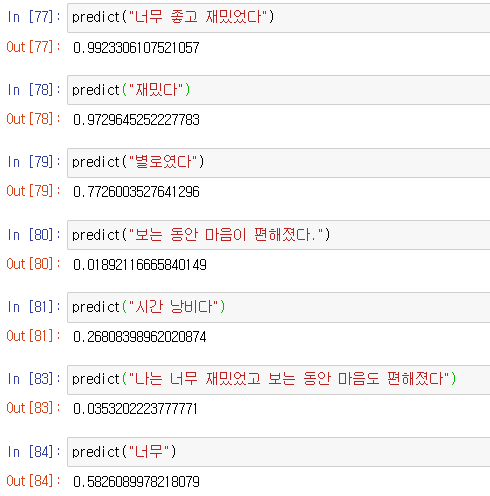

# 한글 텍스트 분류 - 02 모델 구현


텍스트가 한글이냐 영어에 따라서 모델이 달라지는 것은 아니다. 이번에는 여러 모델을 사용하는 것이 아닌 하나의 모델만 사용해 문장 분류를 해보자. 딥러닝의 합성곱 신경망을 사용해서 모델링을 해볼 것이다. 저번에 배웠던 내용을 토대로 다른 모델을 사용할 수도 있을 것이다.

따라서 코드 자체도 거의 똑같다. 복습 정도로 생각하고 따라해보자. 설명은 거의 생략한다.

```python
import tensorflow as tf
from tensorflow.python.keras.preprocessing.text import Tokenizer
from tensorflow.keras.preprocessing.sequence import pad_sequences
from tensorflow.keras.callbacks import EarlyStopping, ModelCheckpoint
from tensorflow.keras import layers
from tensorflow.keras.layers import Embedding, Conv1D, GlobalMaxPooling1D, Dropout, Dense

import numpy as np
import pandas as pd

import matplotlib.pyplot as plt

import re
import os
import json

from konlpy.tag import Okt
from tqdm import tqdm
from bs4 import BeautifulSoup
import nltk
from nltk.corpus import stopwords
```

```python
DATA_IN_PATH = './data_in/'
DATA_OUT_PATH = './data_out/'
INPUT_TRAIN_DATA = 'nsmc_train_input.npy'
LABEL_TRAIN_DATA = 'nsmc_train_label.npy'
DATA_CONFIGS = 'data_configs.json'

train_input = np.load(open(DATA_IN_PATH + INPUT_TRAIN_DATA, 'rb'))
train_label = np.load(open(DATA_IN_PATH + LABEL_TRAIN_DATA, 'rb'))
prepro_configs = json.load(open(DATA_IN_PATH + DATA_CONFIGS, 'r'))
```

필요한 라이브러리와 데이터를 불러왔다. 불러온 데이터는 넘파이 파일로 저번에 토크나이저를 통해 리뷰를 숫자로 바꾼 결과값들이다.

```python
SEED_NUM = 1234
tf.random.set_seed(SEED_NUM)
```

모델의 하이퍼 파라미터를 정의하자.

```python
model_name = 'cnn_classifier_kr'
BATCH_SIZE = 512
NUM_EPOCHS = 10
VALID_SPLIT = 0.1
MAX_LEN = train_input.shape[1]
```

모델을 쌓고 컴파일하자.

```python
model = tf.keras.Sequential([
    Embedding(input_dim=74066, output_dim=128),
    Conv1D(filters=100, kernel_size=4, padding='valid', activation=tf.keras.activations.relu),
    GlobalMaxPooling1D(),
    Dropout(0.2),
    Dense(units=250, activation='relu'),
    Dense(units=1, activation='sigmoid')
])
```

```python
model.compile(optimizer=tf.keras.optimizers.Adam(),
              loss=tf.keras.losses.BinaryCrossentropy(),
              metrics=[tf.keras.metrics.BinaryAccuracy(name='accuracy')])
```

콜백함수이다.

```python
# overfitting을 막기 위한 ealrystop 추가
earlystop_callback = EarlyStopping(monitor='val_accuracy', min_delta=0.0001,patience=2)
# min_delta: the threshold that triggers the termination (acc should at least improve 0.0001)
# patience: no improvment epochs (patience = 1, 1번 이상 상승이 없으면 종료)\

checkpoint_path = DATA_OUT_PATH + model_name + '/weights.h5'
checkpoint_dir = os.path.dirname(checkpoint_path)

# Create path if exists
if os.path.exists(checkpoint_dir):
    print("{} -- Folder already exists \n".format(checkpoint_dir))
else:
    os.makedirs(checkpoint_dir, exist_ok=True)
    print("{} -- Folder create complete \n".format(checkpoint_dir))
    

cp_callback = ModelCheckpoint(
    checkpoint_path, monitor='val_accuracy', verbose=1, save_best_only=True, save_weights_only=True)
```

학습시키자. 시간 오래걸릴 수 있음을 주의하자.

```python
history = model.fit(train_input, train_label, batch_size=BATCH_SIZE, epochs=NUM_EPOCHS,
                    validation_split=VALID_SPLIT, callbacks=[earlystop_callback, cp_callback])
```

학습 데이터는 85퍼센트, 검증 데이터는 82퍼센트의 정확도가 나온다.

다음은 예측 과정이다. 예측하는 것을 연습해보자. 아무리 모델을 잘 쌓아도 예측을 할 줄 모르면 사용할 수가 없어 그림의 떡이 된다.

```python
def preprocessing(review, remove_stopwords = True):
    # 함수의 인자는 다음과 같다.
    # review : 전처리할 텍스트
    # okt : okt 객체를 반복적으로 생성하지 않고 미리 생성후 인자로 받는다.
    # remove_stopword : 불용어를 제거할지 선택 기본값은 True
    
    # 1. 한글 및 공백을 제외한 문자 모두 제거.
    review_text = re.sub("[^가-힣ㄱ-ㅎㅏ-ㅣ\\s]", "", review)
    
    # 2. okt 객체를 활용해서 형태소 단위로 나눈다.
    word_review = okt.morphs(review_text, stem=True)
    
    stop_words = set(['은', '는', '이', '가', '하', '아', '것', '들','의', '있', '되', '수', '보', '주', '등', '한'])
    
    if remove_stopwords:
        
        # 불용어 제거(선택적)
        word_review = [token for token in word_review if not token in stop_words]
    
    clean_review = ' '.join(word_review)

    return clean_review
```

먼저 전처리 함수를 정의했다. 우리가 전처리 과정에서 나온 깨끗한 리뷰들을 데이터프레임으로 저장하고 사용할 예정인데, 데이터 프레임에 리뷰가 ['나', '너무', '재밌다', '보다'] 와 같이 저장되어 있다. 그런데 알고보니 이는 리스트가 아닌 문자열이라 preprocessing함수를 미리 정의해서 데이터 프레임의 리뷰 데이터들을 나 너무 재밌다 보다 와 같이 단어들의 나열로 만들 예정이다.

우리가 예측하는 과정에서 뜬금없이 전처리된 학습 데이터를 다루는 이유는 이를 단어사전을 만드는 데에 활용하기 위함이다. 단어사전을 통해 리뷰를 글자들로 바꿀 수 있는데 인공지능을 학습시키는 과정에서도 진행했듯이 예측하는 과정에서도 필요하다.

```python
okt=Okt()
train_data = pd.read_csv('nscm_train_clean.csv')
clean_review = []

for review in train_data['review'] :
    sentence = preprocessing(review)
    clean_review.append(sentence)
```

okt 객체는 미리 만들어 두었다. 한글 데이터 전처리를 할 때 단어를 구분할 때 okt를 썼었던 것을 기억하자. tokenizer에 단어사전을 만들기 위해 clean_review 리스트에 전처리된 리뷰들을 담아두는 과정이다. 데이터 프레임이나 시리즈 형태로 들어가는 것 보다 리스트 형태로 들어가는 것이 훨씬 과정이 짧은 것 같다. 과정이 짧은 건지 에러가 뜨는건지는 모르겠다.

```python
tokenizer = Tokenizer()
tokenizer.fit_on_texts(clean_review)
```

Tokenizer를 이용해 단어사전을 만들었다. 전처리 함수는 미리 만들었으므로 리뷰를 숫자로 만드는 인코딩 함수를 만들고, 전처리와 인코딩, 예측을 한 번에 할 수 있는 함수를 만들어 보자. 이는 저번과 거의 동일하다.

```python
def encoding(review) :
    global tokenizer
    encoded = tokenizer.texts_to_sequences([review])
    pad = pad_sequences(encoded, maxlen=8)
    return pad
```

```python
def predict(review) :
    clean_review = preprocessing(review, remove_stopwords=True)
    print(clean_review)
    pad = encoding(clean_review)
    return float(model.predict(pad))
```

다음은 사용한 결과이다.



결과가 생각보다 우리가 원하는 결과는 아니다. 영어 텍스트의 합성곱 신경망과 동일하게 학습을 시켰는데 결과가 원하지 않게 나온 것을 보면 데이터의 질이나 전처리에 있어서 아쉬운 점이 있는 것 같다.