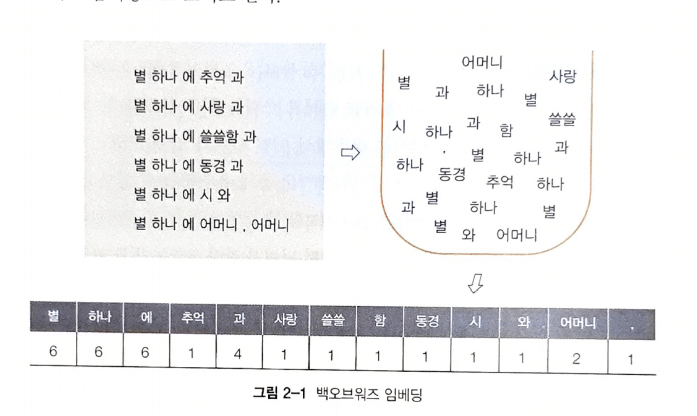

# 한국어 임베딩 - 02 벡터가 어떻게 의미를 가지게 되는가

자연어의 의미를 임베딩에 어떻게 녹여낼 수 있는지에 대해 알아보자.

1. 자연어의 계산과 이해

    알다시피 컴퓨트넌 자연어를 사람처럼 이해할 수 없다. 그저 계산기일 뿐이다. 임베딩은 이런 계산기에게 자연어를 계산하는 것을 가능하게 한다. 임베딩은 자연어를 컴퓨터가 처리할 수 있는 숫자들의 나열인 벡터로 바꾼 결과물이기 때문이다. 컴퓨터는 임베딩을 계산/처리해 사람이 알아들을 수 있는 형태의 자연어로 출력한다. 사람 말을 모두 이해하는 인공지능이 등장한다고 해도 그 이해의 본질은 계산이다.

    그러면 임베딩에 자연어 의미를 어떻게 함축할 수 있을까. 그 비결은 자연어의 통계적 패턴 (statistical pattern) 정보를 통째로 임베딩에 넣는 것이다. 자연어의 의미는 해당 언어 화자들이 실제 사용하는 일상 언어에서 드러나기 때문이다. 임베딩을 만들 때 쓰는 통계 정보는 크게 세 가지가 있다. 어떤 단어가 많이 쓰였는가 (백오브워즈 가정), 단어가 어떤 순서로 등장하는가 (언어 모델), 문장에 어떤 단어가 같이 나타났는가(분포 가정)이다.

    위의 세 철학은 서로 연관이 있다. 이 셋은 말뭉치의 통계적 패턴을 서로 다른 각도에서 분석하는 것이며 상호 보완적이다. 

    어떤 단어가 문장에서 주로 나타나는 순서는 해당 단어의 주변 문맥과 매우 깊은 관계를 가지며 어떤 단어 쌍이 얼마나 자주 나타나는지와 관련한 정보를 수치화하기 위해 개별 단어 그리고 단어 쌍의 빈도 정보를 적극 활용할 수 밖에 없기 때문이다.

2. 어떤 단어가 많이 쓰였는가
    - 백오브워즈 가정 (bar of words)

        수학에서 백(bag)이란 중복 원소를 허용한 집합을 뜻한다. 원소의 순서는 고려하지 않는다. 백오브워즈란 단어의 등장 순서와 관계없이 문서 내 단어의 등장 빈도를 임베딩으로 쓰는 기법을 뜻한다. 백오브워즈는 문장을 단어들로 나누고 이들을 중복 집합에 넣어 임베딩으로 활용하는 것이라고 보면 된다. 단어들을 바구니에 넣고 하나씩 꺼내면서 그 빈도를 세어 놓은 것으로 이해하면 쉽다. 경우에 따라서는 등장히면 1 아니면 0과 같이 빈도 역시 단순화한 백오브워즈 임베딩을 사용하기도 한다.

        

        백오브워즈 임베딩에는 '저자가 생각한 주제가 문서에서의 단어 사용에 녹아있다' 라는 가정이 깔려 있다. 즉, 주제가 비슷한 문서라면 단어 빈도 또는 단어 등장 여부가 비슷하고, 백오브워즈 임베딩 역시 유사할 것이라고 보는 것이다. 빈도를 그대로 백오브워즈로 쓴다면 많이 쓰인 단어가 주제와 더 강한 관련을 맺고 있을 것이라는 전제 역시 깔려있다.

        백오브워즈 임베딩은 간단한 아이디어지만 정보 검색 (Information Retrieval) 분야에서 여전히 많이 쓰이고 있다. 사용자의 질의에 가장 적절한 문서를 보여줄 때 질의를 백오브워즈 임베딩으로 변환하고 질의와 걺색 대상 문서 임베딩 간 코사인 유사도를 구해 유사도가 가장 높은 문서를 사용자에게 노출한다.

    - TF-IDF

        단어 빈도 또는 등장 여부를 그대로 임베딩으로 쓰는 것에는 큰 단점이 있다. 어떤 문서에든 쓰여서 해당 단어가 많이 나타났다 하더라도 문서의 주제를 가늠하기 어려운 경우가 있기 때문이다. 을/를 이/가 와 같은 조사는 대부분의 한국어 문서에 등장한다. 조사는 모든 문서에 많이 쓰이지만 조사는 문서의 주제를 유추하는데 도움이 되지 않는다.

        이를 보완하기 위해 제안된 기법이 TF-IDF이다. 저번에 본 단어-문서 행렬에 아래 수식과 같이 가중치를 계산해 행렬 원소를 바꾼다. TF-IDF 역시 단어 등장 순서를 고려하지 않는다는 점에서 백오브워즈 임베딩이라고 할 수 있다.

        TF-IDF(w) = TF(w)*log(N/DF(w))