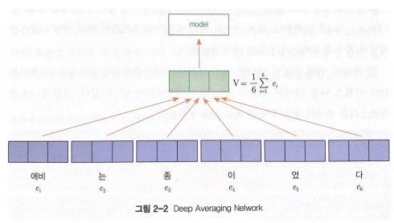
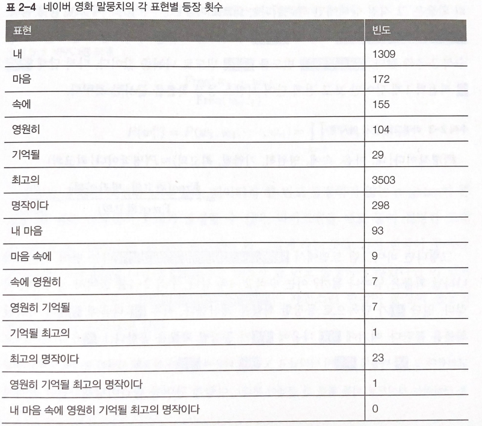
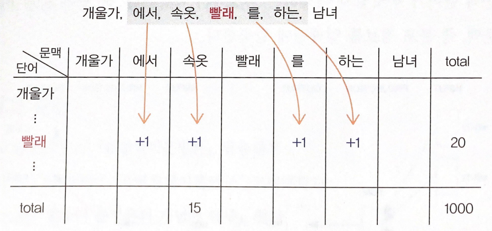

# 한국어 임베딩 - 02 벡터가 어떻게 의미를 가지게 되는가

자연어의 의미를 임베딩에 어떻게 녹여낼 수 있는지에 대해 알아보자.

1. 자연어의 계산과 이해

    알다시피 컴퓨트넌 자연어를 사람처럼 이해할 수 없다. 그저 계산기일 뿐이다. 임베딩은 이런 계산기에게 자연어를 계산하는 것을 가능하게 한다. 임베딩은 자연어를 컴퓨터가 처리할 수 있는 숫자들의 나열인 벡터로 바꾼 결과물이기 때문이다. 컴퓨터는 임베딩을 계산/처리해 사람이 알아들을 수 있는 형태의 자연어로 출력한다. 사람 말을 모두 이해하는 인공지능이 등장한다고 해도 그 이해의 본질은 계산이다.

    그러면 임베딩에 자연어 의미를 어떻게 함축할 수 있을까. 그 비결은 자연어의 통계적 패턴 (statistical pattern) 정보를 통째로 임베딩에 넣는 것이다. 자연어의 의미는 해당 언어 화자들이 실제 사용하는 일상 언어에서 드러나기 때문이다. 임베딩을 만들 때 쓰는 통계 정보는 크게 세 가지가 있다. 어떤 단어가 많이 쓰였는가 (백오브워즈 가정), 단어가 어떤 순서로 등장하는가 (언어 모델), 문장에 어떤 단어가 같이 나타났는가(분포 가정)이다.

    위의 세 철학은 서로 연관이 있다. 이 셋은 말뭉치의 통계적 패턴을 서로 다른 각도에서 분석하는 것이며 상호 보완적이다. 

    어떤 단어가 문장에서 주로 나타나는 순서는 해당 단어의 주변 문맥과 매우 깊은 관계를 가지며 어떤 단어 쌍이 얼마나 자주 나타나는지와 관련한 정보를 수치화하기 위해 개별 단어 그리고 단어 쌍의 빈도 정보를 적극 활용할 수 밖에 없기 때문이다.

2. 어떤 단어가 많이 쓰였는가
    - 백오브워즈 가정 (bar of words)

        수학에서 백(bag)이란 중복 원소를 허용한 집합을 뜻한다. 원소의 순서는 고려하지 않는다. 백오브워즈란 단어의 등장 순서와 관계없이 문서 내 단어의 등장 빈도를 임베딩으로 쓰는 기법을 뜻한다. 백오브워즈는 문장을 단어들로 나누고 이들을 중복 집합에 넣어 임베딩으로 활용하는 것이라고 보면 된다. 단어들을 바구니에 넣고 하나씩 꺼내면서 그 빈도를 세어 놓은 것으로 이해하면 쉽다. 경우에 따라서는 등장히면 1 아니면 0과 같이 빈도 역시 단순화한 백오브워즈 임베딩을 사용하기도 한다.

        

        백오브워즈 임베딩에는 '저자가 생각한 주제가 문서에서의 단어 사용에 녹아있다' 라는 가정이 깔려 있다. 즉, 주제가 비슷한 문서라면 단어 빈도 또는 단어 등장 여부가 비슷하고, 백오브워즈 임베딩 역시 유사할 것이라고 보는 것이다. 빈도를 그대로 백오브워즈로 쓴다면 많이 쓰인 단어가 주제와 더 강한 관련을 맺고 있을 것이라는 전제 역시 깔려있다.

        백오브워즈 임베딩은 간단한 아이디어지만 정보 검색 (Information Retrieval) 분야에서 여전히 많이 쓰이고 있다. 사용자의 질의에 가장 적절한 문서를 보여줄 때 질의를 백오브워즈 임베딩으로 변환하고 질의와 걺색 대상 문서 임베딩 간 코사인 유사도를 구해 유사도가 가장 높은 문서를 사용자에게 노출한다.

    - TF-IDF

        단어 빈도 또는 등장 여부를 그대로 임베딩으로 쓰는 것에는 큰 단점이 있다. 어떤 문서에든 쓰여서 해당 단어가 많이 나타났다 하더라도 문서의 주제를 가늠하기 어려운 경우가 있기 때문이다. 을/를 이/가 와 같은 조사는 대부분의 한국어 문서에 등장한다. 조사는 모든 문서에 많이 쓰이지만 조사는 문서의 주제를 유추하는데 도움이 되지 않는다.

        이를 보완하기 위해 제안된 기법이 TF-IDF이다. 저번에 본 단어-문서 행렬에 아래 수식과 같이 가중치를 계산해 행렬 원소를 바꾼다. TF-IDF 역시 단어 등장 순서를 고려하지 않는다는 점에서 백오브워즈 임베딩이라고 할 수 있다.

        TF-IDF(w) = TF(w)*log(N/DF(w))

        TF (Term Frequency)는 어떤 단어가 특정 문서에 얼마나 많이 쓰였는지 빈도를 나타낸다. 많이 쓰인 단어가 중요하다는 가정을 전제로 한 수치이다.

        DF (Document Frequency)는 특정 단어가 나타난 문서의 수를 뜻한다. DF가  클수록 다수 문서에 쓰이는 범용적인 단어라고 할 수 있다.

        TF는 같은 단어라도 문서마다 다른 값을 가지고, DF는 문서가 달라지더라도 단어가 같다면 동일한 값을 지닌다.

        IDF(Inverse Document Frequency)는 전체 문서 수 (N)을 해당 단어의 DF로 나눈 뒤 로그를 취한 값이다. 그 값이 클수록 특이한 값이란 이야기다. 이는 단어의 주제 예측 능력과도 직결된다. (해당 단어만 보고 문서의 주제를 가늠해 볼 수 있는 정도)

        TF-IDF가 지향하는 원리는 다음과 같다. 어떤 단어의 주제 예측 능력이 강할 수록 가중치가 커지고 반대일 경우 작아진다. 또 TF가 높으면 TF-IDF가 커진다. 단어 사용 빈도는 저자가 상정한 주제와 관련을 맺고 있을 것이라는 가정에 기초한 것이다. 

        TF-IDF를 적용하면 '것'과 같이 정보성이 없는 단어들은 그 가중치가 줄게 되어 불필요한 정보가 사라진다. 

        - Deep Averaging Network

          Deep Averaging Network(Iyyer et al., 2015)는 백오브워즈 가정의 뉴럴 네트워크 버전이다.

          

          이 모델이 백오브워즈 가정과 연결될 수 있는 지점은 단어의 순서를 고려하지 않는다는 점에 있다. 위 그림처럼 애비는 종이었다 라는 문장의 임베딩은 중복집합 {애비, 는, 종, 이, 었, 다}에 속한 단어의 임베딩을 평균을 취해 만든다. 벡터의 덧셈은 교환법칙이 성립하므로 단어의 임베딩의 평균을 취해 문장 임베딩을 만드는 방식은 단어 순서가 어떻게 오던지 상관이 없다.

          이 구조는 문장 내에 어떤 단어가 쓰였는지, 쓰였다면 얼마나 많이 쓰였는지 그 빈도만을 따진다. 이러한 문장 임베딩을 입력받아 해당 문서가 어떤 범주인지 분류하는 목적으로 사용할 때 성능이 좋아 현업에서도 자주 쓰인다.

        1. 단어가 어떤 순서로 쓰였는가

           - 통계 기반 언어 모델

             언어 모델(language model)이란 단어 시퀀스에 확률을 부여하는 모델이다. 단어의 등장 순서를 무시하는 백오브워즈와 달리 언어 모델은 시퀀스 정보를 명시적으로 학습한다. 따라서 백오브워즈의 대척점에 언어 모델이 있다고 말할 수 있다.

             단어가 n개 주어진 상황이라면 언어 모델은 n개 단어가 동시에 나타날 확률, 즉, P(w1, ... , wn)을 반환한다. 통계 기반의 언어 모델은 말뭉치에서 해당 단어 시퀀스가 얼마나 자주 등장하는지 빈도를 세어 학습한다.

             잘 학습된 언어 모델이 있다면 어떤 문장이 그럴듯한지 (확률 값이 높은지), 주어진 단어 시퀀스 다음 단어는 무엇이 오는 게 자연스러운지 알 수 있다.

             - 누명을 쓰다 → 0.41
             - 누명을 당하다 → 0.02
             - 두시 삼십이분 → 0.51
             - 이시 서른두분 → 0.08
             - 난폭 운전 → 0.39
             - 무모 운전 → 0.01

             n-gram이란 n개 단어를 뜻하는 용어다. 난폭, 운전/ 눈, 뜨다 등은 2-gram 또는 바이그램(bigram)이다. 누명, 을 쓰다 등은 3-gram 또는 트라이그램(tribram), 바람, 잘, 날, 없다 등은 4-gram 이다. 경우에 따라서 n-gram은 n-gram에 기반한 언어 모델을 의미하기도 한다. 말뭉치 내 단어들을 n개씩 묶어서 그 빈도를 학습했다는 뜻이다.

             아래 표는 네이버 영화 리뷰 말뭉치에서 각각의 표현이 등장한 횟수를 가리킨다. 띄어쓰기 단위인 어절을 하나의 단어로 보고 빈도를 센 것이다. 

             

             표를 보면 '내 마음 속에 영원히 기억된 최고의 명작이다' 는 한 번도 등장하지 않았다. 이 경우 네이버 영화 말뭉치로 학습한 언어 모델은 해당 표현이 나타날 확률을 0으로 부여하게 된다. 즉, 문법이나 의미적으로 아무 문제가 없지만, 한 번도 등장하지 않았기에 해당 표현을 말이 안된다고 판단한다는 이야기이다.

             '내 마음 속에 영원히 기억될 최고의' 라는 표현 다음에 '명작이다'라는 단어가 나타날 확률은 조건부확률의 정의를 활용해 최대우도추정법으로 유도하면 다음 수식과 같다. Freq란 해당 문자열 시퀀스가 말뭉치에서 나타난 빈도를 가리킨다. 하지만 수식 우변의 분자가 0이서저 전체 값이 0이 된다.

             $P(명작이다|내, 마음, 속에, 영원히, 기억될, 최고의) = Freq(내, 마음, 속에, 영원히, 기억될, 최고의, 명작이다) / Freq(내, 마음, 속에, 영원히, 기억될, 최고의)$

             n-gram 모델을 쓰면 이런 문제를 일부 해결할 수 있다. 직전 n-r개 단어의 등장 확률로 전체 단어 시퀀스 등장 확률을 근사하는 것이다. 이는 한 상태의 확률은 그 직전 상태에만 의존한다는 마코프 가정에 기반한 것이다. '내 마음 속에 영원히 기억될 최고의' 다음에 '명작이다'가 나타날 확률을 바이그램 모델로 근사하면 아래 수식과 같다. 최고의 명작이다 빈도를 최고의 빈도로 나눠준 값이다. 다시 말해 명작이다 직전의 1개 단어만 보고 전체 단어 시퀀스 등장 확률을 구하는 것이다.

             $P(명작이다|최고의) = Freq(최고의, 명작이다)/Freq(최고의) = 23/3503$

             P(명작이다|최고의)가 P(명작이다|내, 마음, 속에, 영원히, 기억될, 최고의)와 근사값임을 가정하는 것이다.

             그렇다면 바이그램 모델에서 '내 마음 속에 영원히 기억될 최고의 명작이다' 라는 단어 시퀀스가 나타날 확률은 얼마나 될까? 먼저 전체 단어에서 '내'가 등장할 확률, 그리고 위와 같이 계산하여 '내' 다음에 '마음'이 등장할 확률 ... '명작이다'가 등장할 확률까지 모두 곱해서 구할 수 있다.

             n-gram은 바이그램 모델의 확장판으로 직전 단어 1개만 참고하는 바이그램 모델과 달리 전체 단어 시퀀스 등장 확률 계산 시 직전 n - 1개 단어의 히스토리를 본다.

             하지만 문제는 여전히 남아 있다. 데이터에 한 번도 등장하지 않는 n-gram이 존재할 때 예측 단계에서 문제가 발생할 수 있다. 바이그램을 예로 들어 설명한다면 다음과 같다. 학습 데이터에 '아이는' 다음에 '인사를'이 등장하지 않는다면 '그 아이는 인사를 잘한다' 와 같은 매우 자연스러운 한국어 문장이 등장할 확률이 0이 된다.

             이를 위해 백오프(back-off), 스무딩(smooting) 등의 방식이 제안됐다. 

             백오프란 n-gram 등장 빈도를 n보다 작은 범위의 단어 시퀀스 빈도로 근사하는 방식이다. n을 크게 하면 할수록 등장하지 않는 케이스가 많아질 가능성이 높기 때문이다. 아까의 예시를 가져오면 네이버 영화 리뷰 말뭉치에서 '내 마음 속에 영원히 기억될 최고의 명작이다'는 7-gram 모델을 적용하면 등장 빈도가 0이다. 이를 백오프 방식으로 (N을 4로 줄임) 7-gram 빈도를 근사하면 아래 수식과 같다. a와 b는 실제 빈도와의 차이를 보정해주는 파라미터다. 물론 빈도가 1 이상은 7-gram에 대해서는 백오프하지 않고 해당 빈도를 그대로 n-gram 모델 학습에 사용한다.

             $Freq(내 마음 속에 영원히 기억될 최고의 명작이다) = aFreq(영원히 기억될 최고의 명작이다) + b$

             스무딩은 위 이미지의 표와 같은 등장 빈도 표에 모두 k만큼 더하는 기법이다. 이렇게 되면 '내 마음 속에 영원히 기억될 최고의 명작이다'의 빈도는 k가 된다. (0+k) 그래서 Add-k 스무딩이라고 부르기도 한다. 만약 k를 1로 설정하면 이를 특별히 라플라스 스무딩이라고 한다. 스무딩을 시행하면 높은 빈도를 가진 문자열 등장 확률을 일부 깎고 학습 데이터에 전혀 등장하지 않는 케이스들에는 작으나마 일부 확률을 부여하게 된다.

           - 뉴럴 네트워크 기반 언어 모델

             우리가 앞서 설명한 통계 기반 언어 모델은 단어들의 빈도를 세어서 학습한다. 그런데 이를 뉴럴 네트워크로 학습할 수도 있다. 뉴럴 네트워크는 입력과 출력 사이의 관계를 유연하게 포착해낼 수 있고, 그 자체로 확률 모델로 가능할 수 있기 때문이다. 콘셉트는 다음과 같다.

             - 발 없는 말이 → 언어 모델 → 천리

             뉴럴 네트워크 기반 언어 모델은 위와 같이 주어진 단어 시퀀스를 가지고 다음 단어를 맞추는 과정에서 학습된다. 학습이 완료되면 이들 모델의 중간 혹은 말단 계산 결과물을 단어나 문장의 임베딩으로 활용한다. ELMo, GPT 등 모델이 여기에 해당한다.

             마스크 언어 모델 (masked language model) 은 언어 모델 기반 기법과 큰 틀에서 유사하지만 디테일에서 차이를 보인다. 이는 문장 중간에 빈 칸을 뚫어 놓고 해당 빈 칸에 어떤 단어가 올지 예측하는 과정에서 학습한다.

             언어 모델 기반 기법은 단어를 순차적으로 입력받아 다음 단어를 맞춰야 하기 때문에 태생적으로 일방향이다. 하지만 마스크 언어 모델 기반 기법은 문장 전체를 다 보고 중간에 있는 단어를 예측하기 때문에 양방향 학습이 가능하다. 이 덕분에 마스크 언어 모델 기반의 방법들은 기존 언어 모델 기법들 대비 임베딩 품질이 좋다. BERT가 이 부류에 속한다.

        2. 어떤 단어가 같이 쓰였는가

           - 분포 가정

             자연어 처리에서 분포(distribution)란 특정 범위, 즉 윈도우(window) 내에 동시에 등장하는 이웃 단어 또는 문맥의 집합을 가리킨다. 개별 단어의 분포는 그 단어가 문장 내에서 주로 어느 위치에 나타나는지, 이웃한 위치에 어떤 단어가 자주 나타나는지에 따라 달라진다. 어떤 단어 쌍이 비슷한 문맥 환경에서 자주 등장한다면 그 의미 또한 유사할 것이라는 게 분포 가정(distributional hypothesis)의 전제다.

             분포 가정은 '단어의 의미는 곧 그 언어에서의 활용이다.' 라는 언어학자 비트겐슈타인의 철학에 기반해 있다. 다시 말해 모국어 화자들이 해당 단어를 실제 어떻게 사용하고 있는지 문맥을 살핌으로써 그 단어의 의미를 밝힐 수 있다는 이야기다.

             예를 들어 우리가 빨래, 세탁 이라는 단어의 의미를 전혀 모른다고 하자. 두 단어의 의미를 파악하기 위해서는 이들 단어가 실제 어떻게 쓰이고 있는지 관찰하면 된다. 우리가 모르는 빨래, 세탁은 각각 타깃 단어이고, 그 주위에 등장한 단어는 문맥 단어 이다.

             - 특기는 자칭 청소와 빨래지만 요리는 절망적이다
             - 재를 우려낸 물로 빨래를 할 때
             - 개울가에서 속옷 빨래를 하는 남녀
             - 찬 물로 옷을 세탁한다.
             - 세탁, 청소, 요리와 가사는 ...

             주어진 문장에 빨래가 청소, 요리, 물, 속옷과 같이 등장하고, 세탁이 청소, 요리, 물, 옷과 같이 등장한다면 분포 가정을 적용해 유추하면 빨래와 세탁은 비슷한 의미를 지닐 가능성이 높다. 이웃 단어가 비슷하기 때문이다. 또 타깃 단어와 문맥 단어 간의 직간접적인 관계를 지닐 가능성 역시 낮지 않다. 이로써 우리는 빨래의 의미는 물을 이용해 하는 어떤 행위 또는 속옷에 가하는 어떤 행위 등으로 추측해 볼 수 있을 것이다.

             하지만 개별 단어의 분포 정보와 그 의미 사이에는 논리적으로 직접적인 연관성이 있어 보이지는 않는다. 다시 말해 분포 정보가 곧 의미라는 분포 가정에 의문점이 제기될 수 있다는 이야기다. 둘 사이에 어떤 관계가 있는지 언어학적 관점에서 추가로 살펴보자.

           - 분포와 의미 : 형태소

             언어학에서 형태소란 의미를 가지는 최소 단위를 말한다. 더 쪼개면 뜻을 잃어버린다. 이 때 '의미'는 어휘적인 것 뿐만 아니라 문법적인 것도 포함된다.

             철수가 밥을 먹었다 라는 문장이 있다면 철수 가 하나의 형태소, 밥 이 하나의 형태소라 할 수 있다. 철수를 더 쪼개면 그 의미가 사라지고, 밥을 더 쪼개면 그 의미가 사라지기 때문이다.

             그런데 언어학자들이 형태소를 분석하는 방법은 조금 다르다. 대표적인 기준으로는 '계열 관계' 가 있다. 해당 형태소 자리에 다른 형태소가 '대치'돼 쓰일 수 있는가를 따지는 것이다. 언어학자들이 한국어 말뭉치를 다량 분석한 결과 '철수' 자리에 '영희' 같은 말이 올 수 있고, 밥 대신 빵을 사용할 수도 있다. 언어학자들은 이를 근거로 철수와 밥에 형태소 자격을 부여한다.

             언어학자들이 계열 관계를 바탕으로 형태소를 분석한다는 사실을 곱씹어보자. 이는 언어학자들이 특정 타깃 단어 주변의 문맥 정보를 바탕으로 형태소를 확인한다는 이야기와 일맥상통하다. 말뭉치의 분포 정보와 형태소가 밀접한 관계를 이루고 있다.

           - 분포와 의미 : 품사

             품사란 단어를 문법적 성질의 공통성에 따라 언어학자들이 몇 갈래로 묶어 놓은 것이다. 학교 문법에 따르면 품사 분류 기준은 기능, 의미, 형식 등 세 가지다. 다음 예문을 보자.

             - 이 샘의 깊이가 얼마냐?
             - 이 산의 높이가 얼마냐?
             - 이 샘이 깊다.
             - 저 산이 높다.

             기능은 한 단어가 문장 가운데서 다른 단어와 맺는 관계를 가리킨다. 위 예시에서 깊이, 높이는 문장의 주어로 쓰이고 있고, 깊다, 높다는 서술어로 사용되고 있다. 이처럼 기능이 같은 단어 부류를 같은 품사로 묶을 수 있다.

             의미란 단어의 형식적 의미를 나타낸다. 어떤 단어가 사물의 이름을 나타내는지, 움직임이나 성질, 상태를 나타내느냐 하는 것이다. 이렇게 본다면 깊이, 높이를 한 덩어리로, 깊다, 높다른 덩어리로 묶을 수 있다.

             형식이란 단어의 형태적 특징을 의미한다. 단어는 깊다 높다 처럼 어미가 붙어 여러 가지 모습으로 변화하는데, 이 기준으로 봐도 깊이, 높이를 한 덩어리 ,깊다 높다를 한 덩어리로 묶을 수 있다.

             하지만 실제 품사를 분류할 때에는 여러가지 어려움이 따른다. 예컨대 의미는 품사 분류 시 고려 대상이 될 수 있으나 결정적인 분류 기준이 될 수 없다. 다음 예문을 보자.

             - 공부하다
             - 공부

             우리는 대개 공부하다를 동사, 공부를 명사로 분류한다. 공부하다는 움직임을 나타내고 공부는 사물의 이름을 내포한다고 보는 것이다. 하지만 공부라는 단어에는 움직임의 의미가 전혀 없다고 보기는 힘들다. 의미가 품사 분류의 결정적인 기준이 될 수 없다는 이야기다. 이는 형태도 마찬가지다.

             - 영수가 학교에 간다.
             - 영수! 조용히 해.

             같은 형태이지만 처음에는 명사, 그 다음은 감탄사로 영수라는 단어가 사용되었다. 형태는 같지만 기능과 의미가 달라졌음을 알 수 있다.

             언어학자들이 꼽는 품사 분류에서 가장 결정적인 기준은 바로 '기능'이라고 한다. 해당 단어가 문장 내에서 점하는 역할에 초점을 맞춰 품사를 분류한다는 것이다.

             그런데 한국어를 비롯한 많은 언어에서는 어떤 단어의 기능이 그 단어의 분포와 매우 밀접한 관련을 맺고 있다고 한다.

             기능은 특정 단어가 문장 내에서 어떤 역할을 하는지, 분포는 그 단어가 어느 자리에 있는지를 나타낸다. 비유하면 '이웃사촌'은 정이 들어 사촌 형제나 다를 바 없이 지내는 이웃을 뜻한다. 이웃(분포)이 혈육 같이 챙겨주는 역할(기능)을 하는 데서 생겨난 말이다. 이처럼 기능과 분포는 개념적으로 엄밀히 다르지만, 밀접한 관련을 가진다.

             형태소의 경계를 정하거나 품사를 나누는 것과 같은 다양한 언어학적 문제는 말뭉치의 분포 정보와 깊은 관계를 가지고 있다. 이 덕분에 임베딩에 분포 정보를 함축하게 되면 해당 벡터에 해당 단어의 의미를 자연스레 내제시킬 수 있게 된다.

           - 점별 상호 정보량

             점별 상호 정보량(PMI) 은 두 확률 변수(random variable) 사이의 상관성을 계량화하는 단위이다. 두 확률 변수가 완전히 독립인 경우 그 값이 0이 된다. 독립이라 함은 단어 A가 나타난 것이 단어 B가 등장할 확률에 전혀 영향을 주지 않고, 단어 B의 등장이 단어 A의 등장에 전혀 영향을 주지 않을 경우를 가리킨다. 반대로 단어 A가 등장할 때 단어 B와 자주 같이 나타난다면 PMI 값은 커진다. 요컨대 PMI는 두 단어의 등장이 독립일 때 대비해 얼마나 자주 같이 등장하는지를 수치화한 것이다. 공식은 다음과 같다.

             $PMI(A, B) = log(P(A,B)/P(A)P(B))$

             PMI는 분포 가정에 따른 단어 가중치 할당 기법이다. 두 단어가 얼마나 자주 같이 등장하는지에 관한 정보를 수치화한 것이기 때문이다. 이렇게 구축한 PMI 행렬의 행 벡터 자체를 해당 단어의 임베딩으로 사용할 수도 있다.

             먼저 단어-문맥 행렬을 만든다. 

             

             만약 윈도우가 2라면 앞뒤로 2개의 문맥 단어의 빈도를 계산한다. 현재의 타깃 단어가 빨래 라면 에서, 속옷, 를, 하는 이라는 문맥 단어가 이번 빈도 계산의 대상이 되고 이들의 값을 1씩 올려준다. 이렇게 모든 단어를 훑어 위의 단어-문맥 행렬을 모두 구했다고 하자. 그러면 이를 통해 빨래 - 속옷 간 PMI 값을 계산할 수 있다.

           - Word2Vec

             분포 가정의 대표적인 모델은 2013년 구글 연구 팀이 발표한 Word2Vec이라는 임베딩 기법이다. CBOW 기법과 Skip-gram 기법이 있다.

             CBOW 모델은 문맥 단어들을 가지고 타깃 단어 하나를 맞추는 과정에서 학습되고, Skip-gram 모델은 타깃 단어를 가지고 문맥 단어가 무엇일지 예측하는 과정에서 학습된다. 둘 모두 특정 타깃 단어 주변의 문맥, 즉 분포 정보를 임베딩에 함축한다.

             실재 Word2Vec 기법은 PMI 행렬과 깊은 연관이 있다는 논문이 발표되기도 했다.