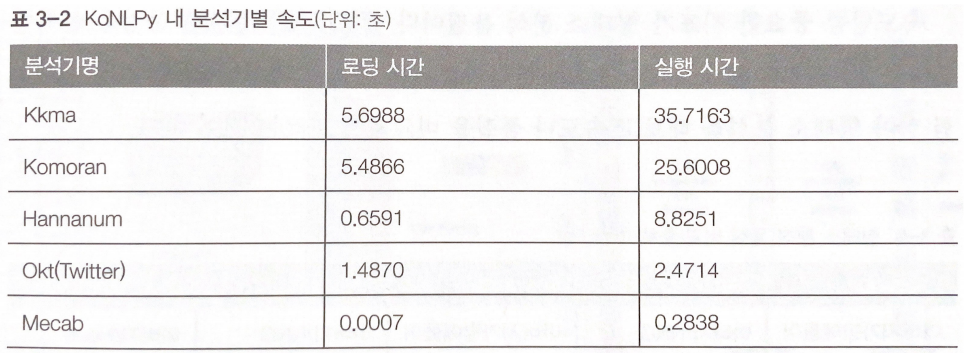
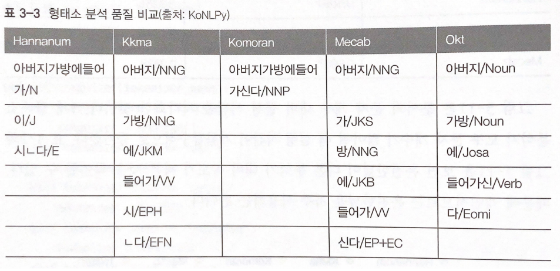

# 한국어 임베딩 - 03 형태소 분석

전처리가 완료된 데이터를 가져왔다. 말뭉치 데이터로는 한국어 위키백과, KorQuAD 학습/데브셋, 네이버 영화 말뭉치 학습/테스트 셋을 사용했다.

품질 좋은 임베딩을 만들기 위해서는 문장이나 단어의 경계를 컴퓨터에 알려줘야 한다. 그렇지 않으면 어휘 집합에 속한 단어 수가 기하급수적으로 늘어나서 연산의 비효율이 발생한다. 특히 한국어는 조사와 어미가 발달한 교착어이기 때문에 이러한 처리를 좀 더 섬세히 해주어야 한다. 예를 들면 '가다'라는 동사는 '가겠다.' '가더라.' 와 같이 다양하게 활용될 수 있다.

위의 '가다'의 활용형을 모두 어휘 집합에 넣는다면 새로운 활용형이 등장할 때 마다 어휘 집합이 계속 늘어난다. 이는 매우 비효율적이다. 이를 해결하기 위해 형태소 분석 기법을 사용해보자.

은전한닢이라는 오픈 소스 형태소 분석기로 가겠다 와 가더라 를 분석한 결과는 '가, 겠, 다', '가, 더라' 이다. 여기에 가겠더라 라는 활용형이 추가되었다고 가정해보자. '가, 겠, 더라'로 분석된다. 따라서 우리는 어휘 집합을 수정하지 않고도 가겠더라 라는 활용형을 처리할 수 있게 된다.

교착어인 한국어는 한정된 종류의 조사와 어미를 자주 이용하기 대문에 각각에 대응하는 명사, 용언 어간만 어휘 집합에 추가하면 취급 단어 개수를 꽤 줄일 수 있다. 형태소 분석기만 잘 활용해도 자연어 처리의 효율성을 높일 수 있다는 이야기다.

1. 지도 학습 기반 형태소 분석

    먼저 지도 학습 기반의 형태소 분석 방법을 설명한다. 여기서 설명하는 형태소 분석기들은 언어학 전문가들이 태깅한 형태소 분석 말뭉치로부터 학습된 지도 학습 기반 모델들이다. 태깅(tagging)이란 아래처럼 모델 입력과 출력 쌍을 만드는 작업을 가리킨다. 이 모델들은 문자열이 주어졌을 때 사람이 알려준 정답 패턴에 최대한 가깝게 토크나이즈한다.

    - 입력 : 아버지가방에들어가신다.
    - 출력: 아버지, 가, 방, 에, 들어가, 신다

    - KoNLPy 사용법

        KoNLPy는 은전한닢, 꼬꼬마, 한나눔, Okt, 코모란 등 5개 오픈소스 형태소 분석기를 파이썬 환경에서 사용할 수 있도록 인터페이스를 통일한 한국어 자연어 패키지다. 각기 다른 언어로 개발된 오픈소스들을 한군데에 묶어 쉽게 사용할 수 있도록 돕는다. 사용법을 분석기별로 순서대로 살펴보자.

        1. 은전한닢

            ```python
            from konlpy.tag import Mecab
            tokenizer = Mecab()
            tokenizer.morphs("아버지가방에들어가신다")
            ```

            결과는 ['아버지', '가', '방', '에', '들어가', '신다'] 이다. 품사 정보까지 확인할 수 있는 코드는 아래와 같다.

            ```python
            tokenizer.pos('아버지가방에들어가신다')
            ```

        2. 나머지

            꼬꼬마, 한나눔, Okt 등 KoNLPy에 속한 다른 형태소 분석기의 사용법은 은전한닢과 동일하다. 다만 처음 tokenizer를 선언할 때만 다르게 해주면 된다.

            (꼬꼬마 : Kkma, 한나눔 : Hannanum, Okt : Okt, 코모란 : Komoran)

            아래는 함수로 어떤 형태소 분석기를 사용하고 싶은지를 인자로 받아 해당 분석기를 반환하는 함수이다. 이후 분석은 위에서 설명한 은전한닢 사용법과 같다.

            함수 아래에는 함수를 활용해 코모란을 사용하는 예시이다.

            ```python
            from konlpy.tag import Okt, Komoran, Mecab, Hannanum, Kkma

            def get_tokenizer(tokenizer_name) :

            	if tokenizer_name == 'komoran' :
            		tokenizer = Komoran()
            	elif tokenizer_name == 'okt' :
            		tokenizer = Okt()
            	elif tokenizer_name == 'mecab' :
            		tokenizer = Mecab()
            	elif tokenizer_name == 'hannanum' :
            		tokenizer = Hannanum()
            	else :
            		tokenizer = Mecab()
            	
            	return tokenizer

            tokenizer = get_tokenizer("komoran")
            tokenizer.morphs("아버지가방에들어가신다")
            tokenizer.pos("아버지가방에들어가신다")
            ```

    - KoNLPy 내 분석기별 성능 차이 분석

        KoNLPy에서는 분석기별 성능 정보 역시 제공하고 있다. 이 정보를 정리한 내용은 다음 표와 같다. 로딩 시간은 분석기가 사용하는 사전 로딩을 포함해 형태소 분석기 클래스를 읽어 들이는 시간을 뜻하고, 실행 시간이란 10만 문자의 문서를 분석하는 데 소요되는 시간을 가리킨다.

        

        은전 한닢이 다른 분석기 대비 속도가 빠른 것을 확인할 수 있다.

        속도만큼 중요한 지표가 형태소 분석 품질이다. '아버지가방에들어가신다' 문장을 분석한 표는 다음과 같다. 어떤 형태소 분석기를 사용할지는 자신이 가진 데이터로 시험 삼아 형태소 분석을 해보고 속도나 품질을 비교해서 고르는 것이 좋다.

        

    - Khaiii 사용법

        Khaiii는 카카오가 2018년 말 공개한 오픈소스 한국어 형태소 분석기다. 국립국어원이 구축한 세종 코퍼스를 이용해 CNN 모델을 적용해 학습했다.

        khaiii는 입력 문장을 문자 단위로 읽어 들인 뒤 컨볼루션 필터가 이 문자들을 슬라이등해 가면서 정보를 추출한다. 이 네트워크의 말단 레이어에서는 이렇게 모든 정보들을 종합해 여태소의 경계와 품사 태그를 예측한다. 카카오 측 설명에 따르면 모델을 C++로 구현해 GPU 없이도 형태소 분석이 가능하며 실행 속도 역시 빠르다고 한다.

        [https://lsjsj92.tistory.com/408](https://lsjsj92.tistory.com/408)

        pip install 로는 다운로드가 단되며 위 링크에서 설치 방법을 설명하고 있지만 내 노트북에서는 안된다...

        ```python
        from khaiii import KhaiiiApi

        tokenizer = KhaiiiApi()

        data = tokenizer.analyze("아버지가방에들어가신다")
        tokens = []

        for word in data :
        	tokens.extend([str(m).split("/")[0] for m in word.morphs])
        ```

        결과는 ['아버지', '가', '방에', '들', '어', '가', '시', 'ㄴ다'] 이다. 위 코드에서 맨 마지막 줄에 split("/")을 사용하지 않으면 품사 정보까지 확인할 수 있다.

    - 은전한닢에 사용자 사전 추가하기

        형태소 분석기를 사용하다 보면 가장 신경써야 하는 점이 중요 토큰들을 어떻게 처리해야 할지다. 예컨대 우리가 '가우스전자'라는 기업의 데이터 분석 팀에 속해 있고 가우스전자에 관한 말뭉치를 분석하거나 이로부터 임베딩을 만들어야 한다고 가정해보자. 이 경우 가우스전자 라는 토큰은 섬세하게 처리해야 한다. 은전한닢 분석기로 가상의 상품명 '가우스전자 텔레비전 정말 좋네요'를 분석한 결과는 다음과 같다.

        ```python
        from konlpy.tag import Mecab

        tokenizer = Mecab()
        tokenizer.morphs("가우스전자 텔레비전 정말 좋네요")
        ```

        ['가우스', '전자', '텔레비전', '정말', '좋네요']

        우리의 관심 단어인 가우스전자 가 의도치 않게 두 개의 토큰으로 분석된 것을 확인할 수 있다. 가우스전자 하나로 분석됐을 때보다 데이터 분석이나 임베딩 품질이 떨어질 가능성이 높다. 따라서 우리는 관심 단어들을 사용자 사전에 추가해 가우스전자 같은 단어가 하나의 토큰으로 분석될 수 있도록 강제해야 한다.

        이 절에서 널리 쓰이고 있는 형태소 분석기인 은전한닢을 기준으로 사용자 사전을 추가하는 방법을 살펴보겠다. 추가 방법은 간단하다. preprocess폴더에 mecab-user-dic.csv파일을 하나 만들고 단어를 다음과 같이 추가한다.

        ```
        가우스전자,,,,NNP,*,T,가우스전자,*,*,*,*,*
        서울대입구역,,,,NNP,*,T,서울대입구역,*,*,*,*
        ```

        이후 다음을 파이썬 콘솔에서 실행한다.

        ```
        bash preprocess.sh mecab-user-dic
        ```

2. 비지도 학습 기반 형태소 분석

    비지도 학습 기반의 형태소 분석 방법을 설명한다. 지도 학습 기반은 전문가들이 직접 형태소 경계나 품사 정보를 모델에 가르쳐줘서 학습된 모델들이다. 이와 달리 비지도 학습 기법들은 데이터의 패턴을 모델 스스로 학습하게 함으로써 형태소를 분석하는 방법이다. 데이터에 자주 등장하는 단어들을 형태소로 인식한다.

    - soynlp 형태소 분석기

        위 형태소 분석기는 pip install soynlp로 설치 가능하다. 이는 형태소 분석, 품사 판별 등을 지원하는 파이썬 기반 한국어 자연어 처리 패키지다. 데이터 패턴을 스스로 학습하는 비지도 학습 접근법을 지향하기 때문에 하나의 문장 혹은 문서에서보다는 어느정도 규모가 있으면서 동질적인 문서 집합에서 잘 작동한다.