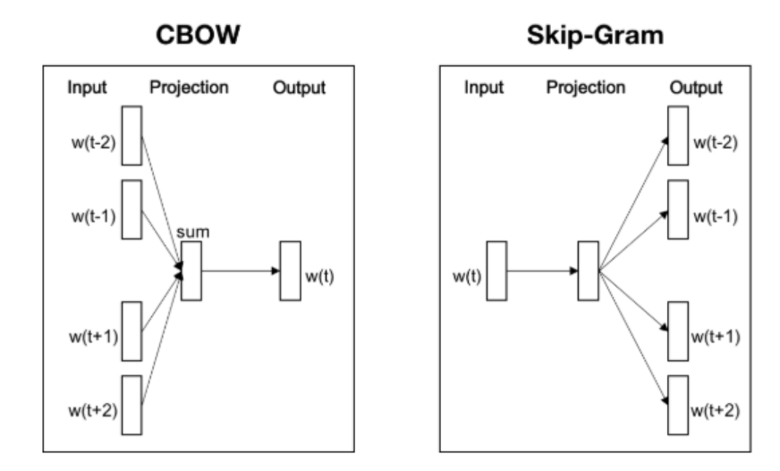

# 한국어 임베딩 - 05 단어 수준 임베딩 Word2Vec

Word2Vec은 2013년 구글 연구 팀이 발표한 기법으로 가장 널리 쓰이고 있는 단어 임베딩 모델이다. 두 개의 논문으로 나누어 발표되었는데, 한 논문에서는 Skip-Gram과 CBOW 모델이 제안되었고, 다른 논문에서는 이 두 모델을 근간으로 하되 네거티브 샘플링 등 학습 최적화 기법을 제안하였다.

1. 모델의 기본 구조

    CBOW와 Skip-gram모델의 기본 구조는 아래 그람과 같다. CBOW는 주변에 있는 문맥 단어 (context word)들을 가지고 타깃 단어(target word) 하나를 맞추는 과정에서 학습된다. Skip-gram 모델은 타깃 단어를 가지고 주변 문맥 단어가 무엇일지 예측하는 과정에서 학습된다. Skip-gram이 같은 말뭉치로도 더 많은 학습 데이터를 확보할 수 있어 임베딩 품질이 CBOW보다 좋은 경향이 있다. Skip-gram 모델을 중심으로 Word2Vec 기법에 대해 알아보도록 하자.

    

2. 학습 데이터 구축

    Word2Vec Skip-gram 모델의 학습 데이터를 구축하는 과정을 살펴보자. 한국어 위키백과에서 빨래가 쓰인 문장 하나를 가져왔다.

    - ... 개울가 에서 속옷 빨래 를 하는 남녀 ...

    포지티브 샘플 (positive sample) 이란 타깃 단어(t) 와 그 주변에 실제로 등장한 문맥 단어 (c) 쌍을 가리킨다. 네거티브 샘플 (negative sample)은 타깃 단어와 그 주변에 등장하지 않은 단어 (말뭉치 전체에서 랜덤 추출) 쌍을 의미한다. 

    Skip-gram 모델은 전체 말뭉치를 단어별로 슬라이딩해 가면서 학습 데이터를 만든다. 이전에 '빨래'를 타깃 단어로 학습했다면 다음 학습 데이터를 만들 때는 '를'이라는 단어가 타깃 단어가 되고 빨래는 문맥 단어가 된다. 결과적으로 skip-gram 모델은 같은 말뭉치를 두고도 얾창나게 많은 학습 데이터 쌍을 만들어낼 수 있다.

    Skip-gram 모델이 처음 제안되었을 때는 타깃 단어가 주어졌을 때 문맥 단어가 무엇일지 맞추는 과정에서 학습됐다. 하지만 이 방식은 소프트맥스 때문에 계산량이 비교적 큰 편이다. (정답이 아닌 단어들이 무수히 많은데 이를 다 계산하는 것은 비효율적...)

    그래서 두 번째 논문에서 제안된 Skip-gram 모델은 타깃 단어와 문맥 단어 쌍이 주어졌을 때 해당 쌍이 포지티브 샘플인지, 네거티브 샘플인지 이진 분류 하는 과정에서 학습한다. 이렇게 학습하는 기법을 네거티브 샘플링이라고 한다. 이 방법은 기존 방법보다 계산량이 훨씬 적다.

    네거티브 샘플은 말뭉치에 자주 등장하지 않는 희귀한 단어가 네거티브 샘플로 조금 더 잘 뽑힐 수 있도록 설계되었다.

    또한 이와 별개로 자주 등장하는 단어는 학습에서 제외하는 서브샘플링 기법도 적용했다. Skip-gram 모델은 말뭉치로부터 엄처나게 많은 학습 데이터 쌍을 만들어낼 수 있기 때문에 고빈도 단어의 경우 등장 횟수만큼 모두 학습시키는 것이 비효율적이라고 본 것이다.

3. 모델 학습

    Skip-gram 모델은 타깃 단어와 문맥 단어 쌍이 주어졌을 때 해당 쌍이 포지티브 샘플인지 아닌지를 예측하는 과정에서 학습된다. 따라서 타깃 단어와 문맥 단어 쌍이 실제 포지티브 샘플이라면 그에 해당하는 조건부 확률을 최대화해야 한다. 모델이 포지티브 샘플 단어 쌍을 입력받았을 때 이 쌍이 정말 포지티브 샘플이라고 잘 맞춰야 한다는 이야기다.

    Skip-gram 모델의 학습 파라미터는 U와 V 행렬 두 개 뿐이다. 둘의 크기는 어휘 집합 크기 x 임베딩 차원 수로 동일하다. U와 V는 각각 타깃 단어와 문맥 단어에 대응한다. ut는 타깃 단어 (t) 빨래 에 해당하는 U의 열벡터, vc는 문맥 단어 (c) 속옷에 해당하는 V의 '열 벡터' 가 된다. NPLM에 비해 학습 파라미터의 종류와 크기가 많이 줄어들었다.

    타깃 단어와 문맥 단어 쌍에 해당하는 조건부 확률을 최대화하려면 ut와 vc의 내적값을 키워야 하는데, 이는 코사인 유사도와 비례한다. 따라서 내적 값의 상향은 포지티브 샘플 t와 c에 해당하는 단어 벡터 간 유사도를 높인다 (벡터 공간 상으로 가까워진다) 는 의미로 이해할 수 있다.

    Skip-gram 모델은 네거티브 샘플 단어 쌍에 관해서도 그에 정의된 조건부 확률을 최대화해야 한다. 모델이 네거티브 샘플 단어 쌍을 입력 받으면 이 데이터가 정말 네거티브 샘플이라고 잘 맞춰야 한다는 이야기다. 물론, 포지티브 샘플 단어 쌍에 대한 조건부 확률과는 식이 다르다.

    이 조건부 확률을 최대화 하려면 ut와 vc의 내적 값을 줄여야 한다. 두 벡터의 내적은 코사인 유사도와 비례하고, 내적 값의 하향은 코사인 유사도가 낮아진다, 벡터 공간에서 멀어진다는 의미로 이해할 수 있다.

    Skip-gram 모델이 최대화해야 하는 로그우도 함수 (log-likelihood function) 은 모델 파라미터은 세타를 한 번 업데이트할 때 1개 쌍의 포지티브 샘플과 k개 쌍의 네거티브 샘플이 학습된다. 이를 최대화하는 과정에서 결과적으로 Skip-gram 모델은 말뭉치의 분포 정보를 단어 임베딩에 함축시키게 된다.

    모델 학습이 완료되면 U만 d차원(임베딩 차원 수)의 단어 임베딩으로 쓸 수 있고, U + V의 전치행렬을 임베딩으로 쓸 수도 있다. 혹은 U와 V의 전치행렬을 이어 붙여 2d 차원의 임베딩으로 사용할 수도 있다.

4. 튜토리얼

    그러면 Word2Vec Skip-gram 임베딩을 만들어보자. 임베딩 수행 대상 말뭉치는 한국어 위키백과, 네이버 영화 리뷰 말뭉치, KorQuAD 등 3개 데이터 셋을 합쳐서 사용한다.

    ```python
    from gensim.models import Word2Vec

    corpus_fname = './tokenized/corpus_mecab_jamo.txt'
    model_fname = './word2vec'
    ```

    ```python
    corpus = [sent.strip().split(" ") for sent in open(corpus_fname, 'r', encoding="UTF8").readlines()]
    model = Word2Vec(corpus, size=100, worker=4, sg=1)
    model.save(model_fname)
    ```

    Word2Vec 모델을 학습한다. size는 Word2Vec 임베딩의 차원 수, workers는 CPU 스레드 개수, sg는 1이면 Skip-gram, 0이면 CBOW로 학습한다.