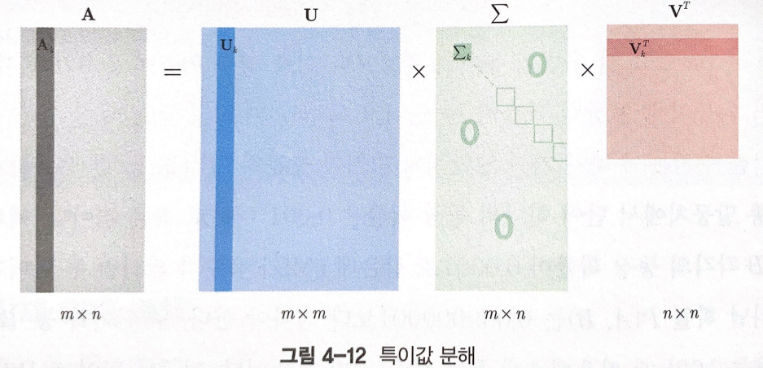
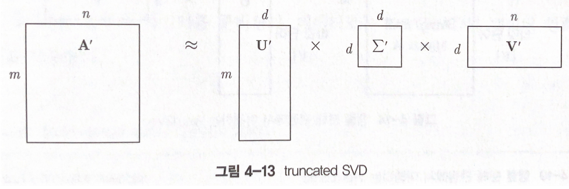

# 한국어 임베딩 - 07 단어 수준 임베딩 LSA

잠재 의미 분석 (LSA)이란 단어-문서 행렬이나 TF-IDF 행렬, 단어-문맥 행렬 같은 커다란 행렬에 차원 축소 방법의 일종인 특이값 분해를 수행해 데이터 차원 수를 줄여 계산 효율성을 키우는 한편 행간에 숨어 있는 잠재 의미를 이끌어내기 위한 방법론이다. 단어-문서 행렬이나 단어-문맥 행렬 등에 특이값 분해를 시행한 뒤 그 결과로 도출되는 행 벡터들을 단어 임베딩으로 사용할 수 있다. 잠재 의미 분석은 GloVe나 Swivel과 더불어 행렬 분해 기반의 기법으로 분류된다.

1. PPMI 행렬

    단어-문서 행렬(1장), TF-IDF 행렬(2장), 단어-문맥 행렬(2장), 점별 상호 정보량(PMI)(2장) 에 모두 잠재 의미 분석을 수행할 수 있다. 각 행렬의 특징에 관해서는 괄호 안에 기재한 장을 참고하자. 이 절에서는 PMI 행렬의 특수한 버전인 PPMI 행렬을 살펴보자.

    PMI란 두 확률변수 사이의 상관성을 계량화한 지표다. 자연어 처리 분야에서 PMI는 두 단어의 등장이 독립을 가정했을 때 대비 얼마나 자주 같이 등장하는지 수치화한 것으로 이해할 수 있다.

    PMI는 수식 상 가끔 씩 단어 A, B가 나올 확률이 마이너스 무한대에 수렴하는 경우가 있는 문제점이 있다.

    이 때문에 자연어 처리 분야에서는 PMI 대신 양의 점별 상호 정보량 (PPMI) 이란 지표를 사용한다. PMI가 양수가 아닐 경우 그 값을 신뢰하기 어려워 0으로 치환해 무시한다는 뜻이다.

    Shifted PMI (SPMI)는 PMI에서 log k 를 빼준 값이다. k는 임의의 상수이다. Shifted PMI는 Word2Vec과 깊은 연관이 있다는 논문이 발표되기도 했다.

2. 행렬 분해로 이해하는 잠재 의미 분석

    

    특이값 분해 (SVD) 는 m x n 크기의 임의의 사각행렬 A를 (m x m)x(m x n)x(n x n)과 같이 분해하는 것을 가리킨다. 

    

    truncated SVD (LSA) 는 특이값 ( (m x m)x(m x n)x(n x n) 에서 m x n 행렬의 대각 성분) 가운데 가장 큰 d개만 가지고, 해당 특이값에 대응하는 특이 백터들로 원래 행렬 A를 근사하는 기법이다.

    만약 m개 단어, n개 문서로 이러우전 단어-문서 행렬에 LSA를 수행했다고 하면 U'는 단어 임베딩, V'는 문서 임베딩에 대응한다. n개 문서로 표현됐던 단어 벡터들이 U'에서 d차원만으로도 표현이 가능해 졌다. 아울러 m개 단어로 표현됐던 문서 벡터들 역시 V'에서 d차원만으로도 커버할 수 있게 된다. 마찬가지로 m개 단어, m개 단어로 이루어딘 PMI 행렬에 LSA를 수행하면 d차원 크기의 단어 임베딩을 얻을 수 있다.

    각종 연구들에 따르면 LSA를 적용하면 단어와 문맥 간의 내재적인 의미를 효과적으로 보존할 수 있게 되어 결과적으로 문서 간 유사도 측정 등 모델의 성능 향상에 도움을 줄 수 있다고 한다. 또한 입력 데이터의 노이즈, 희소성을 줄일 수 있다.

3. 행렬 분해로 이해하는 Word2Vec

    Levy&GoldBerg(2014)는 네거티브 샘플링 기법으로 학습된 Word2Vec의 Skip-gram 모델은 행렬 분해 관점에서 이해할 수 있다고 증명해 주목을 받았다. 

    — 중요 하지 않은 것 같으니 나중에 —

    이런 저런 과정들을 자세히 들여다 보면 Word2Vec은 행렬 분해 관점에서 이해할 수 있다.

4. 튜토리얼

    단어-문맥 행렬과 PPMI 행렬에 대한 LSA 임베딩을 각각 구축해보자. 

    ```python
    from sklearn.decomposition import TruncatedSVD
    from soynlp.vectorizer import sent_to_word_contexts_matrix

    corpus_fname = '말뭉치 데이터 경로'

    corpus = [sent.replace('\n', '').strip() for sent in open(corpus_fname, 'r').readline()]

    input_matrix, idx2vocab = sent_to_word_contexts_matrix(corpus, window=3, min_tf=10, dynamic_weight=True, verbose=True)

    cooc_svd = TruncatedSVD(n_components=100)
    cooc_vecs = cooc_svd.fit_transform(input_matrix)
    ```

    위 코드는 단어-문맥 행렬에 LSA를 적용하는 코드다. soynlp에서 제공하는 sent_to_word_contexts_matrix 함수를 활용하면 2장에서 언급한 단어-문맥 행렬을 구축할 수 있다. window=3 은 타깃 단어 앞뒤 3개 단어를 문맥으로 고려한다는 뜻이다. dynamic_weight는  타깃 단어에서 멀어질수록 카운트하는 동시 등장 점수를 조금씩 깎는다는 의미이다. verbose는 구축 과정을 화면에 표시할지 여부이다. min_df는 검색을 해보았는데 단어가 등장하는 빈도가 설정한 값보다 낮게 등장하면 무시한다는 이야기다. 반대로 max_df를 설정하면 단어가 등장하는 빈도가 설정값 보다 높으면 무시한다.

    아무튼 이렇게 만든 단어-문맥 행렬의 차원 수는 어휘 수 x 어휘 수의 정방행렬이다. 말뭉치 단어 수가 보통 10만 개를 넘는 점을 고려하면 매우 큰 행렬이다. 여기에 사이킷런에서 제공하는 TruncatedSVD 함수를 적용해 그 차원 수를 100으로 축소한다. 최종적으로는 어휘 수 x 100 크기의 단어 임베딩 행렬이 만들어진다.

    ```python
    from soynlp.word import pmi

    ppmi_matrix, _, _ = pmi(input_matrix, min_pmi=0)
    ppmi_svd = TruncatedSVD(n_components=100)
    ppmi_vecs = ppmi_svd.fit_transform(input_matrix)
    ```

    위 행렬은 PPMI 행렬에 LSA를 적용하는 코드다. 위에서 구축한 단어-문맥 행렬에 soynlp에서 제공하는 pmi를 적용한다. min_pmi 보다 낮은 PMI 값은 0으로 치환한다. 따라서 min_pmi=0으로 설정하면 PPMI 행렬이 나온다. pmi_matrix의 차원 수 또한 어휘 수 x 어휘 수의 정방행렬이다. 여기에 TruncatedSVD 함수를 적용해 그 차원 수를 100으로 축소한다. 최종적으로는 어휘 수 x 100 크기의 단어 임베딩 행렬이 만들어진다.