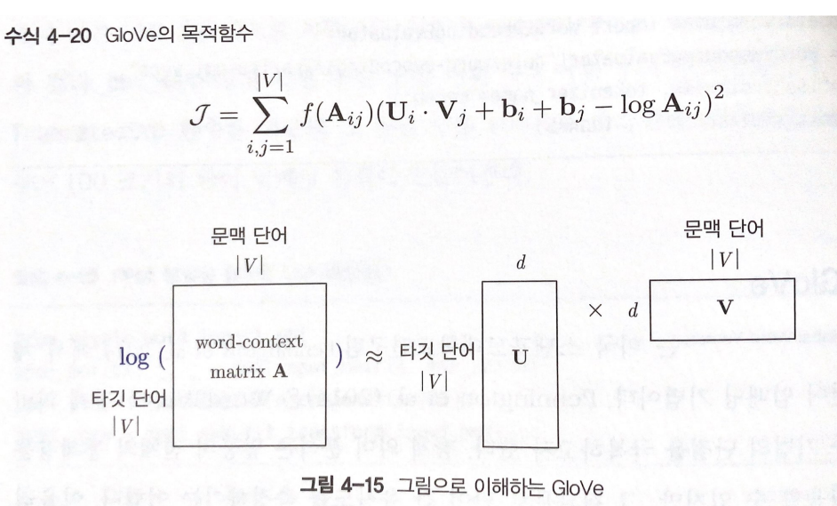

# 한국어 임베딩 - 08 단어 수준 임베딩 GloVe

GloVe는 미국 스탠포드 대학교 연구팀에서 2014년 개발한 단어 임베딩 기법이다. Word2Vec과 잠재 의미 분석 두 기법의 단점을 극복하고자 했다. 잠재 의미 분석은 말뭉치 전체의 통계량을 모두 활용할 수 있지만, 그 결과물로 단어 간 유사도를 측정하기는 어렵다. 아울러 Word2Vec 기법이 단어 벡터 사이의 유사도를 측정하는 데는 LSA 보다 유리하지만 사용자가 지정한 윈도우 내의 로컬 문맥만 학습하기 때문에 말뭉치 전체의 통계 정보는 반영되기 어렵다는 단점을 지닌다. (그런데 GloVe 이후 발표된 Levy&Goldberg(2014)는 Skip-gram 모델이 말뭉치 전체의 글로벌한 통계량인 SPMI 행렬을 분해하는 것과 동치라는 점이 증명되었다.)

1. 모델 기본 구조

    연구팀은 임베딩된 두 단어 벡터의 내적이 말뭉치 전체에서의 동시 등장 빈도의 로그 값이 되도록 목적함수를 정의했다. 임베딩된 단어 벡터 간 유사도 측정을 수월하게 하면서도 말뭉치 전체의 통계 정보를 좀 더 잘 반영해보자는 것이 GloVe가 지향하는 핵심 목표라고 할 수 있다.

    

    수식을 보면 단어 i, j에 각각 해당하는 벡터 Ui, Vj 사이의 내적 값과 '두 단어 동시 등장 빈도의 로그 값' 사이의 차이가 최소화될수록 학습 손실이 작아진다. 바이어스(bias)항 두개와 f(Aij)는 임베딩  품질을 높이기 위해 고안한 장치이며 |V|는 어휘 집합 크기이다.

    Glove는 우선 학습 말뭉치 대상으로 단어-문맥 행렬 A를 만드는 것에서부터 학습을 시작한다. 이후 목적함수를 최소화하는 임베딩 벡터를 찾기 위해 행렬 분해를 수행해야 한다. 처음에 행렬 U, V를 랜덤으로 초기화한 뒤 수식을 최소화하는 방향으로 U, V를 조금씩 업데이트해 나간다. 학습 손실이 더 줄지 않거나 정해진 만큼 학습하면 학습을 종료한다. 학습이 끝나면 U를 단이 엄베딩으로 쓸 수 있다. 이밖에 U + V의 전치행렬, 혹은 U와 V의 전치행렬을 이어 붙여 임베딩으로 사용하는 것도 가능하다.

2. 튜토리얼

    아니 이걸 또 bash로 하네 근데 glove는 많이 쓰는 모델이고 하니까 나중에 모델 구현할 때 검색해서 코드 참고해서 하기 어렵지 않을거임 ㅇㅇ