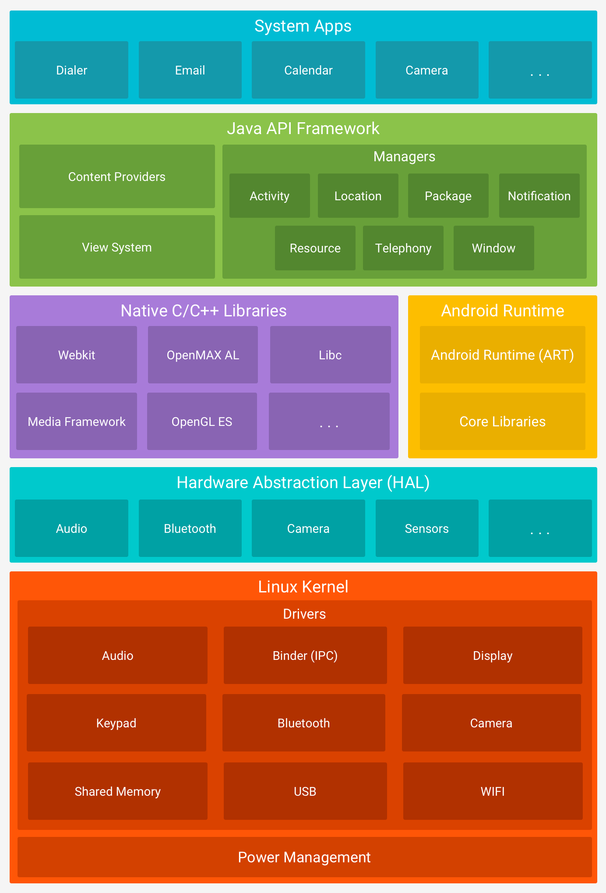

# chapter 1 - 01 안드로이드와 코틀린

안드로이드가 동작하는 플랫폼과 리눅스 커널, 현재 사용되고 있는 안드로이드의 API 레벨 그리고 함수형 프로그래밍에 대해 알아보자.

1. 운영체제와 플랫폼

    안드로이드 플랫폼은 리눅스 운영체제 안에서 리눅스와 상호작용하면서 동작한다. 아래 그림은 안드로이드 플랫폼으로 아직 이해하기는 어렵지만, 전체 아키텍처 위쪽에 안드로이드가 실행되는 런타임 영역이 존재한다는 점은 알고 넘어가자.



2. 플랫폼 버전과 API 레벨

안드로이드는 사용하는 플랫폼 버전과 별개로 API레벨이라는 것이 있다. API는 개발자에게 안드로이드 플랫폼의 기능을 사용할 수 있게 제공하는 도구로 API레벨에 따라서 새로운 기능이 추가되거나 코드 전체를 변경해야 하는 경우도 있다. 그래서 API레벨의 변경 사항이 있을 때 기존의 코드를 다시 한 번 확인할 필요가 있다.

최신 버전이 안드로이드 11이지만 실제 사용자가 사용하는 버전은 훨씬 다양하다. 현재 시점의 플랫폼 점유율은 안드로이드 개발자 사이트에서 확인할 수 있다. 2020년 3월 기준으로 API 레벨 16, 젤리빈 버전 이상을 사용하는 디바이스가 전체의 99.6%이다. 특별한 경우가 아니면 그 이전 버전은 고려하지 않아도 된다. 이 글을 읽는 시점에 따라 점유율이 달라질 수 있으니 참고하자.

3. 코틀린

다시 안드로이드 플랫폼의 구조를 생각하면 리눅스 커널과 자바 API 프레임워크가 결합된 형태이다. 과거에 안드로이드 플랫폼에 대한 설명에는 JVM이 항상 따라 붙었는데, 자바 가상 머신 위에서 앱이 동작했기 때문이다. 현재는 이를 대신에 안드로이드 런타임을 사용한다. 따라서 JVM이 없지만 여전히 가상 머신 위에서 동작한다는 점에서 자바의 동작 구조를 차용하고 있다.

기존에는 주로 자바를 앱 개발 언어로 사용했지만 2017년 5월 Google I/O에서 코틀린을 공식 언어로 채택한 후 코틀린으로 앱을 개발하는 기업이 차츰 늘어나고 있다. 구글은 2019년 Google I/O에서 코틀린 퍼스트를 선언하며 모든 문서에서 코틀린 코드를 먼저 노출하는 등 좀 더 강력하게 코틀린을 메인 언어로 지원하고 있다. 

4. 함수형 프로그래밍 언어 코틀린

코틀린은 함수형 프로그래밍을 표방하고 있다. 객체지향 프로그래밍과 비교하자면 객체지향 프로그래밍은 클래스 내부에 있는 함수로만 로직을 작성하지만, 함수형 프로그래밍은 이런 제한 없이 어디에서나 작성할 수 있다. 'Hello World'를 출력하는 짧은 코드로 비교하면 다음과 같다.

- 자바

    ```java
    class Hello {
    	public static void main(String args[]) {
    		System.out.pring("Hello World");
    	}
    }
    ```

- 코틀린

    ```kotlin
    System.out.print("Hello World");
    ```

5. 안드로이드 개발에 있어서 자바와 코틀린의 차이

안드로이드 앱을 개발할 때는 코틀린도 객체지향 언어처럼 클래스 내에서 로직을 작성해야 한다. 코틀린이 자바와 100% 호환된다는 이야기를 들어봤을 텐데, 이는 분명 장점이지만, 여전히 안드로이드는 자바와 코틀린을 동시에 지원하므로 자바의 형식에 맞춰서 코틀린으로 개발해야 한다.조금 불편하지만 그래도 코틀린으로 작성하면 자바로 작성했을 때 보다는 코드의 양이 훨씬 적어진다.