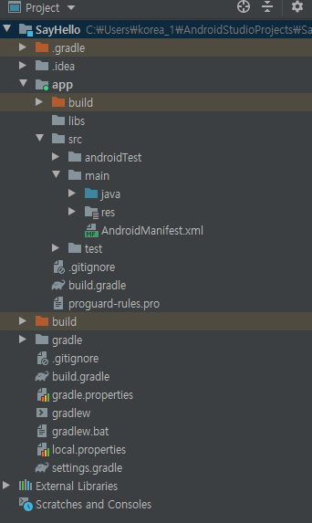
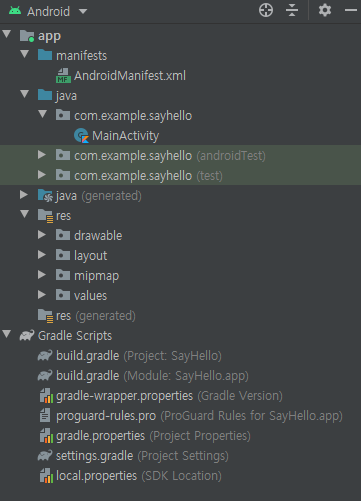

# chapter 2 - 01 안드로이드 스튜디오 시작

1. 안드로이드 스튜디오 설치하기

    다음 URL을 참고하자. https://developer.android.com/studio

2. 프로젝트 구조 이해하기

    안드로이드 앱을 만들기 위해서는 프로젝트를 생성해야 한다. 프로젝트는 소스 코드와 이미지, 음악, 텍스트 파일 등의 리소스를 체계적으로 관리하는 최상위 디렉터리다. 

    대부분의 통합 개발 환경(IDE)는 필요에 따라 프로젝트 내부에 생성되는 실제 디렉터리 구조를 재배열해서 보여주는데, 안드로이드 스튜디오도 동일한 기능을 제공한다. 기본적으로 안들외드 스튜디오 화면에 보이는 디렉터리 구조는 실제 파일 탐색기나 파인더로 열어보면 그 구조가 완전히 다르다.

    그래서 프로그래머는 필요에 따라 실제 디렉터리 뷰를 열어서 사용하기도 하고, 기본 구조인 Android 뷰를 이용하기도 한다. 안드로이드 스튜디오에서 실제 디렉터리 뷰를 보기 위해서는 Project를 선택한다. 주로 디렉터리를 보는 뷰로써 Android와 Project를 사용한다.

    - Android 뷰

manifests 폴더 : 설치 관련 정보 디렉터리

java 폴더 : 소스 코드 디렉터리

res : 이미지, 레이아웃, MP3 등의 리소스 디렉터리

Gradile Scripts : 빌드 관련 설정 정보 디렉터리

- Project 뷰

맨 위 상단 : 실제 프로젝트 디렉터리

app : 앱과 관련된 모든 소스 (코드, 라이브러리, 이미지) 등 디렉터리

src : 내가 만든 소스(코드, 레이아웃, 이미지) 가 있는 디렉터리

java : 소스 코드가 있는 디렉터리

res : 이미지, 레이아웃, MP3 등의 리소스 디렉터리

AndroidManifest.xml : 설치 정보 파일

build.gradle : 빌드 정보 파일