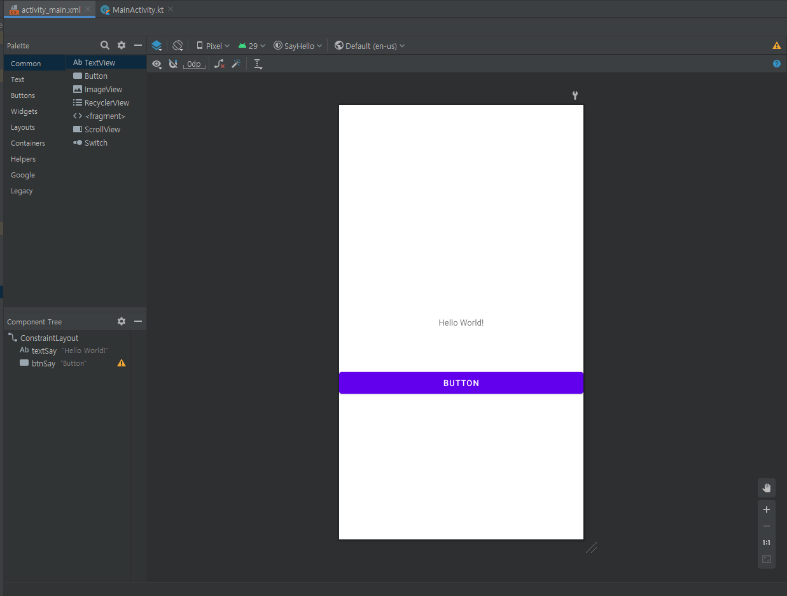

# chapter 2 - 02 앱을 만들어 실행하기

이번에는 에뮬레이터를 생성하고 연결하는 방법과 스마트폰을 연결하는 방법을 알아보자.  또 코틀린으로 작성한 소스 코드를 에뮬레이터에서 실행해보자. 버튼을 누르면 문자열 'Hello World!'가 'Hello Kotlin!'으로 바뀌는 어플을 실행해보자.

1. 에뮬레이터 생성 및 실행하기

    위 내용은 그림과 함께 설명을 보는 것이 편하므로 더 좋은 설명을 하는 분의 사이트로 링크를 달아 놓았다.

    [https://blog.naver.com/sbd38/221677368687](https://blog.naver.com/sbd38/221677368687)

    기기를 고를 때 너무 좋은 사양의 기기를 고르게 되면 안드로이드 스튜디오의 성능에 영향을 미치게 된다. 지금이야 간단한 공부 용도이기에 큰 상관이 없을 수 있어도, 실제 개발을 할 때는 안드로이드 스튜디오가 느려질 정도로 소스 코드 양이 많아진다. 

2. 스마트폰 설정 및 연결하기

    스마트폰에 연결하기 위해서는 개발자 옵션 (Developer Options) 을 활성화 해야 한다. 다음 과정을 따라 해보자.

    1. 스마트폰을 켜고 설정(Settings) 아이콘을 눌러 이동
    2. 설정에서 휴대전화 정보를 눌러 이동
    3. 휴대전화 정보에서 소프트웨어 정보를 눌러 이동
    4. 빌드번호 (Build Number) 를 찾을 수 있는데, 이 빌드 번호를 5회 이상 연속해서 누르면 개발자 모드가 활성화되었다는 메시지가 나온다. 설정 화면으로 돌아가 화면을 아래쪽으로 스크롤하면 개발자 옵션 (Developer Options) 이 나타난다.
    5. 개발자 옵션을 눌러 화면으로 이동한다.
    6. 그런 다음 USB 디버깅 옆의 스위치를 눌러 활성화해준다.
    7. USB 케이블을 이용해 스마트폰을 컴퓨터에 연결한다.
    8. 안드로이드 스튜디오 창의 상단 툴바에서 Available devices 목록 버튼을 클릭한 후 Run on multiple devices를 클릭한다.
    9. Available devices 목록에 나타난 스마트폰 이름을 선택하고 Run을 클릭하면 스마트폰에 앱이 설치된 후 실행된다.

3. 앱을 만들어 실행하기 : say! Hello~

    이제 본격적으로 앱을 만들어 실행해보자. 앱을 만들어 실행하는 과정은 크게 4단계로 진행된다.

    - 프로젝트 생성
    - 레이아웃 편집
    - 소스 코드 연결
    - 앱 실행하기

    1. 프로젝트 생성

        안드로이드 스튜디오를 실행해서 새 프로젝트를 생성하자. Empty Activity를 선택하자. 다음으로 앱 이름 등 여러가지를 설정하는 화면이 나온다.

        - Name : 프로젝트의 이름이다. 이 프로젝트의 이름은 SayHello이다.
        - Package name : 패키지명이다. 추후에 자세히 설명하겠지만, 어플리케이션 ID이며 나중에 변경할 수 있다. 패키지명은 꼭 소문자로만 입력해주어야 한다. 'com.example.sayhello'라고 입력하자.
        - Save location : 프로젝트를 저장할 위치입니다.
        - Language : Kotlin으로 개발할 것이므로 Kotlin을 고르자.
        - Minimum API Level : API 16 현재 99.6퍼센트 이상의 사용자들은 API 16 단계, 즉 안드로이드 4.1 젤리 빈 이상을 사용중이다.

        위 내용을 설정하면 프로젝트가 생성된다. 첫 줄은 패키지명, 두 번째 줄 import는 다른 곳에서 필요햔 명령을 가져오는 명령이다 ...을 누르면 import로 선언된 내용을 확인할 수 있다. class부터가 실제 코드이다.

    2. 레이아웃 편집하기

        레이아웃은 텍스트나 이미지 등을 화면에 배치할 수 있는 도구이다. 프로젝트가 생성되면 기본 화면이 나타나는데 편집기창 상단에 보이는 파일 이름으로 된 탭을 선택하면 레이아웃 편집기로 이동할 수 있다. 파일의 확장자에 따라 .kt 파일은 소스 코드 편집기가 열리고 .xml 파일은 레이아웃 편집기가 자동으로 선택되어 열린다.

        

        먼저 상단 파란색 버튼을 눌러서 Design 모드로 변경하면 위와 같이 나타난다. 좌측 상단에 Button을 가져와서 Hello World! 글자 아래에 가져다 두자. 그 다음 버튼을 클릭하면 우측에 컨스트레인트(Constraint) 편집기가 나타난다. 이는 이 버튼이 다른 요소들과 연결할 수 있게 해준다.

        

        중간의 Constraint Widget에서 사각형 안의 화살표를 클릭해서 위와 같이 바꿔주자. 또 숫자도 위와 같이 설정해주자. 숫자는 버튼과 상하좌우의 간격을 설정하고, 화살표는 컨스트레인트의 모드를 설정한다.

        - 컨스트레인트의 세가지 모드
            1. Wrap Content (>> <<)

                위젯 안쪽의 내용물 (주로 텍스트) 에 크기를 맞춘다.

            2. Fixed (|-| |-|)

                가로세로 속성 필드에 입력된 크기에 맞게 가로세로를 고정한다.

            3. Match Constraint (|w| |w|)

                크기를 제약 조건인 Constraint 연결부에 맞춘다.

        이제 버튼과 텍스트뷰(Hello World!) 위젯의 아이디를 변경하고 소스 코드와 연결할 준비를 하자. 먼저 버튼을 클릭하고 속성 영역 가장 위에 있는 id 입력 필드에 'btnSay'라고 입력하자. 대소문자를 구분하며 띄어쓰기는 사용할 수 없다. 그리고 마찬가지로 Hello World!를 클리갛고 id 속성에 'textSay'라고 입력하자. 이는 소스 코드에서 각 요소를 부르는 이름이 된다.

    3. 소스 코드 연결하기

        이제 소스 코드를 연결하자. MainActivity.kt 탭을 클릭해서 파일을 열어 소스 코드를 편집하자. 기존에 써 있는 onCreate 메서드 코드 블록 ({})안에서 레이아웃의 버튼 id로 입력했던 btnSay를 입력하면 코드 자동 완성이 나타난다. 엔터키 혹은 클릭을 통해 선택하자. 만약 자동 완성이 나타나지 않는다면 다음 URL을 참고하자.

        [https://duckssi.tistory.com/34](https://duckssi.tistory.com/34)

        자동 완성을 선택하면 소스 코드의 class 선언부 위에 다음과 같은 import가 자동으로 추가된다. 이 import가 있기 때문에 소스 코드에서 레아아우스이 아이디에 직접 접근할 수 있다.

        ```kotlin
        import kotlinx.android.synthetic.main.activity_main.*
        ```

        자 다음으로 btnSay.setOnclickListener 를 입력하여 버튼 리스너를 설정하자. 버튼을 클릭했을 때 setOnclickListener 내부의 코드를 작동시킨다.

        ```kotlin
        btnSay.setOnClickListener{
                    textSay.setText("Hello Kotlin!!!")
                }
        ```

        btnSay를 클릭하면 textSay의 텍스트를 Hello Kotlin!!!으로 바꾸라는 코드이다.

        

    4. 앱 실행하기 이제 소스 코드를 에뮬레이터에서 실행해보자. 우측 상단 툴바에서 실행 아이콘, 녹색 삼각형을 클릭해서 실행해보자.

        