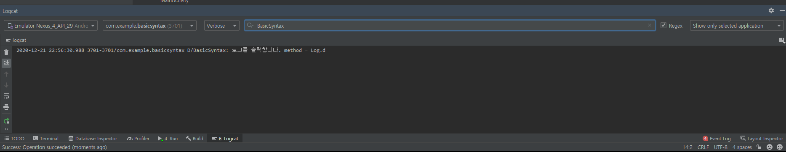

# chapter 3 - 01 코딩 준비하기 (Kotlin)

코딩을 준비하는 핵심 키워드는 로그(Log)와 로그캣(Logcat)이다. 안드로이드 앱을 실행하면 엄청나게 많은 로그가 생성된다. 이 중에서 원하는 내용을 찾기란 쉽지 않기 때문에 안드로이드 스튜디오의 로그라는 클래스를 코드 중간중간에 적절하게 사용하여 앱의 실행 흐름 혹은 결과값을 확인할 수 있다.

로그 클래스에서 일반적으로 사용되는 함수로는 v (verbose), i (information), d (debug), w (warning), e (error) 총 다섯 가지가 있다. 사용 방법을 알아보자.

- 로그의 활용

    우리가 작성한 코딩의 결과값은 에뮬레이터 화면에서 확인할 수 있지만 안드로이드 ㄷ스튜디오가 제공하는 로그(Log)에 정의되어 있는 함수를 활용할 수도 있다.

    ```kotlin
    Log.d("태그", "출력 메시지");
    ```

    d는 debug를 의미하며 첫 인자로는 검색 용도로 사용되는 '태그'를 입력하고, 두 번째 인자에는 '실제 출력할 메시지'를 입력한다.

    소스 코드를 작성해서 로그를 안드로이드 스튜디오 내에 있는 로그캣(Logcat) 창에 출력해보자. MainActivity.kt 파일을 열고 12번째 줄에 다음을 입력해보자.

    ```kotlin
    Log.d("BasicSyntax", "로그를 출력합니다. method = Log.d")
    ```

    전체 코드의 모습은 아래와 같다.

    ```kotlin
    package com.example.basicsyntax

    import androidx.appcompat.app.AppCompatActivity
    import android.os.Bundle
    import android.util.Log

    class MainActivity : AppCompatActivity() {
        override fun onCreate(savedInstanceState: Bundle?) {
            super.onCreate(savedInstanceState)
            setContentView(R.layout.activity_main)

            Log.d("BasicSyntax", "로그를 출력합니다. method = Log.d")
        }
    }
    ```

    처음에는 Log 글자가 빨간색으로 나타나지만 alt + enter를 누른 다음 가장 상단의 import를 선택하면 해결된다. 이는 안드로이드에서 기본으로 제공하는 클래스나 함수를 사용하기 위해서는 import 과정을 거쳐야 하는데, 아직 Log 클래스를 import 하지 않았기 때문에 나타나는 현상이다. 이를 해결하면 import android.util.Log 구문이 자동으로 추가된다. 이제 이를 에뮬레이터 위에서 실행시키자. 

    당연히 아무것도 건드리지 않았기 때문에 Hello World! 라고만 적혀 있고 아무 동작도 하지 않는다. 안드로이드 맨 하단에 Logcat 탭을 클릭해서 창을 열어보자. 로그 내용이 매우 많은데, 우리가 로그로 입력했던 태그인 BasicSyntax 를 로그 영역 상단의 돋보기 표시가 있는 검색창에 입력하면 해당 로그만 볼 수 있다.

    

    우린 이렇게 로그를 사용할 수 있다. 그리고 그 결과물을 로그캣을 통해 확인할 수 있다.

    - 로그(Log) : 코딩을 할 때 코드의 흐름을 파악하기 위해 앱 외부에 출력하는 정보이다. 디버거를 사용할 수도 있지만 매번 디버깅할 포인트를 정해야 하는 불편함이 있다. 하지만 로그는 한 번 설정으로 항상 해당 코드의 흐름을 확인할 수 있다.
    - 로그캣(Logcat) : 출력되는 로그를 모아서 보는 도구이다. 내가 작성한 앱의 로그만 볼 수도 있고, 태그를 잘 활용하면 해당 태그를 필터로 사용해서 특정 로그만 확인할 수 있다.

    다음은 앞으로 자주 접할 로그 사용법이다.

    - Log.v() [verbose] 상세한 로그 내용을 출력하기 위해 사용
    - Log.d() [debug] 개발에 필요한 내용을 출력하기 위해 사용 (개발자용)
    - Log.i() [information] 정보성의 일반적인 메시지를 전달하기 위해 사용
    - Log.w() [warning] 에러는 아니지만 경고성 메시지를 전달하기 위해 사용
    - Log.e() [error] 실제 에러 메시지를 출력하기 위해 사용