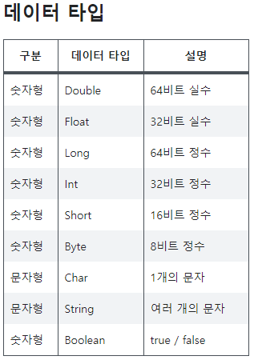

# chapter 3 - 02 변수와 상수

이번에는 변수를 사용하는 방법과 상수, 데이터 타입(자료형), 작성 규칙(코딩 컨벤션)에 대해 알아보자. 코딩에 있어서 가장 기본이 되는 내용이니 꼭 이해하고 넘어가자.

1. 변수 var

    변수 (Variable)란 값을 임시로 메모리 (저장 공간) 에 저장하고 그 저장 공간에 이름을 부여한 것을 말한다. 변수는 이름과 값으로 구성되며 변수에 이름을 부여하고 값을 입력하는 행위는 메모리의 특정 위치에 이름표를 붙이고 값을 담아두는 것과 같다. 이렇게 메모리에 값을 입력하면서 이름표를 붙여 놓으면 소스 코드에서 해당 값을 사용하고자 할 때 앞에서 붙였던 이름으로 사용할 수 있다.

    변수는 변수의 이름 앞에 var을 입력해서 선언할 수 있는데, 두 가지 방법이 있다.

    - 변수 선언과 동시에 값 넣기

        ```kotlin
        var 변수명(이름) = 값
        ```

        입력되는 값으로 타입을 추론할 수 있다. 값이 입력되는 순간 해당 값의 형태 (문자, 숫자, 불리언 등) 으로 변수의 타입이 결정된다.

    - 값으로 초기화하지 않고 선언만 사용하기

        ```kotlin
        var 변수명 : 타입
        변수명 = 값
        ```

        선언만 할 경우에는 반드시 먼저 변수명 옆에 콜론(:) 구분자를 붙여서 타입(자료형)을 지정해야 한다. 처음에 값을 초기화 하던, 하지 않던 변수는 최초 선언 시에 타입이 결정된다. 변수는 한 번 타입을 결정하면 동일한 타입의 값만 담을 수 있다.

        예를 들어 Age 변수를 Int형으로 선언하고 숫자를 담다가 갑자기 "홍길동" 이라는 값을 담을 수는 없다.

2. 데이터 타입

    코틀린에서 제공하는 기본 데이터 타입은 다음과 같다.

    

    기본 타입 (Primitive Type)은 변수에 저장되는 값의 크기가 미리 정해져 있는 타입을 말한다. Int는 2,147,483,647 까지만 저장할 수 있고 Byte는 127까지만 저장할 수 있다. Byte에 저장 범위를 넘어서는 128을 입력하면 전혀 다른 숫자가 된다. 

    String의 경우 쌍따옴표(" ") 사이에 몇 글자가 와도 상관이 없으니 값의 크기를 특정할 수 없다. 그래서 String은 기본 타입이 아니다. 하지만 사용 빈도가 높기에 이번에 기본 타입과 같이 알아보자.

    - Double (-1.7E+308의 근사값 ~ 1.7E+308의 근사값)

        소숫점이 있는 값을 저장할 때 사용한다.

        ```kotlin
        var doubleValue: Double
        doubleValue = 3.141592
        ```

    - Float (-3.4E+38의 근사값 ~ 3.4E+38의 근사값)

        Double과 동일한 용도이지만 더 작은 범위의 숫자를 저장할 때 사용한다. 안드로이드 스튜디오는 Double과 구분하기 위해 Float의 경우 숫자 끝에 'F'를 붙여준다. (소문자도 가능하지만 대문자를 권장)

        ```kotlin
        var floatValue: Float
        floatValue = 3.141592F
        ```

    - Int (-2,147,483,648 ~ 2,147,483,647)

        소숫점이 없는 정수값을 사용할 때 사용한다.

        ```kotlin
        var intValue: Int
        intValue = 2147483647
        ```

        가독성을 위해 언더바로 자릿수를 구분해줄 수 있다. 개발자가 읽기 쉽게 하기 위한 것으로 컴퓨터는 앞의 값과 동일하게 인식한다.

        ```kotlin
        intValue = 2_147_483_647
        ```

    - Long (-2E63 ~ 2E63-1)

        Int보다 큰 범위의 정수를 저장할 수 있다. Double과 Float의 관계처럼 Int와 구분하기 위해 숫자 끝에 'L'을 붙여준다. 'L'을 소문자로 입력하면 글꼴에 따라 숫자 1과 구분하기 어려울 수 있기에 대문자를 사용한다.

        ```kotlin
        var longValue: Long
        longValue = 214748367L
        ```

    - Short와 Byte (-32,768 ~ 32,767, -128 ~ 127)

        정수값을 저장하는데 사용하지만 입력할 수 있는 값의 크기가 Int보다 작다.

        ```kotlin
        var shortValue: Short = 32_767
        var byteValue: Byte = 127
        ```

        만약 타입을 지정하지 않는 숫자는 어떤 데이터 타입으로 저장될까? 정수의 경우 모두 Int로, 실수의 경우 Double로 저장된다. 같은 숫자라도 서로 다른 타입이라면 서로 다른 타입의 변수에 저장할 수 없다. 데이터 타입을 변화낳는 과정을 거쳐야 입력할 수 있다.

    - Char

        Char는 하나의 글자만 외따옴표(' ')로 감싸서 저장할 수 있다. Char는 타입을 특정하지 않아도 외따옴표 안에 하나의 글자만 저장하기 때문에 Char로 저장된다.

        ```kotlin
        var CharValue = 'A'
        ```

    - String

        여러개의 문자를 저장할 수 있다. 기본 타입에는 포함되지 않지만 거의 모든 컴퓨터 언어에서 가장 많이 사용되는 타입이다.

        ```kotlin
        var stringValue: String = "ABCDEF"
        ```

    - Boolean

        true, false 둘 중에 1개의 값을 저장할 수 있다. 주로 조건문에서 의사결정을 하기 위한 용도로 많이 사용된다.

        ```kotlin
        var BoolValue = true
        ```

    여기까지 배운 내용을 실제 코딩에 적용하여 결과로 출력해보자. 출력된 결과물은 로그캣에서 확인해보자.

    ```kotlin
    package com.example.basicsyntax

    import androidx.appcompat.app.AppCompatActivity
    import android.os.Bundle
    import android.util.Log

    class MainActivity : AppCompatActivity() {
        override fun onCreate(savedInstanceState: Bundle?) {
            super.onCreate(savedInstanceState)
            setContentView(R.layout.activity_main)

            var myName = "홍길동"
            var myAge: Int
            myAge = 27
            myAge = myAge + 1
            Log.d("BasicSyntax", "myName = $myName, myAge = $myAge")
        }
    }
    ```

    코틀린에서는 더하기 연산으로 2개의 문자를 하나로 합칠 수 있다. "홍" + "길동" 처럼 2개의 문자를 더하면 "홍길동"과 같이 하나의 문자로 만들어 준다. 여기에 추가로 문자열을 보다 쉽게 다를 수 있는 문자열 템플릿도 제공한다.

    문자열 내부에서 달러($) 기호를 넣으면 해당 영역이 문자가 아닌 코드라는 것을 알려준다. 그래서 위 로그처럼 작성을 했을 때 $myName이 문자 그대로 출력되는 것이 아닌 변수 myName을 불러와준다. 주의할 점은 $변수 다음에 이어지는 문자가 있다면 무조건 공백으로 구분지어 주어야 한다는 점이다.

3. 상수 val

    변수의 다른 선언 방법으로 상수가 있다. 상수는 변수와는 다르게 val로 선언하며, 한 번 입력된 값은 변경할 수 없다. 그래서 주로 기준이 되는 변하지 않는 값을 미리 입력해둘 때 사용한다.

    ```kotlin
    val 상수 이름 = 값
    ```

    선언은 위와 같이 한다. 상수로 정의된 값은 바뀌지 않기 때문에 복잡한 값을 미리 상수로 정의해두고 사용할 때는 값이 아닌 상수 이름만 기억하고 있다가 불러서 사용하면 되기 때문에 코딩이 훨씬 편해진다.

    예를 들면, 다음과 같이 활용할 수 있다.

    ```kotlin
    val PI = 3.141592F
    val myRoomArea = 10 * 10 * PI
    ```

    다음과 같이 상수의 값을 변경하려고 하면 에러가 발생한다.

    ```kotlin
    val constValue = 197
    constValue = 457   //에러
    ```

4. 네이밍 컨벤션

    프로젝트별로 다르겠지만, 큰 프로젝트는 천 명 이상의 프로그래머가 함께 일을 하기도 한다. 이렇게 많은 프로그래머가 각자의 방식으로 코딩을 하면 개발 후 오류 수정이나 업데이트 시에 코드 분석이 어려워질 수 있다. 개발하는 프로그래머와 유지보수하는 프로그래머가 다른 경우도 많이 있기 때문이다.

    그래서 각각의 프로젝트에는 코드를 작성하는 규칙들이 있는데, 이것을 코딩 컨벤션(Coding Convention)이라고 한다. 인터넷을 검색하면 수많은 작성 규칙을 찾아볼 수 있는데 여기에서는 그 중에서 꼭 필요한 몇가지와 그렇게 작성해야 하는 이유에 대해 알아보려고 한다.

    - 클래스명

        대체로 코틀린의 네이미 컨벤션(명명 규칙)은 캐멀 케이스(Camel Case)를 사용한다. 클래스명의 첫 글자는 대문자로, 나머지 글자는 소문자로 표기한다. 그리고 새로운 단어가 나타나면 첫 글자를 대문자로 표기한다.

        클래스명은 파일명과 동일하다. 우리가 앞에서 작성한 코드 중 class MainAcitivity ... 시작하는 줄이 있는데, 여기서 MainActivity가 클래스명이다.

        ```kotlin
        class MainActivity
        ```

    - 함수명과 변수명

        캐멀 케이스를 따르며 첫 글자만 소문자로, 이후 새로운 단어의 첫 글자는 대문자로 표기한다.

        ```kotlin
        fun onCreateActivity()
        ```

    - 상수명

        모두 대문자로 작성한다.

        ```kotlin
        val Hello: String = "안녕"
        ```

        만약 상수명이 2개 이상의 단어로 이루어져 있으면 언더바로 구분하는 스네이크 케이스(Snake Case)를 사용할 수 있다.

        ```kotlin
        val HOW_ARE_YOU: String = "어떻게 지내?"
        ```

    - 들여쓰기

        새로운 코드 블록이 시작되면 스페이스바 또는 탭 키로 동일한 간격만큼 들여쓰기를 해야 한다. 코딩 규칙을 통틀어서 가장 중요하다. 만약 우리가 이를 지키지 않으면 면접을 볼 기회조차 없을 정도로 코딩을 하는 사람들은 들여쓰기를 중요하게 생각한다. 새로운 블록의 시작마다 들여쓰기 (일반적으로 공백 4칸) 를 한다.

        ```kotlin
        package com.example.basicsyntax

        import androidx.appcompat.app.AppCompatActivity
        import android.os.Bundle
        import android.util.Log

        class MainActivity : AppCompatActivity() {
            override fun onCreate(savedInstanceState: Bundle?) {
                super.onCreate(savedInstanceState)
                setContentView(R.layout.activity_main)

                var myName = "홍길동"
                var myAge: Int
                myAge = 27
                myAge = myAge + 1
                Log.d("BasicSyntax", "myName = $myName, myAge = $myAge")
            }
        }
        ```

    최근에는 클래스명을 제외한 함수명과 변수명을 스네이크 케이스로 작성하는 경우도 많아졌다. 캐멀 케이스보다 가독성이 좋기 때문이다. 다만 스네이크 케이스의 경우 상수명만 대문자를 사용하고 다른 때는 소문자를 사용한다.

    따라서 개인적으로 작성하는 코드의 경우는 캐멀 케이스 또는 스네이크 케이스를 개인의 선호도에 따라 선택할 수 있지만, 하나의 프로젝트를 스네이크 케이스로 시작했다면 모든 코드를 스네이크 케이스로 작성하는 일관성은 있어야 한다.