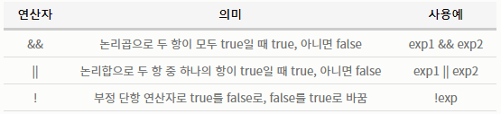

# chapter 3 - 03 조건문

조건문이란 주어진 조건식의 결과값이 참인지 거짓인지에 따라 코드를 실행할 것인지 혹은 다른 코드를 실행할 것인지 판단하기 위한 프로그래밍 문법이다. 코틀린에서는 if와 when 두가지 형태의 조건문을 사용할 수 있다.

제어문이라고도 하는데 이는 코드의 흐름을 조건에 따라 바꿀 수 있기 때문이다. 제어문에는 크게 조건문에 해당하는 if, when 그리고 반복문에 해당하는 for, while이 있다. 이들 중 조건문에 대해서 배워보자. 비교 연산자와 논리 연산자도 잘 기억해두자.

1. 조건문 if

    조건문은 언제 사용할 수 있을까? 복권 당첨 프로그램이 있다고 할 때 내가 가진 번호와 이번 주 당첨 번호를 비교해 당첨 여부를 조건문 중 하나인 if를 사용해서 다음과 같이 작성할 수 있다.

    ```kotlin
    var myNumbers = "1, 2, 3, 4, 5, 6"
    var thisWeekNumbers = "5, 6, 7, 8, 9, 10"

    if (myNumbers == thisWeekNumbers) {
    	Log.d("Lotto", "당첨되었습니다.")
    }
    ```

    위 코드처럼 내 번호와 이번주 당첨 번호가 같은지를 if로 비교한 후 같을 경우 당첨 메시지를 출력하지만 그렇지 않으면 아무것도 출력하지 않는다.

    이렇게 특정 코드를 실행하거나 실행하지 않을 때 조건문을 사용할 수 있다.

    - if문을 사용하기 위한 조건

        if 조건식에는 비교 연산자와 논리 연산자를 사용한 조건식만 사용 가능하며, 조건식의 결과는 Boolean 타입인 true 와 false로 나타난다.

        비교 연산자는 보통 두 값을 비교하는 연산자로 다음과 같은 종류가 있다.

        

        비교 연산자는 다음 예제처럼 비교의 결과값이 true 또는 flase 중의 하나인 Boolean 타입으로 반환된다.

        ```kotlin
        var a = 30
        var b = 19
        var bigger = a > b

        Log.d("비교 연산자", "a는 b보다 크다. : $bigger")
        ```

        다음은 true가 로그캣에 찍히는 것을 알 수 있다.

        논리 연산자는 주로 비교연산자로 나타난 결과를 한 번 더 연산하기 위해서 사용된다.

        

        논리 연산자의 결과값도 Boolean 타입으로, true 또는 false이다.

        ```kotlin
        var a = 30
        var b = 19
        var c = 37
        var bigger = a > b && a > c

        Log.d("비교 연산자", "a는 b보다 크고, c보다도 큽니다. : $bigger")
        ```

        결과가 false로 반환된다. 논리 연산자 양 옆의 연산 결과가 모두 true이기 때문이다. &&는 AND연산, || 는 OR연산이다.

    - 기본적인 if문 사용하기

        ```kotlin
        if ("조건식") {
        	"조건식이 참일 경우 실행되는 코드"
        }
        ```

        if문의 기본적인 사용 방법은 위와 같다. 참고로 코드를 여는 중괄호로 시작해 닫는 중괄호를 만날 때 까지를 코드 블록(Code Block), 코드 스코프(Code Scope)라고 한다. 아래는 기본적인 if문의 예제이다.

        ```kotlin
        var out = 0
        var strike = 3
        if (strike > 2) {
        	out = out + 1
        }
        ```

    - if ~ else문 사용하기

        조건식의 결과가 참이면 if 다음에 있는 코드 블록의 코드가 실행되고, 거짓이면 else 다음에 있는 코드 블록의 코드가 실행된다.

        ```kotlin
        if ("조건식") {
        	"조건식이 참일 경우 실행되는 코드"
        } else {
        	"조건식이 거짓일 경우 실행되는 코드"
        }
        ```

        예제는 다음과 같다.

        ```kotlin
        var ball = 4
        if (ball > 3) {
        	Log.d("ControlFlow", "4볼로 출루합니다.")
        } else {
        	Log.d("ControlFlow", "타석에서 다음 타구를 기다립니다.")
        }
        ```

    - if ~ else if ~ else문 사용하기

        다음 구문은 if 문을 반복해서 사용하는 if문의 예시이다. 처음 조건이 만족하지 않았을 때만 다음 조건을 비교하는 것으로 같은 조건에서 if문만 2개 사용했을 때와는 결과가 다를 수 있다는 점을 조심해야 한다.

        ```kotlin
        if ("조건식1") {
        	"조건식1이 참일 경우 실행되는 코드"
        } else if ("조건식2") {
        	"조건식1이 거짓, 조건식 2가 참일 때 실행되는 코드"
        } else {
        	"조건식이 모두 거짓일 경우 실행되는 코드"
        }
        ```

        다음은 if문만 2개 사용하는 것과 else if문을 사용했을 때의 차이점을 보여주는 예제이다.

        ```kotlin
        var a = 1
        var b = 2
        var c = 3

        // if문 두 번 사용하기
        if (a < b) {
        	Log.d("ControlFlow", "1: a는 b보다 작다.")
        }
        if (a < c) {
        	Log.d("ControlFlow", "1: a는 c보다 작다.")

        // else if문 사용하기

        if (a > b) {
        	Log.d("ControlFlow", "2: a는 b보다 작다.")
        } else if (a > c) {
        	Log.d("ControlFlow", "2: a는 c보다 작다.")
        }
        ```

        1번은 두 개의 if문이 모두 실행되지만 else if문을 사용하면 뒤의 조건식을 만족해도 뒤의 코드 블록은 출력되지 않는다.

    - 변수에 직접 if문 사용하기

        if문의 조건식 겨로가를 변수에 대입할 수 있다. 다음 예제에서 a와 b를 비교했을 때 a가 b보다 더 크브로 변수 bigger에 5를 대입한다.

        ```kotlin
        var a = 5
        var b = 3

        var bigger = if (a > b) a else b
        ```

    - if문의 마지막 값을 반환값으로 사용하기

        위의 코드와 같은데 if문의 코드 영역이 여러 줄일 경우에도 마지막 줄을 변숫값으로 사용할 수 있다.

        ```kotlin
        var a = 5
        var b = 3
        var bigger = if (a > b) {
        	a = a - b
        	a
        }
        ```

        위의 코드에서 코드 블록의 마지막 줄 a가 bigger에 저장된다. (조건을 만족한다면)

    다음은 변수에 직접 if문을 사용하는 예제이다.

    ```kotlin
    var eraOFRyu = 2.32
    var eraOfDegrom = 2.43

    val era = if (eraOfRyu < eraOfDegrom) {
    	Log.d("MLB_Result", "2019 류현진이 디그롬을 이겼습니다.")
    	eraOfRyu
    } else {
    	Log.d("MLB_Result", "2019 디그롬이 류현진을 이겼습니다.")
    	eraOfDegrom
    }

    Log.d("MLB_Result", "2019 MLB에서 가장 낮은 ERA는 ${era}입니다.")
    ```

2. 조건문 when

    조건문 when을 이해하기 위해서는 먼저 다른 언어의 switch문을 공부하는 것이 도움이 된다. 다른 언어에서의 switch문과 if문을 비교하자면 switch문은 if문의 연산식에서 사용되는 비교 연산자 중에 ==만 사용해서 같은 값인지를 비교하는 조건문이다. 코틀린을 제외한 거의 모든 컴퓨터 언어에서는 switch라는 이름으로 사용되며 선택문이라고 불리기도 한다.

    ```matlab
    switch (val) {
    	case "비교값" :
    		// 변수값이 비교값과 같다면 이 영역이 실행
    }
    ```

    하지만 코틀린의 when문은 다른 언어와는 다르게 같은 값뿐만 아니라 범위 값도 처리할 수 있고 사용 방법도 더 많다. 코틀린에서의 when문은 특정 값을 선택할 수 있는 switch의 사용법에 if문의 범위 비교 기능이 더해진 if문의 확장판이라고 생각하면 된다.

    - 일반적인 형태의 when 사용하기

        when 다음에 괄호를 작성하고 괄호 안에는 주로 비교 대상 파라미터로 사용할 변수명을 입력한다. if에서처럼 괄호 다음에 중괄호를 사용해 when 블록을 구분하고 블록 내부에서 비교할 값은 화살표 연산자를 사용해서 사용한다.

        ```kotlin
        when ("파라미터") {
        	"비교값" -> {
        		// 변수의 값과 비교값이 같으면 실행되는 코드
        	}
        }
        ```

        앞에서 살펴본 switch문과 비교하면 값을 비교하는 줄 앞의 case가 없어지고 비교값 다음의 콜론이 화살표 연산자로 대체되었다. 

        여러 개의 값을 하나의 when문에서 비교할 수도 있고 else 역시 사용할 수 있다.

        ```kotlin
        when ("파라미터") {
        	"비교값1" -> {
        		// 변수의 값과 비교값1이 같으면 실행되는 코드
        	}
        	"비교값2" -> {
        		// 변수의 값과 비교값2이 같으면 실행되는 코드
        	}
        	"비교값3" -> {
        		// 변수의 값과 비교값3이 같으면 실행되는 코드
        	}
        	else -> {
        		// 변수의 값이 앞에서 비교한 값들과 다르면 실행되는 코드
        	}
        }
        ```

        다음 예제를 통해 자세한 사용법을 살펴보자.

        ```kotlin
        var now = 10

        when(now) {
        	8 -> {
        		Log.d("when", "현재 시간은 8시 입니다.")
        	}
        	9 -> {
        		Log.d("when", "현재 시간은 9시 입니다.")
        	}
        	else -> {
        		Log.d("when", "현재 시간은 8시나 9시가 아닙니다.")
        	}
        }
        ```

    - 콤마로 구분해서 사용하기

        특정 값을 비교하는데 결과 처리가 동일하다면 콤마(,)로 구분해서 한 번에 비교할 수 있다.

        ```kotlin
        var now = 9

        when (now) {
        	8, 9 -> {
        		Log.d("when", "현재 시간은 8시 또는 9시입니다.")
        	}
        	else -> {
        		Log.d("when", "현재 시간은 9시가 아닙니다.")
        	}
        }
        ```

    - 범위 값을 비교하기

        in을 사용해서 범위 값을 비교할 수도 있다. ≤, ≥과 같은 기능을 구현할 수 있다.

        ```kotlin
        var ageOfMichael = 19

        when (ageOfMichael) {
        	in 10..19 -> {
        		Log.d("when", "마이클은 10대입니다.")
        	}
        	!in 10..19 -> {
        		Log.d("when", "마이클의 나이를 알 수 없습니다.")
        	}
        }
        ```

    - 파라미터 없는 when 사용하기

        when 다음에 오는 괄호를 생략하고 마치 if문처럼 사용할 수도 있다.

        ```kotlin
        var currentTime = 6

        when {
        	currentTime == 5 -> {
        		Log.d("When", "현재 시간은 5시입니다.")
        	}
        	currentTime > 5 -> {
        		Log.d("When", "현재 시간은 5시가 넘었습니다.")
        	}
        	else -> {
        		Log.d("When", "현재 시간은 5시 이전입니다.")
        	}
        }
        ```

3. if문과 when문은 언제 사용할까?

    조건문이 2개나 있는데 어떤 것을 언제 사용해야 할까? 일반적으로 범위가 넓고 값을 특정할 수 없을 경우 if문을 이용해서 처리하는 것이 바람직하고, 범위가 제한적이고 값도 특정할 수 있는 경우 when을 사용하는 것이 더 낫다. 데이터의 개수가 많지 않은 경우에는 when문을 사용하면 쉽게 잘 읽히는 코드를 작성할 수 있다.

    만약 요일마다 하는 일이 다른데, 요일을 입력하면 그 요일에 하는 일을 출력하는 프로그램을 작성한다고 할 때 if 문으로 작성하면 else if를 계속 늘려나가며 작성해야 하고, when문을 사용하면 화살표로 직관적으로 확인할 수 있다.