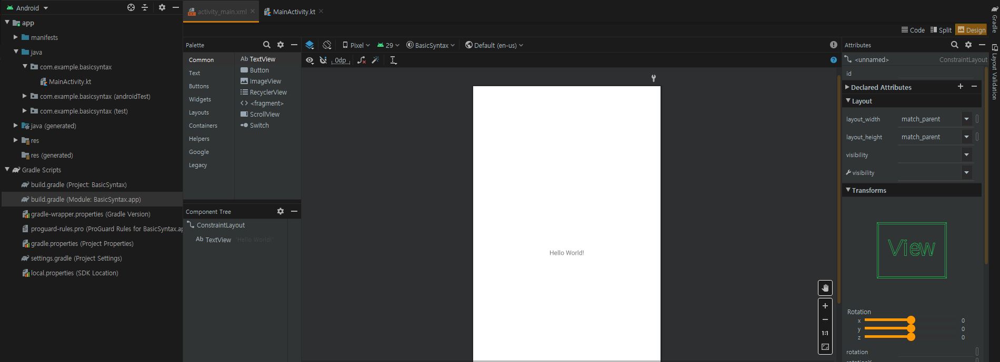
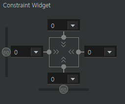
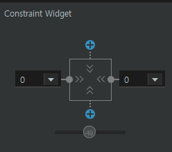
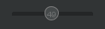
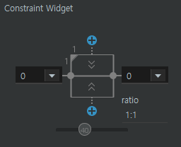
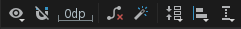
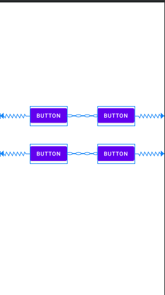
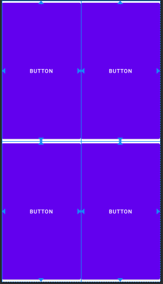
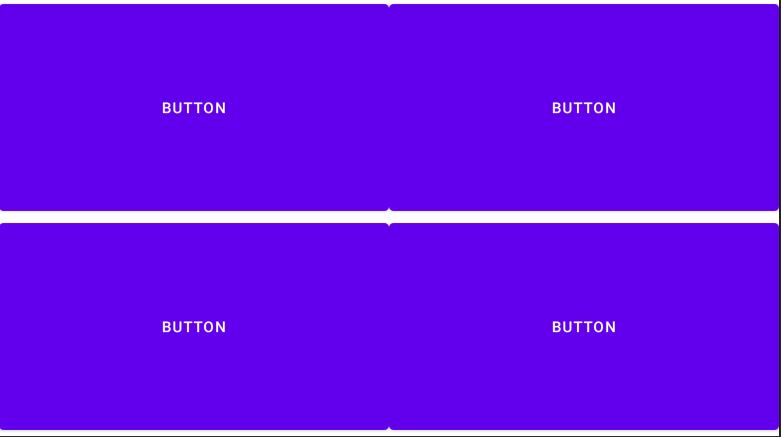

# chapter 4 - 01 배치를 담당하는 레이아웃

레아아웃은 눈에 보이지 않으면서 그 안에 버튼, 텍스트뷰(TextView)와 같은 여러 요소들의 배치를 도와준다. 레이아웃의 사용법을 익히고, 레이아웃 안에 버튼이나 텍스트뷰와 같은 위젯들을 배치하는 방법을 알아보자.

1. 레이아웃 파일

    프로젝트를 처음 생성하면 우리가 아무런 설정을 하지 않아도 소스 코드를 작성할 수 있는 1개의 액티비티(MainActivity.kt) 파일이 만들어진다. 마찬가지로 화면을 구성할 수 있는 activity_main이라는 이름의 레이아웃 파일도 자동으로 만들어지는데, 레이아웃 파일은 소스 코드가 아닌 리소스로 분류되기 때문에 파일명은 모두 소문자로 작성되고 파일 이름 끝에 파일의 타입인 XML을 붙여서 activity_main.xml이 된다.

2. 컨스트레인트 레이아웃

    컨스트레인트 레이아웃(Constraint Layout)은 안드로이드 기본 레이아웃으로 화면에 배치되는 위젯들 사이에 간단한 제약조건(Constraint) 설정 만으로 전체 화면을 쉽게 구성할 수 있도록 도와준다.

    - 기본 레이아웃

        상단 탭에서 activity_main.xml을 클릭해서 레이아웃 파일을 열면 다음 그림과 같은 화면이 기본적으로 보여진다.

        화면 중앙의 Hello World! 라고 쓰인 텍스트뷰를 클릭하면 우측에 속성을 설정하는 영역이 나타나고 하단의 컴포넌트 트리를 보면 컨스트레인트 레이아웃이 기본 레이아웃으로 지정된  것을 확인할 수 있다.

        

    - 핸들러 사용하기

        컴포넌트 트리 혹은 UI 편집기에서 컨스트레인트 레이아웃 안에 있는 텍스트 뷰를 클릭하면 그림과 같이 텍스트뷰 주위에 선택 영역이 표시된다.

        텍스트뷰 상하좌우로 그림과 같이 4개의 동그라미가 보이는데 이것을 핸들러(Handler)라고 한다. 핸들러가 현재 연결 상태이면 파란색으로, 아니면 흰색으로 나타난다.

        

        핸들러를 드래그해서 연결하고자 하는 다른 위젯의 핸들러에 가져다 놓거나, 자신을 포함하고 있는 레이아웃의 가장자리에 가져다 놓으면 w자로 생긴 주름무늬 선이 생성된다. 이렇게 연결되는 선을 컨스트레인트(Constraint)라고 하고, 컨스트레인트가 연결될 수 있는 부위를 앵커 포인트(Anchor Point)라고 한다.

    - 컨스트레인트 편집기

        컨스트레인트 레이아웃 안에 있는 위젯("Hello World")을 선택하면 컨스트레인트를 조절할 수 있는 편집기가 속성 영역에 나타난다.

        

        편집기의 검은색 동그라미가 UI 편집기의 파란색 동그라미와 같은 핸들러이다.  컨스트레인트 편집기에서 연결되어 있는 핸들러를 클릭하면 연결을 해제할 수 있다. 연결이 해제되면 컨스트레인트 편집기의 위아래 핸들러에 +표시가 나타나고 UI 편집기의 파란 핸들러도 흰색으로 바뀐다.

    - 크기 조절 핸들러

        크기 조절 핸들러 (Size Hanler)는 주로 상하 또는 좌우 양쪽에 컨스트레인트가 연결되었을 때 사용한다. 다음은 좌우 양쪽으로 연결되었을 때의 모습니다. 핸들러 가운데에 보이는 사각 박스 안의 >> << 모양을 클릭하면 세 가지 모드로 변경할 수 있다.

        

        1. Wrap Content (>> <<)

            위젯 안쪽의 내용물에 크기를 맞춘다. 텍스트뷰의 경우 입력된 문자의 크기에 맞춰서 크기가 조절된다.

        2. Fixed (|-| |-|)

            layout_width, layout_height 속성에 입력된 크기로 고정된다. 예를 들어 layout_width 속성값에 250dp를 입력하면 250dp만큼 영역을 차지한다.

        3. Match Constraint (|w| |w|)

            컨스트레인트의 시작과 끝(앵커 포인트)에 맞춰서 크기가 조절된다.

    - 바이어스

        상하 또는 좌우 양쪽이 같이 연결되었을 때는 바이어스(Bias)라는 위치 조절 버튼이 활성화된다. 처음에는 50으로 설정되어 있는 값은 비율을 의미하며 위젯을 양쪽 컨스트레인트의 중앙에 위치시킨다. 좌우로 드래그하면 0~100 사이의 값으로 변경할 수 있다.

        

    - 가로세로비 설정

        크기를 매치 컨스트레인트 (|w| |w|)로 설정하면 가로세로비 (Aspect Ratio) 기능이 활성화되면서 사각형의 좌측 위 모서리에 작은 삼각형 모양이 나타난다. 이 모양을 클릭함녀 가로: 세로 비율을 설정할 수 있는 ratio 필드가 나타나고, '1:1'을 입력하면 해당 위젯의 가로세로 비율이 변경된다.

        

    - 레이아웃 툴바

        어떤 레이아웃을 선택하느냐에 따라서 해당 레이아웃에 맞는 툴바가 UI 편집기 상단에 제공된다. 컨스트레인트 레이아웃은 다음과 같이 8개의 도구가 제공된다.

        

        왼쪽부터 순서대로 설명하면 다음과 같다.

        1. View Options (뷰 옵션) : 제약조건을 화면에 표시하거나 숨길 수 있다. 제약조건이 너무 많거나 화면에 표시되는 위젯의 수가 많아져 복잡해졌을 때는 클릭해서 끌 수 있다.
        2. Auto Connect (오토 커넥트) : 오토 커넥트가 켜진 상태에서 위젯을 컨스트레인트 레이아웃에 가져다 놓으면 기본 컨스트레인트를 연결해준다.
        3. Default Margin (디폴트 마진) : 컨스트레인트 연결 시 설정한 만큼 기본 마진값을 적용한다.
        4. Clear Constraints (클리어 컨스트레인트) : 화면 상의 모든 컨스트레인트를 제거한다. 개별로 제거할 때는 위젯에 마우스 포인터를 올리면 나타나는 동일한 모양의 아이콘을 클릭한다.
        5. Infor Constraints (인퍼 컨스트레인트) : 오토 커넥트를 끄고 작업할 때 사용한다. 가까운 위젯이나 레이아웃에 2개 이상의 컨스트레인트를 연결한다.
        6. Pack (팩) : 여러 개의 위젯을 동시에 선택한 상태에서 크기를 조절할 때 사용한다. 선택된 위젯들의 상태에 따라 크기가 조절될 때도 있고, 위치가 조절될 때도 있다.
        7. Align (얼라인) : 선택된 위젯들을 정렬해준다.
        8. GuidLine (가이드라인) : 레이아웃 안의 모든 위젯에 대해 공통의 여백을 지정할 때 사용한다. 가로 또는 세로 가이드라인을 삽입하면 위젯들은 가이드라인에 컨스트레인트를 연결할 수 있다.

    - 체인으로 연결하기

        컨스트레인트 레이아웃을 처음 접하면 가장 다루기 어려운 것이 체이닝(Chaining)이다. 체이닝은 컨스트레인트로 연결된 위젯끼리 서로의 위칫값을 공유해서 상대적인 값으로 크기와 위치를 결정하도록 해주는데 각 화면 전체를 기준으로 했을 때는 물론, 화면을 가로세로로 전환했을 때도 위젯의 상대 비율을 유지해준다.

        여러 개의 위젯을 한 화면에 구현할 때 기존의 레이아웃에서 작업할 때는 여러 개의 레이아웃을 겹쳐서 사용해야만 구현할 수 있었는데, 컨스트레인트 레이아웃은 하나의 레이아웃으로 구현할 수 있다.

        앞에서 작성한 UI를 모두 지우거나 ConstraintChain 프로젝트를 생성해 레이아웃 파일을 열자.

        1. 팔레트(Palette)의 버튼(Buttons) 카테고리에서 버튼(Button) 4를 차례대로 UI 편집기로 드래그하여 컨스트레인트를 연결하지 않은 채 그림과 같이 배치하자.

            

        2. 먼저 위쪽에 있는 버튼 2개를 선택한 다음 마우스 우클릭하면 나타나는 메뉴에서 Chains - Create Horizontal Chain을 선택하자. 버튼 2개가 가로축 체인처럼 연결된다.
        3. 같은 방법으로 아래쪽 버튼 2개도 체인으로 연결한다.
        4. 정상적으로 연결되었다면 다음과 같은 화면이 된다.

            

        5. 이번에는 세로축 체인을 연결해보자. 한 번에 한 줄씩 해야 한다. 그렇지 않으면 원하지 않는 결과가 나타난다. 마찬가지로 버튼 2개를 선택하고 우클릭 한 후 Chains - Create Vertical Chain을 선택한다.
        6. 버튼 4개가 모두 체인으로 연결되었다. 체인은 컨스트레인트와는 다르게 체인 모양의 인터페이스로 되어 있다. 이제 4개의 버튼을 모두 선택하고 속성에서 layout_width와 layout_height 값을 'match_constraint'로 변경한다. 그러면 0dp로 설정된다.

            

        7. 체인 연결과 속성 적용이 모두 정상적으로 적용되었다면 스마트론을 회전시켜도 버튼이 모두 화면에 꽉 찬 형태로 나타난다. 레이아웃 툴바 위의 왼쪽 두번째 버튼을 누르면 회전시킬 수 있다.

            

    - 가이드라인

        가이드라인(GuideLine)은 컨스트레인트 레이아웃에만 사용할 수 있는 보조 도구이다.

        가로세로 두가지 가이드라인이 있는데, 가이드라인을 드래그해서 화면 임의의 위치에 가져다 놓으면 레이아웃 안에 배치되는 위젯에 가상의 앵커 포인트를 제공한다.

3. 리니어 레이아웃

    리니어 레이아웃(LinearLayout)은 위젯을 가로 또는 세로 한 줄로 배치하기 위한 레이아웃이다. 레이아웃 속성 중에 orientation의 가로 (horizontal), 세로 (vertical)만 변경해주면 기존에 배치되어 있던 위젯들도 방향을 바꿀 수 있다.

    - 리니어 레이아웃을 기본 레이아웃으로 사용하기

        리니어 레이아웃을 사용하기 위해서 컨스트레인트 레이아웃 안에 리니어 레이아웃을 추가할 수도 있지만 레이아웃이 중첩되면 그만큼 그래픽 처리 속도가 느려지기 때문에 기본 레이아웃인 컨스트레인트 레이아웃을 리니어 레이아웃으로 바꾼 후에 작업하도록 하자. 새 프로젝트를 새로 생성하고 실행해보자.

        1. UI 편집기 우측 상단에 있는 Code 버튼을 클릭해서 모드를 변경하자.
        2. 화면이 XML 코드를 직접 편집할 수 있는 모양으로 변경된다.

            ```xml
            <?xml version="1.0" encoding="utf-8"?>
            <androidx.constraintlayout.widget.ConstraintLayout xmlns:android="http://schemas.android.com/apk/res/android"
                xmlns:app="http://schemas.android.com/apk/res-auto"
                xmlns:tools="http://schemas.android.com/tools"
                android:layout_width="match_parent"
                android:layout_height="match_parent"
                tools:context=".MainActivity">

                <TextView
                    android:layout_width="wrap_content"
                    android:layout_height="wrap_content"
                    android:text="Hello World!"
                    app:layout_constraintBottom_toBottomOf="parent"
                    app:layout_constraintLeft_toLeftOf="parent"
                    app:layout_constraintRight_toRightOf="parent"
                    app:layout_constraintTop_toTopOf="parent" />

            </androidx.constraintlayout.widget.ConstraintLayout>
            ```

        3. XML 코드에서 2행에 있는 androidx.constraintlayout.widget.CostraintLayout을 'LinearLayout'으로 수정한다.

            ```xml
            <?xml version="1.0" encoding="utf-8"?>
            <LinearLayout xmlns:android="http://schemas.android.com/apk/res/android"
                xmlns:app="http://schemas.android.com/apk/res-auto"
                xmlns:tools="http://schemas.android.com/tools"
                android:layout_width="match_parent"
                android:layout_height="match_parent"
                tools:context=".MainActivity">

                <TextView
                    android:layout_width="wrap_content"
                    android:layout_height="wrap_content"
                    android:text="Hello World!"
                    app:layout_constraintBottom_toBottomOf="parent"
                    app:layout_constraintLeft_toLeftOf="parent"
                    app:layout_constraintRight_toRightOf="parent"
                    app:layout_constraintTop_toTopOf="parent" />

            </LinearLayout>
            ```

        4. 다시 우측 상단에 있는 Design 버튼을 클릭해서 모드를 변경하면 컴포넌트 트리의 최상위 레이아웃이 리니어 레이아웃을오 변경된 것을 볼 수 있다. 이런 식으로 다른 레이아웃도 기본 레이아웃으로 사용할 수 있다.

    - orientaion 속성

        하위 버전의 안드로이드 스튜디오에서는 필수 속성이었지만 3.1부터는 입력하지 않으면 가로 (horizontal)이 적용되어 가로로 배치된다. 레이아웃 안에 있는 기본 텍스트뷰를 삭제하고, 팔레트에서 새로운 텍스트뷰 3개를 드래그해서 레이아웃 안에 가져다 놓으면 가로로 정렬된다.

    - layout_weight 속성

        레이아웃 안에 배치되는 위젯의 크기를 비율로 나타낼 수 있는 옵션이다. 리니어 레이아웃에 배치되는 위젯은 layout_weight 속성의 기본 설정값이 1이다. 따라서 앞의 그림에서 텍스트뷰 3개의 가로 비율은 1:1:1이다. 리니어 레이아웃의 orientation 속성이 vertical이면 세로 비율이 1:1:1이다.

        가운데 텍스트뷰를 선택해서 layout_weight 속성을 2로 바꾸면 텍스트뷰의 비율이 변한다. 그런데 정확하게 1:2:1이 아닌 것처럼 보이는데 이는 텍스트뷰의 layout_width의 속성의 기본값이 wrap_content이기 때문이다. 3개의 텍스트뷰를 모두 선택한 상태에서 layout_width의 값을 0dp로 변경해주면 정확히 1:2:1로 설정된다.

    - gravity 속성

        gravity 속성은 다른 레이아웃의 필수 속성이기도 하다. 레이아웃에 삽입되는 위젯을 gravity 속성에 설정된 방향으로 정렬한다. 동시에 2개 이상의 방향을 선택할 수 있다.

        gravity 속성은 속성 영역의 아래쪽 All Attributes 영역에 있다.

        gravity의 하위 속성을 모두 펼쳐서 center의 체크박스를 체크하면 true로 변경되며 글자가 가운데로 정렬된다.

    - layout_gravity 속성

        내가 속해있는 레이아웃 (부모 레이아웃)을 기준으로 나의 위치를 설정할 때 사용한다. gravity 속성과 비교해서 알아두면 더 쉽다. gravity의 속성을 변경하면 버튼 내부의 텍스트 위치가 변경되는 것이고, layout_gravity의 속성을 변경하면 자신의 위치가 변경된다. 부모 레이아웃을 기준으로 gravity가 적용되기 때문이다. 주로 리니어 레이아웃과 프레임 레이아웃에서 사용된다.

    - 스크롤뷰와 함께 사용하기'

        리니어 레이아웃과 같은 일반 레이아웃들은 화면 크기(높이 또는 넓이)를 넘어가는 위젯이 삽입돼도 스크롤되지 않는다. 따라서 버튼이 화면 밖으로 넘쳐도 스크롤을 할 수 없다.

        이런 경우 최상위 레이아웃을 스크롤 할 수 있는 요소로 감싸야 한다. 스크롤뷰를 사용하려면 기본 레이아웃(컨스트레인트 레이아웃)을 스크롤뷰로 변경해서 사용하거나, 기본 레이아웃 안에 스크롤 뷰를 추가해야 한다.

        기본 레이아웃을 스크롤뷰로 변경하는 방법은 컨스트레인트 레이아웃을 리니어 레이아웃으로 변경하는 방법과 동일하다. andoridx.constraintlayout.widget.ConstraintLayout 문자열을 'ScrollView'로 변경한다.

        ```xml
        <?xml version="1.0" encoding="utf-8"?>
        <ScrollView xmlns:android="http://schemas.android.com/apk/res/android"
            xmlns:app="http://schemas.android.com/apk/res-auto"
            xmlns:tools="http://schemas.android.com/tools"
            android:layout_width="match_parent"
            android:layout_height="match_parent"
            tools:context=".MainActivity">

        </ScrollView>
        ```

        다음은 진짜 스크롤이 되는지 확인하는 과정이다. 

        스크롤뷰 안에 있던 텍스트 뷰는 삭제하고, 팔레트 영역의 레이아웃 카테고리에 있는 리니어 레이아웃 1개를 드래그해서 스크롤뷰 안에 가져다 놓은 다음 orientation 속성을 'vertical'로 변경한다. 리니어 레이아웃 안에 버튼을 20개 정도 삽입한 다음 에뮬레이터에서 실행해보면 스크롤 되는 것을 확인할 수 있다.

    - 빈 여백을 만드는 Space 도구

        스페이스(Space)는 빈 여백을 만들 수 있는 레이아웃 보조 도구이다. 리니어 레이아웃에 여러 개의 버튼을 배치하면서 버튼 사이의 일정한 간격을 두고 싶을 때 사용한다.

4. 프레임 레이아웃

    프레임 레이아웃(FrameLayout)은 입력되는 위젯의 위치를 결정하기보다는 위젯을 중첩해서 사용하기 위한 레이아웃이다. 주로 게임 화면처럼 배경과 플레이어가 서로 다른 레이어에서 겹쳐 움직여야 할 때 사용하면 좋다.

    레이아웃 중에서 처리 속도가 가장 빠르기 때문에 1개의 이미지만 화면에 보여준다든지 하는 단순한 형태로 사용할 경우에는 가장 성능이 좋다.

    프레임 레이아웃은 주로 삽입되는 다른 레이아웃이나 위젯을 겹쳐 놓는 용도이기 때문에 레이아웃으로의 필수 속성이 따로 없다. 정렬도 프레임 레이아웃이 아닌 삽입되는 위젯의 layout_gravity 속성을 사용한다.