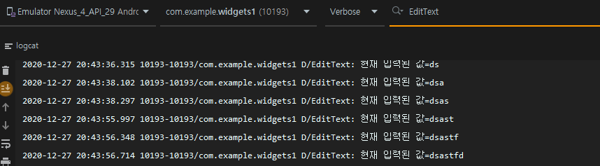
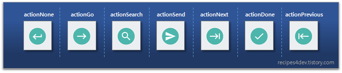
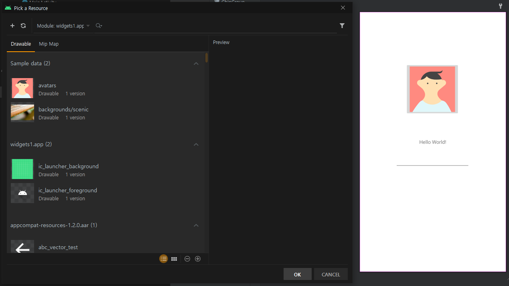
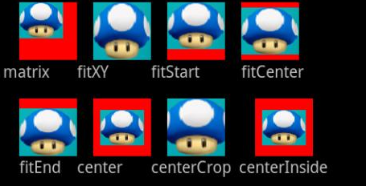
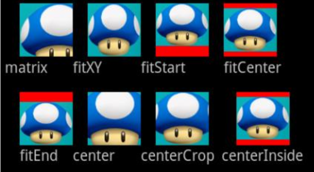

# chapter 4 - 02 화면에 그려지는 디자인 요소 위젯

위젯은 버튼, 텍스트뷰, 이미지뷰와 같이 화면에 그려지는 디자인 요소이다. 우리가 익히 알고 있는 스마트폰의 홈 화면에 나타나는 위젯과 동일한 용어로 불리기 때문에 이 둘을 착각하지 않아야 한다.

안드로이드 스튜디오 버전 3.1부터 더 세분화되었는데 천천히 살펴보자.

1. 위젯의 대표 메뉴
    - Common

        텍스트, 버튼, 레이아웃 등에서 일반적으로 많이 사용되는 것들을 모아놓은 메뉴이다.

    - Text

        글자를 화면에 나타내거나 입력받을 수 있는 위젯을 모아놓는 메뉴(카테고리)이다.

        글자를 보여주는 기능만 있는 텍스트뷰와 글자를 입력받을 수 있는 에디트텍스트(EditText)가 있다. 아이콘에 언더바가 있으면 모두 에디트텍스트이다.

    - Buttons

        버튼은 사용자로부터 클릭 또는 터치 관련 이벤트를 받을 수 있는 위젯의 모음이다. 버튼, 라디오버튼, 체크박스, 스위치 등이 여기에 속한다.

        스마트폰에서는 클릭과 터치 이벤트를 구분한다. 터치는 손을 대는 순간 발생하지만, 클릭은 특정 위치를 터치한 뒤에 같은 위치에서 손가락을 떼었을 때만 발생한다. 버튼의 경우 클릭 이벤트를 받는 위젯이다.

    - Widgets

        위젯은 이미지, 웹 사이트, 별점 표시, 진행 상태 등의 정보를 화면에 그리는 위젯 모음이다.

2. 텍스트뷰

    택스트뷰(Textview)는 화면에 텍스트를 출력하는 가장 기본적인 위젯이다. 레이아웃 파일에서 텍스트뷰의 text 속성에 값을 직접 입력할 수도 있고, 소스 코드에서 입력할 수도 있다.

    위젯의 사용법은 어렵지 않지만 여기서 사용되는 속성들이 다른 위젯에서 동일하게 사용되는 것이 많기 때문에 텍스트뷰의 속성 사용법을 잘 알아놓는 것이 좋다.

    - 사용할 텍스트 정의 및 적용하기 : text

        text는 화면에 나타낼 텍스트를 입력하는 속성이다. text 속성에 직접 입력할 수도 있지만 권장하지 않는다. 앱을 개발할 때 string.xml에 사용할 텍스트를 미리 정의해놓고 가져다가 사용하는 것이 다국어 처리, 텍스트 수정 등 앱을 관리하기에 용이하기 때문이다.

        string.xml에 사용할 텍스트를 정의해보자.

        1. 프로젝트의 탐색기의 뷰가 Android인 상태에서 app-res-values 디렉터리 안에 strings.xml 파일이 있다.
        2. 파일을 열어 <string> 태그를 만들고 다음과 같이 3행과 4행을 추가한다.

            ```xml
            <resources>
                <string name="app_name">WidgetsTextView</string>
                <string name="string_01">화면에 보여질 글자 01</string>
                <string name="string_02">화면에 보여질 글자 02</string>
            </resources>
            ```

            스트링 ID에 공백은 사용할 수 없으며 같은 ID를 중복해서 사용할 수 없지만 서로 다른 스트링 ID에 같은 텍스트를 사용하는 것은 가능하다.

        3. TextView에 적용하기 위해 다시 activity_main.xml을 열고 UI 편집기에 기본으로 생성되어 있는 텍스트 뷰를 선택하자. 우측 속성 영역에서 "Hello World!"가 입력되어 있는 text 속성 입력 필드에 strings.xml에서 미리 작성해두었던 스트핑 ID 하나를 '@string/스트링 ID' 형태로 입력한다. @으로 시작하는 입력필드는 특정 리소스를 참조하고 있다는 의미이다.

            

    - 텍스트 색상 지정하기 : textColor

        텍스트의 색상을 지정할 수 있는 속성이다. 안드로이드의 모든 색상은 RGB(+투명)을 기준으로 0부터 255까지의 숫자를 16진수로 표현한다. #기호와 ㅎㅁ께 사용해 각 색상을 두 자리씩 끊어서 해당 색의 비율을 나타낸다. (투명 빨강 녹색 파랑 순)

        색상도 문자열과 같이 직접 입력하지 않고 colors.xml에 작성된 값을 참조해서 사용한다. strings.xml과 같은 디렉터리에 있다. 

        1. colors.xml 파일을 열면 앱에서 사용하는 기본 컬러가 이미 작성되어 있다. 기본 컬러 아래에 2개 정도의 컬러를 추가하자. strings와 같은 구조로 작성되는데 태그명이 color인 것만 다르다.

            ```xml
            <?xml version="1.0" encoding="utf-8"?>
            <resources>
                <color name="purple_200">#FFBB86FC</color>
                <color name="purple_500">#FF6200EE</color>
                <color name="purple_700">#FF3700B3</color>
                <color name="teal_200">#FF03DAC5</color>
                <color name="teal_700">#FF018786</color>
                <color name="black">#FF000000</color>
                <color name="white">#FFFFFFFF</color>

                <color name="color_blue">#0000FF</color>
                <color name="color_red">#ff0000</color>
            </resources>
            ```

        2. 적용하는 방법은 텍스트를 적용했던 것과 같다. 속성 영역의 textColor 속성에 @color/컬러 ID를 입력하면 된다. 

    - 텍스트 크기 지정하기 : textSize

        textSize는 텍스트의 크기를 지정하는 속성이다. 안드로이드에서는 dp, px, sp 등과 같은 단위를 사용하는데, 텍스트가 입력되는 위젯은 주로 sp를 사용한다. 이는 문자열 크기를 나타내기 위해 사용되는 단위이다.

        다른 위젯이 모두 dp를 사용하는 것과 달리 텍스트 위젯이 sp를 사용하는 이유는 같은 해상도에서 문자열의 크기를 다르게 사용하는 경우가 있기 때문이다. 화면 스케일에 돌립적으로 크기를 조절할 수 있는 단위이다.

        예를 들면 같은 기종의 핸드폰을 사용하는 사람 중 눈이 나빠 폰트 크기를 키워야 할 경우 sp가 적용된 위젯이 있으면 줌인이나 줌아웃 시에 다른 위젯에는 영향을 주지 않고 해당 위젯의 글자만 커지거나 작아지게 할 수 있다.

        1. 크기를 조절하는 textSize도 dimens.xml 이라는 파일에 따로 입력한 후에 참조해서 사용할 수 있다. 이는 기본적으로 제고되는 파일이 아니라 values 디렉토리에 따로 생성해야 한다. values 디렉터리에서 마우스 우클릭을 한 후 New - Values resource file 을 선택하자. 확장자는 자동으로 생성된다.
        2. <dimen name="디멘 ID">값 sp</dimen> 의 형태로 작성한다. 이 파일에는 단위가 혼재되어 작성된다.

            ```xml
            <?xml version="1.0" encoding="utf-8"?>
            <resources>
                <dimen name="text_dimen">24sp</dimen>
                <dimen name="size_dimen">24dp</dimen>
            </resources>
            ```

        3. 값을 적용할 때는 마찬가지로 textSize 속성에 @dimen/디멘 ID 를 입력한다.

    - 텍스트 스타일 지정하기 : textStyle

        textStyle은 텍스트의 스타일을 설정하는 속성이다. 시스템에서 제공해주는 스타일은 normal bold italic 세 가지가 있다. 체크박스를 선택해서 스타일을 적용할 수 있는데 중복 적용이 가능하다.

    - 입력 가능한 줄 수 설정하기 : maxLines, minLines

        maxLines 속성은 텍스트 뷰에 최대 입력 가능한 줄 수를 설정한다. 1로 설정한 상태에서 한 줄 이상의 글자가 입력되면 두 번째 줄부터는 화면에 출력하지 않는다.

        minLines 속성은 반대로 최소 줄 수를 미리 설정하는 것이다 3으로 설정하면 글자의 입력 여부와 상관없이 위젯의 세 줄의 공간을 미리 그려둔다. 값을 설정하지 않으면 입력되는 줄 수에 맞춰 자동으로 늘어난다.

        strings.xml에 여러 줄을 입력하기 위해서는 <br />을 줄 바꿈할 위치에 추가하면 된다.

        ```xml
        <string name="string_01">화면에 보여질 글자 01 <br />두번째 줄 <br />  세번째 줄 </string>
        ```

    - 텍스트뷰 한 줄로 보이기 : singleLine

        singleLine은 텍스트뷰를 한 줄로 보이게 하는 속성이다. maxLines 속성을 1로 설정할 때와 다른 점은 여러 주이 있을 때 두번째 줄을 없애는 것이 아닌 <br />을 없애 한 줄로 보이게 한다.

    - 말줄임 표시하기 : ellipsize

        텍스트뷰의 maxLines 속성이 1이거나 문자열이 길어서 글자가 잘릴 때 설정한다. 처음, 중간, 혹은 마지막 부분에 말줄임(...)을 표시하거나 marquee로 글자를 좌우로 움직이게 할 수 있다.

        - none : 사용하지 않는다.
        - start : 텍스트의 첫 부분을 말줄임표로 바꿔준다.
        - middle : 텍스트의 중간 부분을 말줄임표로 바꿔준다.
        - end : 텍스트의 마지막 부분을 말줌일표로 바꿔준다.
        - marquee : 글자가 흐르는 효과를 준다. 이를 사용하기 위해서는 singleLine이 true여야 한다. maxLines 속성과는 충돌이 일어날 수 있다.

            focusable 속성은 auto, focusableInTouchMode 속성은 true 로 하면 전광판처럼 텍스트가 웁직이는데 추가적으로 marqueeRepeatMode 속성을 설정하면 반복 횟수를 설정할 수 있다.

    - 텍스트 글꼴 지정하기 : fontFamily

        fontFamily는 글꼴을 지정한다. 기본 글꼴 이외에 외부 폴트도 지정할 수 있다. 입력 필드를 클릭하면 나타나는 메뉴에서 More Fonts... 로 사용할 글꼴을 추가할 수 있다.

    - 비율로 글꼴 크기 지정하기 : ems

        ems 속성인 텍스트뷰의 크기를 나타낼 때 현재 글꼴의 크기를 기준으로 설정하는 상대값이다. 예를 들어 텍스트뷰에 설정된 크기가 12sp 라면 1 em 은 12sp가 된다. 즉, 글꼴 크기에 텍스트뷰를 맞춰 글꼴이 커질 때 텍스트와 텍스트뷰의 비율을 유지하는 것이다.

        스마트폰에서 글꼴을 줌인 또는 줌아웃할 때 ems를 기준으로 텍스트뷰의 크기가 커지거나 작아진다.

    - 텍스트뷰 높이 고정하기 : lines

        lines 속성은 텍스트뷰의 높이를 고정할 때 사용한다. maxLines 속성과 사용법이 비슷해 보이나 다른 점은 maxLines의 경우 5로 설정해도 문자열의 줄 수가 한 줄이면 텍스트뷰의 높이도 화면에서 한 줄만 차지하는 반면, lines는 높이가 항상 5로 고정된다. 만약 5를 초과한다고 해도 더 늘어나지 않는다.

    - 텍스트 전체 길이 제한하기 : maxLength

        maxLength는 텍스트의 전체 길이를 제한하는 속성으로 설정한 값만큼의 글자만 보이고 나머지는 보이지 않게 할 수 있다.

3. 에디트텍스트

    텍스트 카테고리의 두 번째에 있는 Plain Text 부터 Number까지 모두 에디트 텍스트 위젯이다. 앱 개발 시 많이 사용되므로 각각의 사용법에 맞게 하나의 위젯을 여러 개로 분리해 놓은 것이다.

    에디트텍스트는 글자를 보여주기도 하지만 주로 입력받는 용도로 사용한다. 대표적인 예로 아이디와 패스워드를 입력받는 것이 있다. 

    에디트텍스트는 텍스트뷰의 주요 속성을 거의 그대로 사용하고 입력받는 것이 주된 기능이다. 실제 코드를 통해 사용법을 알아보자.

    - 에디트텍스트에 입력되는 글자를 실시간으로 처리하기

        에디트텍스트를 통해 입력되는 글자를 실시간으로 로그에 출력하는 방법을 알아보자. 실제 앱을 개발할 때 실시간으로 아이디의 유효성을 검사하거나, 패스워드를 검사할 때 사용하는 코드의 형태이다. 새로운 프로젝트를 생성하고 실행해보자.

        1. activity_main_xml 파일을 열고 텍스트 카테고리의 플레인텍스트를 드래그해서 컨스트레인트 레이아웃 중앙에 미리 생성되어 있는 텍스트뷰 아래에 가져다 놓는다.좌우 양쪽 컨스트레인트를 레이아웃의 가장자리에, 위쪽은 텍스트뷰에 연결한다.
        2. id 속성 입력 필드에는 'editText'를 입력한다.
        3. text 속성에 써있는 Name은 삭제한다.
        4. MainActivity.kt 탭을 클랙해 소스 코드로 이동한다. onCreate() 메서드 안에 다음과 같이 입력한다.

            ```kotlin
            editText.addTextChangedListener(object : TextWatcher {
                        override fun afterTextChanged(s: Editable?) {
                            Log.d("EditText", "현재 입력된 값=${s.toString()}")
                        }

                        override fun beforeTextChanged(s: CharSequence?, start: Int, count: Int, after: Int) {
                        }

                        override fun onTextChanged(s: CharSequence?, start: Int, before: Int, count: Int) {
                        }
                    })
            ```

        5. 에뮬레이터를 실행하고 필드창에 글자를 입력하며 로그캣을 보면 입력되는 값이 실시간으로 로그에 찍히는 것을 볼 수 있다.

            

        6. 로그인 시 아이디를 체크할 때처럼 입력된 글자가 8자 이상인지를 체크하고 싶다면 다음과 같이 afterTextChanged 함수 안에 코드를 작성하고 실행해보자. '안녕하세요'만 입력했을 때는 나타나지 않는다.

            ```kotlin
            if (s.String().length >= 8) {
            	Log.d("EditText", "현재 입력된 값=${s.toString()}")
            }
            ```

    - 클릭하면 사라지는 미리보기 : hint

        클릭하면 사라지는 미리보기를 작성할 수 있다. 다른 프로그래밍 툴에서는 'place holder'라는 이름으로 불린다.

    - 키보드 모양 설정하기 : inputType

        inputType 속성에 입력되는 옵션에 따라 나타나는 키보드의 모양이 바뀐다. inputType 속성에서 number를 선택하면 숫자만 있는 키보드가 나타나고, textPassword를 선택하면 입력되는 텍스트가 검은색 점으로 가려진다. 팔레트의 텍스트 카테고리에 있는 플레인텍스트 아래 대부분이 에디트에서 inputType의 옵션만 바꾼 형태이다.

        [inputType](https://www.notion.so/f28662daa3384b0c9fbf39c969d56d4b)

    - 이벤트 설정하기 : imeOptions

        입력 완료 후 실행할 이벤트를 설정한다. Ime는 input method editor의 약자로 텍스트 편집기를 뜻한다. inputType 속성을 통해서 어떤 입력을 가능하게 할지 정했다면 imeOptions 속성에서는 입력이 완료된 상황에서 어떤 처리를 할 지 정하는 것이다. 이는 키보드에 오른쪽 하단 아이콘으로 나타난다.

        

4. 이미지 버튼

    일반적인 버튼은 텍스트뷰를 상속받기 때문에 기본 속성 사용법은 텍스트뷰와 비슷하다. 동작을 위한 클릭리스터의 사용법 또한 앞장에서 언급했기에 여기서는 생략하고 바로 이미지 버튼에 대해 알아보자.

    버튼, 이미지 버튼 둘 다 백그라운드 속성으로 이미지를 부여할 수 있는데 버튼은 백그라운드 이미지위에 텍스트만, 이미지 버튼은 백그라운드 이미지 위에 아이콘과 같은 이미지를 추가할 수 있다.

    버튼의 경우 백그라운드로 버튼 이미지만 만든 후에 안의 내용을 바꿔서 사용하는 경우가 많은데 이때 버튼에 삽입되는 콘텐츠의 종류에 따라 버튼의 종류가 결정된다.

    버튼과 이미지의 차이는 클릭을 받아주는 리스너를 텍스트에 구현했는가 이미지뷰에 구현했는가하는 차이이며 버튼은 텍스트뷰의 속성을 이미지버튼은 이미지뷰의 속성을 거의 그대로 사용한다.

    - 기본 이미지 사용하기

        이미지 버튼을 드래그해서 UI 편집기에 가져다 놓으면 사용할 이미지를 서낵하는 창이 나타난다. 좌측 메뉴에서 Drawable을 선택하면 임시로 사용할 수 잇는 Sample data 중 ㅇ하나를 선택할 수 있다. Sample data 중에서 avatars를 선택하고 OK를 클릭한다.

        

    - 새로운 이미지 사용하기
        1. 먼저 사용할 이미지를 준비하고 이 이미지를 res - drawable 디렉터리에 저장한다.
        2. 다시 UI 편집기의 이미지 버튼을 선택한 상태에서 속성 영역의 src 옆의 버튼을 클릭하면 이미지를 선택할 수 있는 팝업창이 다시 나타난다. 앞에서 저장한 이미지를 선택한다. 하위 버전과의 호환성을 위해 srcCompat도 같이 설정해 주는것도 좋다. 특별한 경우가 아니면 src를 사용하자.

    - 투명 배경 설정하기

        이미지 버튼은 기본적으로 배경에 회색 영역을 포함하고 있는데 속성 중 background 속성에 @android:color/transparent 를 적용하면 회색 영역을 없애고 투명하게 만들 수 있다.

    - 이미지 크기 설정하기 : scaleType

        scaleType은 이미지 버튼 뿐만 아니라 이미지 뷰에서도 많이 사용한다.

        1. 이미지뷰가 이미지보다 큰 경우

            

        2. 이미지가 더 큰 경우

            

        centerCrop은 가로세로 사이즈 중 근접한 길이를 기준으로 나머지 한 쪽을 잘라서 비율을 맞춘다.

    - 이미지 영역에 색 채우기 : tint

        tint는 이미지 영역에 색을 채우는 속성이다. 입력 필드 오른쪽의 아이콘은 리소스인 colors.xml에 정의해둔 값을 연결하기 위해서 사용되고 스포이드 아이콘은 색을 직접 선택할 수 있는 팝업창이 나타난다. 일반적으로 투명 배경을 가진 이미지에 사용한다. 이미지의 투명도를 기준으로 색이 적용되기 때문이다.

    - 투명도 조절하기 : alpha

        alpha는 투명도를 조절한다. 1부터 0까지의 값을 입력하며 1이면 투명하지 않은 상태, 0이면 투명한 상태가 된다.

5. 라디오 그룹과 라디오 버튼

    라디오 버튼(RadioButton)은 여러 개의 선택지 중에서 하나만 선택할 때 사용한다. 단독으로 사용할 수도 있지만 라디오 그룹(Radio Group)과 함께 사용하면 다루기가 더 쉽다.

    - 라디오 그룹과 라디오 버튼 사용하기

        새 프로젝트를 생성하고 activity_main.xml을 열어 가운데 텍스트뷰는 삭제하자.

        1. 버튼 카테고리에서 라디오그룹을 찾아 UI 편집기에 드래그해 가져다 놓고 id 속성에 radioGroup이 입력되어 있는지 확인하자.
        2. 컨스트레인트를 네 방향 모두 연결해서 화면 가운데에 배치한다.
        3. 라디오그룹 아래에 3개의 라디오버튼을 가져다 놓자. UI 편집기에서 라디오그룹 선택이 잘 안되기 때문에 컴포넌트 트리에 있는 라디오 그룹에 드래그해 놓으면 쉽게 들어간다. 라디오그룹의 id 속성에는 radioGroup, 라디오버튼의 id 속성에는 각각 radioApple, radioBanana, radioOrange 라고 입력한다.
        4. text 속성에 각각 사과 바나나 오렌지를 입력한다.
        5. MainActivity.kt 으로 이동해 onCreate() 메서드 안에 다음과 같이 작성한다.

            ```kotlin
            radioGroup.setOnCheckedChangeListener { group, checkedId ->
                        when (checkedId) {
                            R.id.radioApple -> Log.d("RadioButton", "chosen Apple")
                            R.id.radioBanana -> Log.d("RadioButton", "chosen Banana")
                            R.id.radioOrange -> Log.d("RadioButton", "chosen orange")
                        }
                    }
            ```

        6. 에뮬레이터를 실행하고 라디오버튼을 클릭해보면 로그가 출력되는 것을 확인할 수 있다. 

    - 라디오버튼 배치하기 : orientation

        라디오 그룹은 리니어 레이아웃에 라디오 버튼을 담을 수 있는 형태의 레이아웃이다. 리니어 레이아웃처럼 orientation 속성을 조절해서 배치되는 라디오 버튼들을 가로로 정렬할 건지 세로로 정렬할 건지 정할 수 있다.

    - 선택된 라디오 버튼 설정하기 : checkedButton

        미리 선택되어 있는 라디오 버튼을 설정할 수 있다. 입력 필드를 클릭해서 펼치면 라디오 그룹 안에 삽입한 라디오 버튼의 목록이 나타난다.

6. 체크박스

    체크박스(CheckBox)는 라디오 버튼과 비슷하지만 하나가 아닌 여러 개를 한 번에 선택할 때 사용한다. 기본적으로 1개의 위젯당 1개의 리스너를 달아줘야 하지만 공통으로 사용되는 리스너를 1개만 구현해서 사용할 수도 있다.

    1. 체크박스를 라디오버튼처럼 구성하기 위해서 생성된 다른 위젯은 모두 삭제하고 리니어 레이아웃을 화면 가운데 배치한다. 컨스트레인트를 네 방향 모두 연결하여 화면 가운데에 베치한다. 그 후 3개의 체크박스를 리니어 레이아웃에 가져다 놓고 각각 id 속성을 checkApple, checkBanana checkOrange를 입력한다. text 속성도 바꿔준다.
    2. 리니어 레이아웃의 외곽선을 입력된 체크박스와 맞추기 위해 각 체크박스의 layout_width와 layout_height 속성을 모두 wrap_content로 설정한다.
    3. 이제 소스 코드로 이동해서 사과의 체크박스에만 먼저 리스너를 달아보자.

        ```kotlin
        checkApple.setOnCheckedChangeListener { buttonView, isChecked ->
                    if (isChecked) Log.d("CheckBox", "checked Apple")
                    else Log.d("CheckBox", "unchecked Apple")
                }
        ```

    4. 에뮬레이터에서 정상적으로 동작하는지 테스트해보자. 이런 방식으로 코딩하면 모든 체크박스에 리스터를 달아주어야 해서 코드가 길어진다.

        라디오 그룹에서 처럼 하나의 코드 블록에서 처리하기 위해 코드를 바꿔보자.

        ```kotlin
        class MainActivity : AppCompatActivity() {

            var listener = CompoundButton.OnCheckedChangeListener { buttonView, isChecked ->
                when (buttonView.id) {
                    R.id.checkApple -> Log.d("CheckBox", "checked Apple")
                    R.id.checkBanana -> Log.d( "CheckBox", "checked Banana")
                    R.id.checkOrange -> Log.d( "CheckBox", "checked Orange")
                }
            }

            override fun onCreate(savedInstanceState: Bundle?) {
                super.onCreate(savedInstanceState)
                setContentView(R.layout.activity_main)

                checkApple.setOnCheckedChangeListener(listener)
                checkBanana.setOnCheckedChangeListener(listener)
                checkOrange.setOnCheckedChangeListener((listener))
            }
        }
        ```

        buttonView가 아이디가 아니라 위젯 자체이므로 .id로 id에 접근할 수 있다.

    5. 체크박스의 경우 해제의 경우도 확인해야 하기 때문에 리스너에 해제에 대한 코드도 추가해야 한다.

        ```kotlin
        class MainActivity : AppCompatActivity() {

            var listener = CompoundButton.OnCheckedChangeListener { buttonView, isChecked ->
                if (isChecked) {
                    when (buttonView.id) {
                        R.id.checkApple -> Log.d("CheckBox", "checked Apple")
                        R.id.checkBanana -> Log.d("CheckBox", "checked Banana")
                        R.id.checkOrange -> Log.d("CheckBox", "checked Orange")
                    }
                } else {
                    when (buttonView.id) {
                        R.id.checkApple -> Log.d("CheckBox", "unchecked Apple")
                        R.id.checkBanana -> Log.d("CheckBox", "unchecked Banana")
                        R.id.checkOrange -> Log.d("CheckBox", "unchecked Orange")
                    }
                }
            }

            override fun onCreate(savedInstanceState: Bundle?) {
                super.onCreate(savedInstanceState)
                setContentView(R.layout.activity_main)

                checkApple.setOnCheckedChangeListener(listener)
                checkBanana.setOnCheckedChangeListener(listener)
                checkOrange.setOnCheckedChangeListener((listener))
            }
        }
        ```

7. 토글버튼, 스위치, 이미지뷰

    토글버튼(ToggleButton)은 체크박스와 동일하다. 부모 클래스인 CompoundButton을 상속받아 사용하기 때문에 체크박스의 리스너와 구현이 완전히 동일하다. 단지 화면에 나타나는 모양만 다르다.

    스위치(Switch)도 체크박스와 구현이 동일하며 체크박스, 토글버튼, 스위치는 모두 CompoundButton을 상속받아 사용하기 때문에 하나의 사용법만 익히면 동일한 리스터로 컨트롤할 수 있다.

    이미지뷰(ImageView)는 이미지버튼과 사용법은 유사하고 리스너를 달아서 click 이벤트도 받을 수 있지만 이미지를 보여주는 용도로만 사용하는 것이 좋다. src, background, scaleType과 같은 주요 속성 또한 이미지 버튼과 동일하다.

8. 프로그래스바

    프로그래스바(ProgressBar)는 진행 상태를 나타내는 위젯이다.

    주로 두 가지로 사용되는데, 하나는 파일 다운로드와 같이 시간이 일정하지 않은 작업을 할 때 현재 진행 중임을 보여주는 용도로 많이 사용한다.

    또 하나는 위와 같은 상황에서 진행 중임과 동시에 얼마정도 진행되었는지 진척도를 %로 보여주는 용도로 사용한다.

    - 프로그래스바의 진행 상태 표시하기

        WidgetsProgressBar 프로젝트를 새로 생성하고 레이아웃 파일을 열자. 화면 가운데 있는 텍스트 뷰는 삭제한다.

        1. 화면 가운데에 리니어 레이아웃(vertical)을 가져다 놓고 컨스트레인트의 상하좌우를 연결, id는 progressLayout, gravity 속성은 center로 설정한다. 그 다음 팔레트의 위젯 카테고리에서 프로그래바와 텍스트 뷰를 1개씩 리니어 레이아웃 안에 놓는다. 텍스트뷰의 text 속성에 Downloading...이라고 입력하자.
        2. 소스코드를 열고 클래스 안에 showProgress 함수를 만들고 리니어 레이아웃을 숨겼다 보였다 할 수 있는 코드를 추가한다. 전체 코드는 다음과 같다.

            ```kotlin
            import kotlin.concurrent.thread

            class MainActivity : AppCompatActivity() {
                override fun onCreate(savedInstanceState: Bundle?) {
                    super.onCreate(savedInstanceState)
                    setContentView(R.layout.activity_main)
                    thread(start=true) {
                        Thread.sleep(3000)
                        runOnUiThread{
                            showProgress(false)
                        }
                    }
                }
                fun showProgress(show: Boolean) {
                    if (show) {
                        progressLayout.visibility = View.VISIBLE
                    } else {
                        progressLayout.visibility = View.GONE
                    }
                }
            }
            ```

9. 시크바

    시크바(SeekBar)는 볼륨을 조절하거나 뮤직플레이어에서 재생 시간을 조절하는 용도로 많이 사용한다. 시크바를 드래그하면 시크바의 값이 텍스트뷰에 나타나는 예제를 구현해보자.