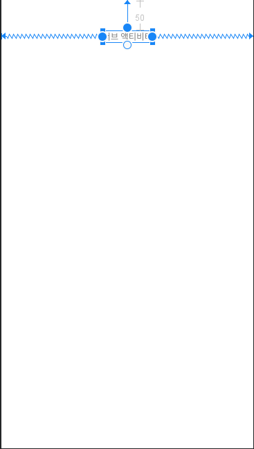

# chapter 5 - 01 액티비티

액티비티는 사용자가 직접 입력하는 화면을 담당하는 컴포턴트이다. 레이아웃을 화면에 그리기 위해서는 액티비티를 통해서만 가능하기 때문에 먼저 레이아웃을 살펴볼 때 액티비티를 사용했었다.

메이저 컴포턴트 중 하나인 액티비티를 다루기 위해서는 먼저 컴포넌트를 구성하고 있는 핵심 요소인 컨텍스트에 대한 이해가 있어야 한다.

1. 컨텍스트

    앞으로 사용할 액티비티, 서비스 등의 컴포넌트와 스피너, 리사이클러뷰와 같은 화면 요소를 사용하기 위해서는 컨텍스트가 필요하다. 이후에 배울 내요을 위해 개념을 간단하게 짚어보자.

    컨텍스트(Context)는 시스템을 사용하기 위한 정보(프로퍼티)와 도구(메서드)가 담겨 있는 클래스이다. 대부분의 컨텍스트는 컴포넌트 실행 시 함께 생성되고, 생성된 컴포넌트가 가지고 있는 메서드를 호출해서 각각의 도구를 사용할 수 있다.

    안드로이드에서의 컨텍스트는 앱을 실행하기 위해 잘 짜여진 설계도의 개념으로 앱에서 사용하는 기본 기능이 담겨있는 기본 클래스 (Base Class)이다. 액티비티는 컨텍스트를 상속받아 구현된다. 액티비티처럼 컨텍스트를 상속받은 컴포넌트들은 코드상에서 baseContext를 호출하는 것만으로 안드로이드의 기본 기능을 사용할 수 있다.

    예로 액티비티 안에서 startActivity() 메서드를 통해 다른 액티비티를 호출할 수 있는 것도 모든 액티비티가 startActivity()가 설계되어 있는 컨텍스트를 상속받아서 구현되어 있기 때문이다.

    - 컨텍스트의 종류
        - 애플리케이션 컨텍스트 (Application Context)

            애플리케이션과 관련된 핵심 기능을 담고 있는 클래스이다. 앱을 통틀어서 하나의 인스턴스만 생성된다. 액티비티나 서비스 같은 컴포넌트에서 applicationContext를 직접 호출해서 사용할 수 있는데 호출하는 지접과 관계없이 모두 동일한 컨텍스트가 호출된다.

        - 베이스 컨텍스트 (Base Context)

            안드로이드의 4대 메이저 컴포넌트인 액티비티, 서비스, 컨텐트 프로바이더, 브로드캐스트 리시버의 기반 클래스이다. 각각의 컴포넌트에서 baseContext 또는 this로 컨텍스트를 사용할 수 있고 컴포넌트의 개수만큼 컨텍스트도 함께 생성되기 때문에 호출되는 지점에 따라 서로 다른 컨텍스트가 호출된다.

    - 컴포넌트별 컨텍스트의 기능

        다음은 각각의 컴포넌트의 컨텍스트에서 지원하는 기능이다. 표에서처럼 화면과 관련된 기능은 액티비티의 컨텍스트만 제공하고 있다. 화면에 다이얼 로그 창을 띄운다든지 리소스 파일을 화면에 그리는 것인 액티비티만 할 수 있다.

        

2. 인텐트

    액티비티를 실행하기 위해서는 단순히 컨텍스트가 제공하는 메서드를 호출하면 되는데, 이때 실행할 액티비티가 명시된 인텐트(Intent)를 해당 메서드에 전달해야 한다. 인텐트는 '의도'라고 해석할 수 있는데, 개발자가 어떤 의도를 가지고 메서드를 실행할 것인지를 인텐트에 담아서 안드로이드에 전달하면 안드로이드는 해당 인텐트를 해석하고 실행한다. 인텐트는 안드로이드 프로그래밍을 하는데 있어서 컨텍스트와 함께 꼭 알아야 하는 개념이다.

    액티비티를 실행하려면 기본적으로 인텐트가 필요하지만, 프로젝트를 생성할 때 함께 만들어지는 MainActivity는 특별한 설정을 하지 않아도 안드로이드에 자동으로 등록되고 실행된다. 하지만 MainActivity 외에 다른 액티비티를 사용할 때는 인텐트에 새 액티비티의 이름을 담아서 시스템에 전달한다. 다음은 새로 생성된 액티비티를 실행하기 위해 인텐트가 전달되는 과정이다.

    1. 실행할 대상의 액티비티 이름과 전달할 데이터를 담아서 인텐트를 생성한다.
    2. 생성한 인텐트를 startActivity() 메서드에 담아서 호출하면 액티비티 매니저에 전달된다.
    3. 액티비티 매니저는 인텐트를 분석해서 지정한 액티비티를 실행시킨다.
    4. 전달된 인텐트는 최종 목적지인 타깃 액티비티까지 전달된다.
    5. 타깃 액티비티에서 전달받은 인텐트에 데이터가 있다면 이를 꺼내서 사용할 수 있다.

3. 새 익티비티 만들고 실행하기

    직접 만들어서 동작을 살펴보자. 새로운 프로젝트를 생성한다.

    1. app - java 디렉터리 밑에 있는 패키지명을 마우스 우클릭하여 나타나는 메뉴에서 New - Activity - Empty Activity를 선택한다.
    2. 액티비티 생성 창의 액티비티명 (Activity Name)에 'SubActivity'라고 입력하면 레이아웃명이 자동으로 'activity_sub'라고 입력된다. 액티비티명은 카멜 케이스를 사용한다. 이름을 설정했으면 Finish 버튼을 누르자.
    3. 생성된 activity_sub.xml 파일을 열고 화면 상단에 텍스트뷰를 하나 가져다 놓고 text 속성에 '서브 액티비티'라고 입력한다. 컨스트레인트는 위쪽과 좌우 세 방향을 연결하고 화면 상단 중앙에 위치시킨다.

        

    - 메인 액티비티 화면 구성하기

        이번에는 activity_main.xml파일을 열어 수정하자.

        1. 'Hello World!'가 적힌 텍스트뷰의 text 속성을 '메인 액티비티'로 입력한다. 컨스트레인트는 앞과 똑같이 설정한다.
        2. 버튼을 텍스트뷰 아래에 가져다 놓고 위쪽 컨스트레인트를 텍스트뷰와 연결하고 좌우는 화면의 가장자리에 연결한다. 버튼의 id는 'btnStart', text속성은 '서브 액티비티 실행'이라고 입력한다.

        

    - 메인 액티비티에서 서브 액티비티 실행하기

        이제 메인 액티비티의 버튼을 클릭하면 서브 액티비티를 실행하는 코드를 작성해보자.

        1. MainActivity.kt 파일을 열고 onCreate() 메서드 안에 다음 코드를 추가해 인텐트를 생성한다. 인텐트를 생성할 때 호출할 클래스의 이름 뒤에 '::class.java'라고 정확하게 입력해야 한다. 조금 특이한 형태이지만 Intent를 사용하기 위한 작성 규칙이다.

            ```kotlin
            val intent = Intent(this, SubActivity::class.java)
            ```

        2. Intent에서 에러가 뜨면 alt + enter를 통해 Import를 해보자.
        3. 이어서 버튼의 id인 'btnStart'를 입력하고 import한 후에 클릭 리스너를 달아준다.

            ```kotlin
            btnStart.setOnClickListener{}
            ```

        4. 클릭 리스너 코드 블록 안에서 startActivity() 메서드를 호출하면서 미리 만들어둔 인텐트를 값으로 넘겨준다. 간단하게 두 줄을 추가하는 것만으로 새로 만든 액티비티를 실행할 수 있다.

            ```kotlin
            btnStart.setOnClickListener { startActivity(intent) }
            ```

        5. 에뮬레이터에서 실행하면 메인 액티비티 화면에 실행 버튼이 보인다. 이를 클릭하면 서브 액티비티가 실행된다.

4. 액티빅티 사이에 값 주고받기

    액티비티와 같은 컴포넌트는 인텐트에 실행 메시지도 전달하지만 인텐트를 통해 데이터도 주고받을 수 있다. 인텐트 내부에 번들(bundle)이라는 데이터 저장 공간이 있는데, 이 번들에 데이터를 담아서 주고받을 수 있다.

    인텐트에 값을 입력할 때는 키와 값의 조합으로 번들에 직접 넣고, 꺼낼 때는 처음 입력했던 키로 꺼낸다. 맵(Map)처럼 동작한다.

    앞서 생성한 Activity 프로젝트에 이어서 계속 따라해보자.

    1. 먼저 MainActivity.kt에 값을 전달하는 코드를 추가하자. onCreate() 메서드 안에서 인텐트를 생성하는 val intent = ... 코드 다음 줄에 putExtra() 메서드를 사용해서 인텐트에 값을 입력하는 코드 두 줄을 추가한다. 첫 번째 값이 키로 사용되고, 두 번째가 실제 값으로 사용된다. 인텐트에 값을 담을 때는 타입 구분이 없지만 꺼낼 때는 값의 타입을 구분한다. 테스트 용도로 from1 키에는 문자, from2 키에는 숫자 값을 담았다.

        ```kotlin
        val intent = Intent(this, SubActivity::class.java)
        intent.putExtra("from1", "hello Bundle")
        intent.putExtra("from2", 2020)
        ```

    2. 값을 받는 측의 코드를 작성하기 전에 전달받은 값을 출력할 텍스트뷰 2개를 화면에 배치하자. activity_sub.xml을 열어 텍스트뷰 2개를 화면에 배치하자. 첫 번째는 화면 좌측에, id와 text는 모두 to1이라고 입력하고, 두 번째는 화면 우측에, id와 text는 모두 to2라고 입력하자. 
    3. SubActivity.kt 파일을 열고 onCreate() 메서드 안에 다음 코드를 추가한다. 먼저 텍스트뷰와 연결하기 위해 to1을 입력하고 Enter 키를 눌러 Import를 선택한다. 그 다음 to1의 text에 인텐트에 담겨온 값을 from1 키로 꺼내서 입력한다. 인텐트에 담겨온 문자에기 때문에 문자열을 꺼내는 getStringExtra() 메서드를 사용해야 한다.

        ```kotlin
        to1.text = intent.getStringExtra("from1")
        ```

    4. 전달받은 인텐트에서 from2도 같은 방법으로 꺼내서 to2의 text에 입력한다. from2에 전달된 값의 타입이 숫자이기 때문에 getIntExtra() 메서드를 사용한다. 이 메서드는 파라미터를 2개 가지고 있는데 일단 두번째 파라미터는 0이라고 입력한다. 이는 아무런 값도 전달되지 않았을 경우 디폴트로 사용할 기본값이다.
    5. 그런데 텍스트뷰의 text속성은 문자열만 받을 수 있는데 숫자 값을 받으면 에러가 생긴다. 쌍따옴표로 감싸고 문자열 템플릿을 사용해서 문자열로 반환해주어야 한다.

        ```kotlin
        to2.text = "${intent.getIntExtr('from2', 0)}"
        ```

    6. 에뮬레이터를 실행하고 결과를 확인하면 to1 텍스트뷰에는 Hello Bundle이, to2 텍스트뷰에는 2020이 출력된다.

        

    - 메인 액티비티에서 값 돌려받기

        이번에는 반대로 서브 액티비티가 종료되면 메인 액티비티로 값을 돌려주는 코드를 작성해보자.

        1. activity_sub.xml 파일을 열고 to1 텍스트뷰 아래에 플레인텍스트를 하나 추가하고 id에는 editMessage, hint 속성에는 '전달할 메시지를 입력하세요.'라 고입력하고, text 속성값은 지운다.
        2. 플레인텍스트 하단에 버튼을 하나 추가하고 id는 btnClose, text 속성에는 액티비티 닫기 를 입력한다.
        3. 서브 액티비티가 종료될 때 자신을 호출했던 액티비티로 값을 돌려주는 코드를 추가하자. SubActivity.kt를 열고 onCreate() 메서드 안에 btnClose 를 입력한 후 클릭 리스너를 달아준다. 액티비티 닫기 버튼을 클릭하면 이 블록 안의 코드가 실행된다.

            ```kotlin
            btnClose.setOnClickListener{}
            ```

        4. 리스너 블록 안에 호출한 메인 액티비티에 돌려줄 인텐트를 하나 생성하고 변수에 저장한다. 돌려줄 때는 대상을 지정하지 않아도 되므로 Intent 안에는 아무것도 담지 않습니다. Intent에 에러가 생기면 임포트해주자.

            ```kotlin
            val returnIntent = Intent()
            ```

        5. 앞에서 생성한 returnIntent에 editMessage의 값을 담는 코드를 입력하자.

            ```kotlin
            returnIntent.putExtra("returnValue", editMessage.text.toString())
            ```

        6. returnIntent와 상태 값을 setResult() 메서드에 담아서 실행하면 호출한 측으로 전달된다. 상태 값은 RESULT_OK와 RESULT_CANCELED로 안드로이드에 이미 상수로 정의되어 있다. 처리한 결과값에 따라 성공이면 OK를, 실패이거나 최소되었으면 CANCELED를 사용하면 된다. setResult() 메서드의 첫 번째 파라미터가 상태값, 두 번째가 전달하려는 인텐트이다.

            그리고 그 뒤에 finish()메서드를 호출해서 최종적으로 값을 전달한다.

            ```kotlin
            setResult(Activity.RESULT_OK, returnIntent)
            finish()
            ```

        7. MainActivity.kt에 값을 돌려받는 코드를 추가하자. onCreate() 메서드의 블록 밖을 클릭하고 ctrl + o 키를 누른다. 메서드 목록 중에서 onActivityResult를 선택하고 OK 버튼을 누르면 코드가 자동으로 생성된다.

            ```kotlin
            override fun onActivityResult(requestCode: Int, resultCode: Int, data: Intent?) {
                    super.onActivityResult(requestCode, resultCode, data)
                }
            ```

        8. onActivityResult() 메서드 안에 서브 액티비티에서 돌려받은 resultCode가 정상인지를 체크하는 코드를 추가한다. 정상이라면 돌려받은 인텐트에서 메시지를 꺼내 변수에 저장해둔다.

            ```kotlin
            if (resultCode == Activity.RESULT_OK) {
            	val message = data?.getStringExtra("returnValue")	
            }
            ```

        9. 해당 메시지를 토스트(Toast)로 화면에 보여주는 코드를 작성한다. 토스트는 화면에 잠깐 나타났다 사라지는 메시지 출력 도구이다.

            ```kotlin
            if (resultCode == Activity.RESULT_OK) {
            	val message = data?.getStringExtra("returnValue")
            	Toast.makeText(this, message, Toast.LENGTH_LONG).show()
            }
            ```

        10. 여기까지 작성하고 에뮬레이터에서 실행한 후 액티비티 닫기 버튼을 클릭해보면 서브 액티비티는 닫히지만 받는 메인 액티비티에는 아무런 변화가 없다. startActivity()로 실해된 액티비티에서는 값을 돌려받을 수 없기 때문이다. 메인 액티비티에서 서브 액티비티를 호출한 후에 값을 돌려받고싶으면 startActivityForResult() 메소드를 사용해야 한다.

    - startActivityForResult 메서드 사용하기
        1. 이어서 MainActivity.kt의 onCreate() 메서드 코드 블럭 안에 있는 startActivity() 메서드를 startActivityForResult()로 변경하고 인텐트와 함께 두 번째 파라미터에는 임시로 99라는 값을 입력한다. 두 번째 파라미터는 메인 액티비티에서 서브 액티비티를 호출하는 버튼이 여러 개 있을 때 어떤 버튼에서 호출된 것인지를 구분하는 용도이다.

            ```kotlin
            btnStart.setOnClickListener { startActivityForResult(intent, 99) }
            ```

        2. onActivityResult() 메서드 안에 작성한 코드에 when문을 추가해서 requestCode가 요청 코드와 같은 99인지 체크한다. 위의 조건문에 when문을 추가하자.

            ```kotlin
            if (resultCode == Activity.RESULT_OK) {
            	when (requestCode) {
            		99 -> {
            			val message = data?.getStringExtra("returnValue")
            			Toast.makeText(this, message, Toast.LENGTH_LONG).show()
            		}
            	}
            }
            ```

        3. 에뮬레이터를 실행해서 결과를 확인하면 잘 동작한다.

5. 액티비티 생명 주기

    안드로이드는 앱이 실행된 후 다른 액티비티 화면으로 전환되거나, 스마트폰 화면이 꺼지거나, 혹은 앱이 종료될 때와 같이 상태 변화가 있을 때마다 화면에 보여지는 액티비티의 생명 주기 메서드를 호출해서 상태 변화를 알려준다.

    - 액티비티 생명 주기 메서드

        액티비티의 상태 변화에 따라 호출되는 생명 주기 메서드는 다음과 같습니다.