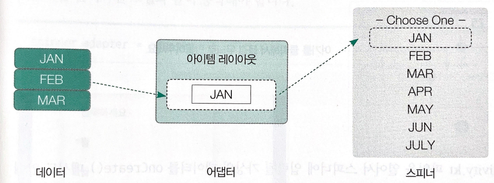

# chapter 5 - 02 컨테이너 : 목록 만들기

안드로이드의 기본 컨테이너를 다루어 보자. 위젯의 위치를 다룰 때 레이아웃을 사용했다면 위젯이나 다른 레이아웃에 데이터를 동적으로 표현해 줄 때 컨테이너를 사용한다. 컨테이너는 데이터를 반복적으로 표시하는 용도로 사용하는데 대표적인 컨테이너로는 목록을 화면에 출력할 때 사용하는 리사이클러뷰 (RecyclerView)가 있다.

가장 많이 사용되는 것이 리사이클러뷰이고, 가장 복잡한 것도 리사이클러뷰이다. 코드의 난이도가 갑자기 올라갈 수 있으니 리사이클러뷰의 축소 버전이라고 할 수 있는 스피너(Spinner)를 먼저 살펴보고 리사이클러뷰를 학습해보자.

컨테이너는 레이아웃과는 다르게 내부 요소의 위치를 결정할 수 있는 속성이 없으므로 컨테이너를 사용할 때는 다른 레이아웃을 컨테이너 안에 삽입해서 사용한다.

1. 스피너

    스피너(Spinner)는 여러 개의 목록 중에 하나를 선택할 수 있는 선택 도구이다. 스피너 우측에 있는 화살표를 누르면 선택할 수 있는 목록이 나열되는 형태이다. 마치 버튼이나 텍스트뷰 같이 작은 위젯처럼 보이지만 내부는 복수의 데이터를 처리할 수 있는 컨테이너 구조로 되어있다.

    스피너는 어댑터(Adapter)라는 연결 도구를 사용해 화면에 나타낼 데이터와 화면에 보여주는 스피너를 연결한다. 여러 개의 데이터가 어댑터에 입력되면 1개의 데이터당 1개의 아이템 레이아웃이 생성되어 화면에 목록 형태로 나타난다. 목록에서 한 줄은 1개의 아이템 레이아웃이다.

    

    - 스피너로 보는 어댑터의 동작 구조

        이제부터는 안드로이드 프로젝트를 만들어서 실제 스피너에 값을 입력하고 동작시켜 보도록 하자.

        1. activity_main.xml 에서 Hello World 텍스트뷰의 id 속성으 result로 변경하고 text 속성에는 선택 결과로 입력한다.
        2. 그 아래에 container 카테고리에서 spinner를 드래그 해서 텍스트뷰 아래에 가져다 놓는다. id는 spinner
        3. 컨스트레인트를 적당히 연결하자.
        4. MainActivity.kt 파일을 열어서 스피너에 입력될 가상의 데이터를 onCreate() 메서드 안에 작성한다. data 변수를 만들고 listOf를 사용해서 여러 개의 데이터를 입력한다. 첫 번째 데이터는 아직 데이터가 선택하지 않았을 때 기본으로 보여주는 '- 선택하세요 -'로 입력한다.

            ```kotlin
            var data = listOf("- 선택하세요 -", "1월", "2월", "3월", "4월", "5월", "6월")
            ```

        5. 앞에서 만든 데이터와 스피너를 연결해줄 ArrayAdapter 클래스를 만들어 adapter 변수에 저장한다. ArrayAdapter 클래스는 adapter에서 사용할 데이터 타입을 제네릭으로 지정해야 한다. 앞에서 문자열로 데이터를 구성했으므로 String으로 지정한다. ArrayAdapter의 파라미터는 총 3개이며 (스피터를 화면에 그리기 위한 컨텍스트, 스피너에 보여줄 목록 하나하나가 그려질 레이아웃, 어댑터에서 사용할 데이터) 순으로 입력한다. 컨텍스트는 this를 사용하고, 레이아웃은 기본으로 제공하는 simple_list_item1을 사용한다. 마지막 값으로 미리 만들어둔 data 변수를 입력한다.

            ```kotlin
            var adapter = ArrayAdapter<String>(this, android.R.layout.simple_list_item_1, data)
            ```

            simple_list_item_1 레이아웃은 텍스트뷰 1개만을 가지고 있는 특수한 레이아웃이다. ArrayAdapter와 같은 기본 어댑터에 사용하면 입력된 데이터에서 문자열 1개를 꺼내서 레이아웃에 그려준다.

        6. 다음 줄에 spinner를 import하고 생성한 어댑터를 연결하자. 다음과 같이 작성하면 된다.

            ```kotlin
            spinner.adapter = adapter
            ```

            에뮬레이터로 실행하면 우리가 만든 데이터를 선택하는 창이 뜬다.

        7. 사용자가 스피너를 선택하면 선택한 값을 선택 결과에 보여주는 코드르 작성해보자. 스피너를 선택하는 동작을 인식하기 위해서 onItemSelectedListener를 사용하는데, 이름 그대로 스피너에 있는 아이템이 선택되면 동작하는 리스너이다. 

            ```kotlin
            spinner.onItemSelectedListener = object: AdapterView.OnItemSelectedListener {
                        override fun onNothingSelected(parent: AdapterView<*>?) {
                            TODO("Not yet implemented")
                        }

                        override fun onItemSelected(parent: AdapterView<*>?, view: View?, position: Int, id: Long) {
                            TODO("Not yet implemented")
                        }
                    }
            ```

        8. 위의 코드 중 두 번째 메서드만 사용할 예정이다. 여기에는 파라미터가 4개 있는데 OnItemSelectedListener를 이용할 때는 대부분 세 번째 position만 이용한다. 사용자가 스피너에서 선택을 하면 몇 번째 아이템인지를 알려주는 파라미터이다. 메서드 안에 다음 코드를 추가하자. 리스너에서 넘겨주는 position 값으로 data의 해당 위치에 있는 문자 값을 선택 결과 텍스트뷰에 입력하는 코드이다.

            ```kotlin
            result.text = data.get(position)
            ```

2. 리사이클러뷰

    리사이클러뷰 (RecyclerView)는 스피너가 조금 더 확장된 형태이다. 리사이클러뷰도 스티너처럼 목록을 화면에 출력하는데, 레이아웃 매니저를 이용하면 간단한 코드만으로 일반 리스트뷰(ListView)를 그리드뷰(GridView)로 바꿀 수도 있다.

    리사클러뷰처럼 목록을 표시하는 컨테이너들은 표시될 데이터와 아이템 레이아웃을 어댑터에서 연결해주므로 어댑터에서 어떤 아이템 레이아웃을 사용하느냐에 따라 표시되는 모양을 다르게 만들 수 있다.

    목록에 표시되는 아이템 레이아웃을 직접 만들어서 사용하도록 하자. 아이템 레이아웃은 아이템 번호, 제목, 작성일자를 가지고 있는 독립적인 레이아웃으로 구성되고, 리사이클러뷰는 연결되는 어댑터 내부에서 화면에 그려질 개수만큼 레이아웃을 생성하고 보여준다.

    - 화면 구성하기

        리사이클러뷰를 UI에 가져다 놓고, 데이터 1개의 구성 요소를 배치한다.

    - 데이터 정의하고 가상 데이터 만들기

        데이터가 있다면 그것을 사용, 없다면 가상 데이터를 만들어서 사용한다. 책에서는 data class를 이용해서 데이터의 저장 유형을 정하고 반복문으로 임의로 MutableList에 데이터를 저장했다.

    - 어댑터 정의하기

        리사이클러뷰는 리사이클러 어댑터라는 메서드 어댑터를 사용해서 데이터를 연결한다. 스피너보다는 훨씬 복잡하고 상속이 필요하다.

        리사이클러뷰 어댑터는 개별 데이터에 대응하는 뷰홀더 클래스를 사용한다. 상속하는 리사이클러뷰 어댑터에 뷰홀더 클래스를 제네릭으로 지정해야 하므로 뷰홀더 클래스를 먼저 만들고 나서, 어댑터 클래스를 만드는 것이 더 편하다.

        상속받는 Adapter 클래스에 제네릭으로 뷰홀더를 지정해두면 Implement Methods로 코드를 자동 완성할 때에 자동 완성된 메서드 중 하나가 파라미터 타입에 제네릭으로 지정해둔 뷰홀더를 사용한다.

        뷰홀더 클래스도 기본 기능이 이미 만들어져 있는 ViewHolder 클래스를 상속받아서 만든다.

    - MainActivity.kt 에서 어댑터 사용하기

        위에서 정의한 어댑터를 변수에 담고, 어댑터에 데이터를 저장하고, 리사이클러뷰 위젯의 adapter 속성에 생성할 어댑터를 연결한다. 마지막으로 리사이클러뷰를 화면에 보여주는 형태를 결정하는 레이아웃 매니저를 연결한다.

    - 목록 클릭 이벤트 처리

        Holder 클래스에 init을 추가하고 그 안에서 아이템뷰에 클릭 리스너를 달아야 한다.